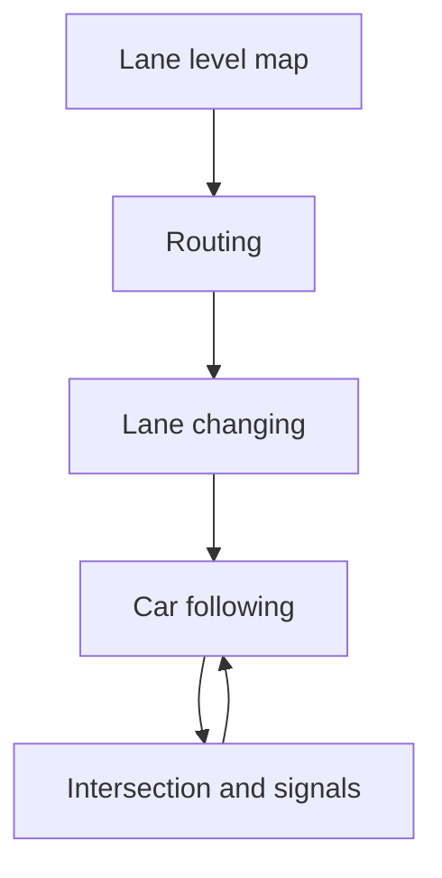
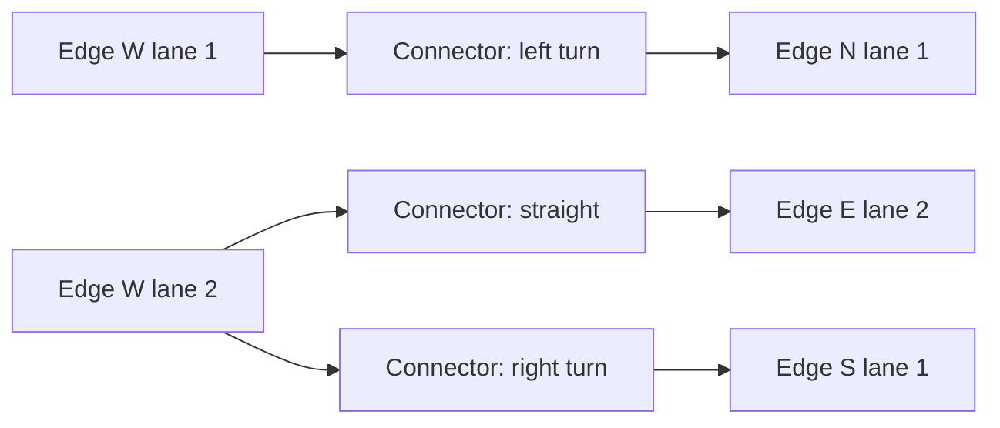
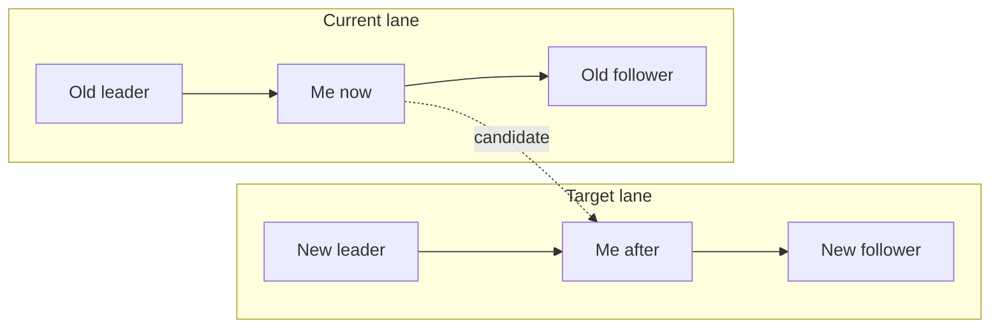
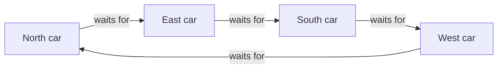
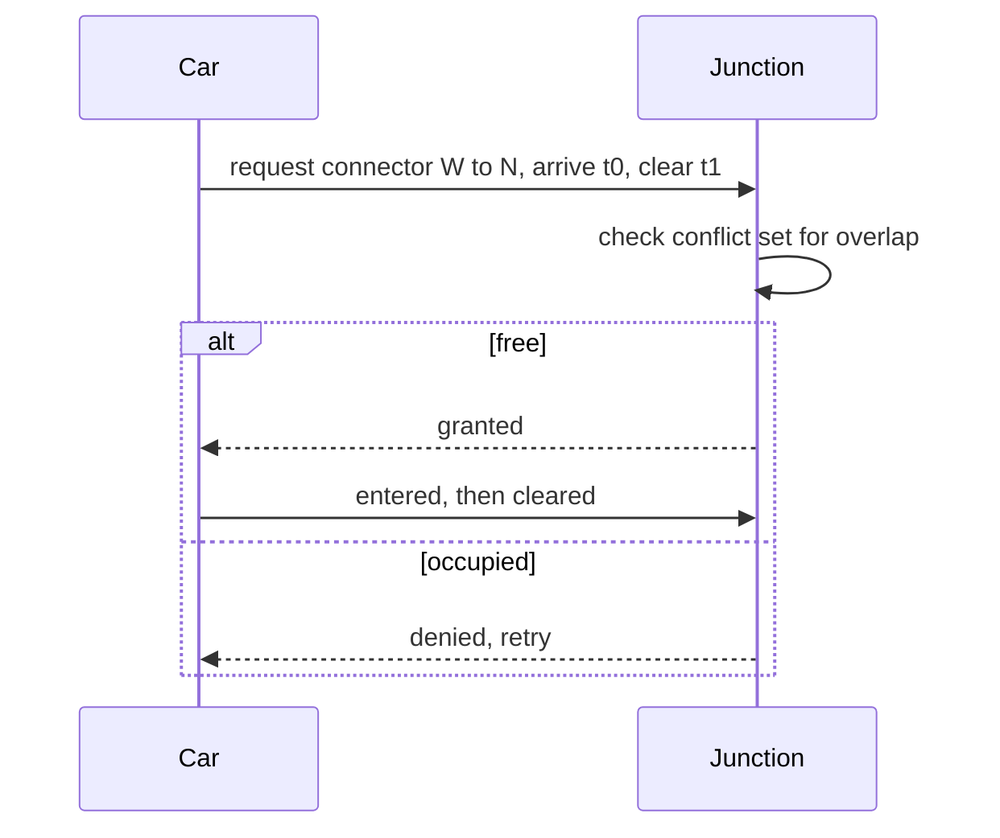
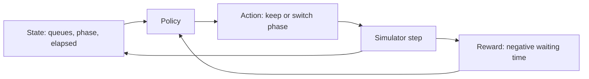

## Table of contents

## Introduction

The first version always works. You spline a few roads, spawn cars, move them along the centerline at a fixed speed, and the city looks alive from a distance. Then a player parks across a junction, the cars behind pile into a solid stripe of metal, and the grid locks up for good. Nothing crashed and nothing threw an error. The simulation is just stuck, and tuning speed values will not unstick it.

That's the point where traffic stops being decoration. Cars don't simply move along roads, they negotiate for space: the gap in front of them, a slot in the next lane, the right to cross a junction before the car opposite does. Every one of those negotiations is a separate algorithm, and they all run at once, sixty times a second, for a few thousand agents.

Below are the layers an AI traffic system needs: lane level maps, the IDM and MOBIL models every classic simulator leans on, and the seams where traffic simulation quietly breaks.

> Two references worth having open: [SUMO](https://eclipse.dev/sumo/), the de facto standard microscopic simulator, and [CityFlow](https://cityflow-project.github.io/), a much smaller engine built to train reinforcement learning agents fast.

## The layers nobody sees

A traffic system looks like one feature and behaves like five. Each layer runs on its own clock and answers a different question.



- **Map** is where lanes exist and how they connect. Static, built offline.
- **Routing** picks the lanes that get this car from A to B. Every few seconds.
- **Lane changing** asks whether the car should be in a different lane. Every second or so.
- **Car following** decides how hard to press the accelerator. Every tick.
- **Intersections and signals** decide who moves through a conflict point. Every tick, globally.

Skip a layer and you don't get a simpler system. You get one that fails in a way you can't debug, because the missing layer's job lands on some other layer that was never designed for it.

## The lane level map

A road graph where nodes are junctions and edges are roads is enough to compute a route. It is nowhere near enough to drive one. A car needs to know which lane it's in, where that lane's centerline runs, and which lanes it may legally enter next. So the real map is two graphs stacked on each other: the **road graph** that routing runs on, and the **lane graph** that treats every lane as its own node, with **connectors** (SUMO calls them *internal lanes*) describing the legal moves through a junction.



Each lane carries a centerline polyline or spline, a width, a speed limit, a direction, and a list of outgoing connectors. Each connector carries the part nobody enjoys writing: its **conflict set**, the list of other connectors it crosses, and the priority relation between them.

:::info
The conflict set is what makes a junction a junction. Two connectors that cross in space cannot both be occupied. Everything about right of way, gap acceptance, and deadlock comes down to how you resolve claims on that set.
:::

Keep positions in **Frenet coordinates**: `(lane_id, s, d)` where `s` is the distance travelled along the centerline and `d` is the lateral offset. Cartesian position gets derived at render time. That single choice removes a whole class of bugs, because "who is in front of me" becomes a comparison of two `s` values instead of projecting world positions onto a curve every frame.

### What the tools give you

| Tool | Scale | Map format | What it's actually for |
| ---- | ----- | ---------- | ---------------------- |
| [SUMO](https://eclipse.dev/sumo/) | Micro, city sized | `.net.xml`, imports OSM | The reference implementation, huge feature surface, slow to learn |
| [CityFlow](https://cityflow-project.github.io/) | Micro, thousands of vehicles | Simple JSON roadnet | RL research, built for throughput over realism |
| [OpenTrafficSim](https://opentrafficsim.org/) | Micro to macro | OTS XML, OSM | Java, research oriented, strong on multi-modal |
| [MATSim](https://www.matsim.org/) | Meso, regional | XML network + plans | Whole day travel demand, not per-tick dynamics |
| [CARLA](https://carla.org/) | Micro, sensor level | OpenDRIVE | Autonomous driving stacks, cameras and lidar |

None of these drop into a game. What they give you is a well-tested definition of what lane level maps have to contain, and OpenDRIVE, the format CARLA uses, is the closest thing to an industry standard for describing one.

### Where the game engines land

Unity ships no traffic system. NavMesh gives you agents that avoid each other, which is a crowd model rather than a traffic model: no lanes, no right of way, no notion of the car in front. It's still right for pedestrians, and I covered how it reasons about space in [the Unity NavMesh post](/blog/unity-navmesh-ai-navigation). Most Unity traffic assets are waypoint systems instead, with points every 10 to 20 meters along each lane, each carrying a speed limit and sometimes a yield flag.

Unreal Engine 5 does ship one. Mass AI, the system behind traffic and crowds in City Sample, runs vehicles as ECS entities so thousands of NPC cars update as flat data, and only the ones near the camera get promoted to full physics vehicles. Its road data is lane based with explicit intersection periods, much closer to the model above than a waypoint chain is.

Which brings up the argument in every gamedev thread on this: waypoints or splines. Waypoints are cheap and easy to author. Splines are smooth but you pay to project a car onto the curve every frame. Frenet coordinates settle it, since `s` along the spline is the cheap scalar you compare and the curve is only evaluated when you need a world position to draw. Waypoint traffic is fine for a racing game where cars are scenery. The moment your open world lets the player stop in a junction, you need lanes, connectors, and conflict sets.

## Routing is the easy part

Routing runs on the road graph, and it's plain shortest path work: Dijkstra or A\* with a Euclidean heuristic. The interesting question is what you use as edge cost.

Free flow travel time (`length / speed_limit`) gives routes that look correct and behave terribly, because every car picks the same "fastest" road and jams it. The standard fix is a cost that grows with load, the **BPR function** from traffic engineering:

```text
t = t_free * ( 1 + alpha * (q / c)^beta )

t_free  free flow travel time on the edge
q       current flow, vehicles per hour
c       capacity of the edge, vehicles per hour
alpha   0.15 by convention
beta    4 by convention
```

At `q = c` travel time is 1.15x free flow. At double capacity it's 3.4x. That fourth power makes cars abandon a road only once it's badly congested, instead of oscillating on every small change.

Recompute routes periodically and stagger the recomputes across cars. Rerouting a thousand agents in one frame is the classic traffic system frame spike, and rerouting all of them against the *same* fresh cost snapshot produces herd behavior, where everyone flees the jam onto the same alternative and creates a new one.

:::warn
A car that reroutes in the middle of a junction visibly teleports. Freeze the route from the moment a car commits to a connector until it clears the junction. That single rule removes more visual glitches than any amount of steering polish.
:::

## Car following with IDM

Now the per-tick layer. Given the car ahead, how hard do I accelerate? The **Intelligent Driver Model** by Treiber, Hennecke and Helbing is the standard answer, and it's one continuous equation with no branches:

```text
a = a_max * [ 1 - (v / v0)^delta - (s_star / s)^2 ]

s_star = s0 + max(0, v * T + (v * dv) / (2 * sqrt(a_max * b)))
```

| Symbol | Meaning | Typical value |
| ------ | ------- | ------------- |
| `v` | current speed | measured each tick |
| `v0` | desired speed | speed limit, plus driver bias |
| `s` | bumper to bumper gap to the leader | measured each tick |
| `dv` | approach rate, `v - v_leader` | measured each tick |
| `s0` | minimum standstill gap | 2 m |
| `T` | desired time headway | 1.5 s |
| `a_max` | comfortable acceleration | 1.5 m/s² |
| `b` | comfortable deceleration | 2.0 m/s² |
| `delta` | acceleration exponent | 4 |

Read it as three competing terms. `1` is "go". `(v / v0)^delta` is the free road term that fades you into your desired speed. `(s_star / s)^2` is the interaction term, and it explodes as the gap shrinks below what you want. That squaring produces hard braking exactly when it's needed and almost no influence when the road ahead is clear. `s_star` itself is the desired gap: a standstill buffer, plus the distance you cover in `T` seconds, plus a term that grows when you're closing on the leader fast.

```ts file=idm.ts
type Driver = {
  v0: number; // desired speed, m/s
  T: number; // time headway, s
  s0: number; // standstill gap, m
  a: number; // max acceleration, m/s^2
  b: number; // comfortable deceleration, m/s^2
};

const DELTA = 4;

export function idmAcceleration(
  d: Driver,
  v: number,
  gap: number,
  leaderSpeed: number
): number {
  const dv = v - leaderSpeed;
  const sStar =
    d.s0 + Math.max(0, v * d.T + (v * dv) / (2 * Math.sqrt(d.a * d.b)));

  // Clamp the gap so a leader at zero distance yields finite braking.
  const s = Math.max(gap, 0.1);

  return d.a * (1 - Math.pow(v / d.v0, DELTA) - Math.pow(sStar / s, 2));
}
```

Two implementation details decide whether this is stable or garbage. Plain Euler integration (`v += a * dt`) lets a decelerating car pass through zero into negative speed and reverse into the car behind it, so clamp speed at zero and advance distance by the average of old and new speed. And IDM is a continuous model: at `dt = 0.1 s` it behaves, at `dt = 1 s` it oscillates and collides. Run the traffic step on a fixed accumulator and interpolate for display. SUMO's default step is `0.1 s`.

:::info
IDM is *collision free by construction* only when you integrate it finely enough and when the leader doesn't change discontinuously. Both assumptions break at junctions, where your leader can appear out of nowhere as a cross-traffic car claims the space in front of you. Keep a hard safety clamp as a last line of defense.
:::

### Phantom jams are a feature

Feed IDM a ring road at medium density, perturb one car slightly, and a stop-and-go wave forms and travels backwards through the platoon. Nobody braked hard and there is no obstacle in the road. This is **string instability**, and real traffic does exactly the same thing. The model being right also means "cars randomly stop for no reason" can be a legitimate output, and you now have to tell that apart from a bug in a system where the two look identical.

## Lane changing with MOBIL

Car following handles one dimension. The lateral decision needs a different model, and **MOBIL** (*Minimizing Overall Braking Induced by Lane change*) is the companion piece to IDM. Its trick is to ask IDM to score hypothetical situations, so it introduces no new parameters. For a candidate change, evaluate three cars before and after the move: you, your new follower, and your old follower.



**Safety criterion.** The car that would end up behind you must not be forced into harder braking than it can accept:

```text
a_new_follower >= -b_safe          b_safe ~ 4 m/s^2
```

**Incentive criterion.** The total gain, weighted by how much you care about the others:

```text
(a_me_after - a_me_before)
  + p * [ (a_new_follower_after - a_new_follower_before)
        + (a_old_follower_after - a_old_follower_before) ]
  > delta_a_threshold + a_bias
```

`p` is the **politeness factor**, the most expressive single number in the whole system. At `p = 1` drivers weigh everyone's comfort equally and traffic flows smoothly. At `p = 0` they're egoists who change lanes whenever it helps them. At `p < 0` they actively enjoy cutting you off. Set it per driver and the personality of your traffic changes without touching any other code.

`delta_a_threshold` (around `0.1 m/s²`) is a hysteresis band, and without it cars flip between lanes on numerical noise. `a_bias` encodes asymmetric rules: a keep-right bias in Europe, or a large negative bias that forces a change when the car has to be in a specific lane for its next turn.

```ts file=mobil.ts
// Every field is an IDM acceleration, before and after the hypothetical change.
type LaneChangeContext = {
  meBefore: number;
  meAfter: number;
  newFollowerBefore: number;
  newFollowerAfter: number;
  oldFollowerBefore: number;
  oldFollowerAfter: number;
  bias: number; // keep-right rule, or a mandatory change pushing the car over
};

const B_SAFE = 4.0;
const THRESHOLD = 0.1;

export function shouldChangeLane(ctx: LaneChangeContext, politeness: number) {
  if (ctx.newFollowerAfter < -B_SAFE) return false;

  const selfGain = ctx.meAfter - ctx.meBefore;
  const othersGain =
    ctx.newFollowerAfter -
    ctx.newFollowerBefore +
    (ctx.oldFollowerAfter - ctx.oldFollowerBefore);

  return selfGain + politeness * othersGain > THRESHOLD + ctx.bias;
}
```

MOBIL is *discretionary*. It describes a driver who would like a better lane, and says nothing about a driver who **must** reach the right lane within 80 meters or miss the exit. For those, drive the decision from the route: as the remaining distance shrinks, raise `a_bias` and lower `b_safe` until the car accepts a gap it would normally refuse, and finally until it slows down and waits for one.

Add merging and it gets worse. Two cars each politely waiting for the other produce a permanent standoff, and in dense traffic a mandatory changer can find that no acceptable gap ever appears. Production systems bolt on **cooperation**, where a car that spots a blocked changer ahead deliberately opens a gap. That's a message between agents, which means your "purely local" model now has communication in it.

## Intersections: where it actually breaks

Everything above is a solved problem with a paper attached. Junctions are where implementations diverge and where your simulation locks up. A connector's conflict set can't be occupied by two cars at once, and a car that has entered a junction cannot back out. That's resource allocation with non-preemptable resources, the textbook setup for deadlock.



Four cars, each yielding to the one on its right, each correct by the rules, all stopped forever. No individual car is buggy; the arrangement is.

### Gap acceptance

For unsignalized junctions the classic model is **gap acceptance**. A car on the minor road watches the major stream and enters when the gap exceeds its **critical gap** `t_c`:

```text
accept if  t_gap >= t_c

t_c ~ 4-7 s for a left turn across traffic
t_f ~ 2-3 s follow-up time for the next car in the queue
```

Make `t_c` a per-driver random draw and you get impatient drivers and cautious ones for free. Then decay `t_c` with waiting time, or a car at a busy left turn in rush hour waits until the heat death of the universe.

### Claims beat rules

The robust approach, and the one most autonomous driving research uses, is to stop encoding right of way as behavior and make it an explicit allocation. Before entering, a car **claims** a time window on each conflict area along its connector. The junction grants or denies.



That buys you three things rule-based yielding never does. An explicit place to break ties (priority, then arrival order, then a stable id, never randomly, or the oscillation comes back). A natural spot to enforce "don't block the box" by requiring free space on the *exit* lane before granting. And a deadlock detector: build the wait-for graph, look for a cycle, and if one exists force the lowest-id car through. It's crude, but a forced move beats a frozen city.

:::danger{title="The exit lane check is not optional"}
Granting entry to a car whose exit lane is full is how gridlock starts. The car stops inside the junction, blocks every crossing connector, and the jam spreads outward through the network until nothing moves. One condition (free space on the exit) prevents a failure mode that no downstream tuning can recover from.
:::

## Signals, and where the AI shows up

A signalized junction replaces negotiation with a schedule. The simple version is a fixed cycle of phases, sized with **Webster's** formula:

```text
C_opt = (1.5 * L + 5) / (1 - Y)

L   total lost time per cycle, seconds
Y   sum over phases of the critical flow ratio q/s
```

Green time splits between phases in proportion to their flow ratios. It's from 1958, it's a decent baseline, and it degrades badly once demand stops matching the assumptions you sized it with. Above it sit **actuated** controllers, which extend green while a detector keeps seeing cars. Above those sits **adaptive** control, and this is where "AI traffic system" usually means reinforcement learning: state is queue lengths and current phase, action is which phase to run next, reward is negative waiting time.



This is why CityFlow exists. Training needs millions of steps and SUMO's per-step cost makes that painful, so CityFlow trades feature depth for raw speed. The pitfalls are the usual reinforcement learning ones in traffic form. Optimize throughput and the policy learns to starve a minor approach forever, so throughput looks great and one street never gets a green. Independent per-junction agents undo each other, because a neighbor's optimal policy sends you more cars than you can clear. And a policy trained against IDM drivers has learned to exploit IDM drivers.

:::warn
A learned controller that beats a fixed cycle in your simulator has beaten *your model of drivers*, not drivers. Before that number means anything, check it against a calibrated demand profile and a different car-following model.
:::

## Making it run at scale

Microscopic traffic simulation is `O(vehicles)` per tick with a small constant, and the constant is where you win or lose.

- **Keep neighbors in the lane, not in the world.** Each lane holds its vehicles sorted by `s`, so leader and follower are array neighbors and you need no spatial query structure at all.
- **Stagger the slow layers.** Car following every tick, lane changing every 4-10 ticks offset per car, routing every few seconds. Most of your budget goes to the cheapest layer.
- **Simulate at a level of detail.** Far from the camera a mesoscopic model that only tracks lane occupancy and travel time is orders of magnitude cheaper. The trap is the transition, because a car crossing back to microscopic has to materialize into a gap that actually exists.
- **Make it deterministic.** Fixed timestep, seeded per-vehicle RNG, stable iteration order. A traffic bug reproduces after four simulated minutes of city-wide state, and without determinism you will not reproduce it at all.

## Why this is hard

The difficulty isn't in any one algorithm. IDM is ten lines and MOBIL is an inequality. It's in what happens when they meet.

- **Coupled layers.** A lane change changes somebody's leader, which changes their acceleration, which changes the gap behind them, which enables another lane change. Every layer feeds every other one within the same tick, and the order you evaluate them in shows up in the output.
- **Failures are global, not local.** A single car stopped in the wrong place produces a citywide gridlock ten minutes later. The stack trace, if there were one, would point at every car.
- **Correct behavior looks like a bug.** Phantom jams are the model working, and so is a car waiting a long time at a left turn. You cannot assert "no car waits more than 30 seconds" without deleting real behavior, which is why the real test is a distribution: flow against density should reproduce a fundamental diagram.

## FAQ

<details><summary>Can I build a traffic system on Unity NavMesh?</summary>
Not on its own. NavMesh solves pathfinding and local avoidance, so cars reach their destination without hitting each other, but there are no lanes, no car-following distance, and no right of way at junctions. Use it for pedestrians and drive vehicles off a lane graph with IDM for the longitudinal part. Unreal's Mass AI in City Sample is the closest thing to a shipped lane-based traffic system in a mainstream engine.
</details>

<details><summary>Waypoints or splines for the road network?</summary>
Neither is the important question. What matters is whether the data is lane level: separate lanes with explicit connectors between them. Waypoints are a lane graph sampled every 10 to 20 meters, splines are the same graph with continuous geometry. Store positions as distance along the lane and the choice becomes an authoring preference rather than an architectural one.
</details>

<details><summary>IDM or a simpler follow-the-leader rule?</summary>
IDM, unless you're rendering fewer than a dozen cars. It's one branchless formula with physically meaningful parameters, and it's the model MOBIL, most papers, and most calibration data assume. A hand-rolled "brake if close" rule costs the same to run and gives you oscillation you'll spend weeks tuning out.
</details>

<details><summary>How do I stop four-way deadlocks for good?</summary>
Don't rely on yield rules alone, because they can produce a legal circular wait. Add explicit reservations at the junction, require free space on the exit lane before granting entry, and run a cycle check on the wait-for graph. When a cycle appears, force the lowest-id car through.
</details>

<details><summary>SUMO or CityFlow?</summary>
SUMO for anything where realism, map fidelity, or feature coverage matters, since it imports OpenStreetMap, models public transport and pedestrians, and has a large ecosystem. CityFlow when you need millions of simulation steps for RL training and can accept a simplified road model.
</details>

<details><summary>Where does "AI" actually live in a traffic system?</summary>
Three places, and only one is machine learning. Search for routing, hand-built behavior models for driving (IDM, MOBIL, gap acceptance), and learned controllers, mostly reinforcement learning for signal timing. The behavior models do the heavy lifting and none of them are neural.
</details>

## Conclusion

An AI traffic system is five systems in a trench coat: a lane level map, a router, a car-following model, a lane-changing model, and a junction arbiter. Each one is small. IDM fits on a napkin, MOBIL is one inequality, routing is Dijkstra with a load-dependent cost. The hard part is that they're coupled, they run every tick, and their failure mode isn't a crash but a city that quietly stops moving.

Start with the map. Get lanes and connectors right, put positions in Frenet coordinates, and add layers on top one at a time so you can tell which one broke. Then accept that some of what looks broken, like the wave of brake lights rolling backwards through traffic with no obstacle causing it, is the simulation getting it exactly right.
