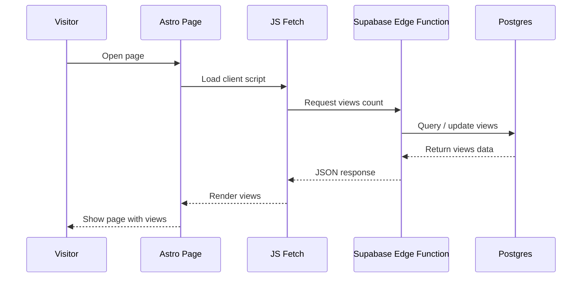

## Table of contents

## Introduction

After setting up **Astro 6**, I became interested in how to add an **Astro page view counter** to my pages? It quickly became clear that in most cases this is easier to build yourself. In this article, I will show a complete solution with maximum details that will work for any **Astro blog**.

## Existing Astro Views Counter Solutions

Naturally, the first thing I did was search the web for ready-made solutions and found the following implementations (of course, this is not all, but these are the first ones on the list of results):

> [https://crockettford.dev/blog/astro-blog-views-counter](https://crockettford.dev/blog/astro-blog-views-counter)

A fairly simple implementation. Good overall, but highly specific. Best suited for people already using **Coolify** and **Docker**.

It also introduces a less native database workflow (**schema**, **connection**, **select**, **increment**), which may be unnecessary complexity for a blog owner.

> [https://mvlanga.com/blog/how-to-build-a-page-view-counter-with-astro-db-actions-and-server-side-islands/](https://mvlanga.com/blog/how-to-build-a-page-view-counter-with-astro-db-actions-and-server-side-islands/)

There's a fair amount of unnecessary code here (in my opinion). A display component and two more for of updating views (**Vanilla** vs. **React**). How is one better than the other, and which should I ultimately use?

Also, the author didn't explain the data storage layer. Where does **Astro DB** connect to, and where will the view data be stored?

> [https://elazizi.com/posts/add-views-counter-to-your-astro-blog-posts/](https://elazizi.com/posts/add-views-counter-to-your-astro-blog-posts/)

Probably the most creative approach and much simpler than previous options.

However, it depends on two third-party services (`corsproxy.io` and `hits.seeyoufarm.com`). If one becomes unavailable, the counter stops working. That is a weak point for long-term use.

By the way, right now one of the services is unavailable. Now do you understand why this is a poor implementation?

### Search Results Summary

| Solution     | Pros              | Cons                        |
| ------------ | ----------------- | --------------------------- |
| crockettford | simple setup      | stack-specific              |
| mvlanga      | native approach   | requires Astro DB knowledge |
| elazizi      | creative solution | third-party dependency      |

None of these options fully matched what I wanted.

The closest was the implementation from **mvlanga**, but it does not fully cover real database setup and production usage.

So I decided to build my own version: simple, practical, and independent **Astro page views** powered by **Supabase**.

## The Plan

We will use:

- **Supabase** as a **Postgres** database
- **Edge Functions** as the backend layer
- **Astro component** for rendering views

All logic for updating and returning views will live in the backend.



## Implementation

If you don't have an account with [Supabase](https://supabase.com/) yet, I'd recommend creating one, confirming your email, and creating your first project. Leave all the settings at default, we don't need that right now.

### Create Database

After creating the project, wait a few minutes for initialization.

Open `SQL Editor` and paste the next script:

```sql
create table public.views (
  id bigint generated by default as identity not null,
  created_at timestamp with time zone not null default now(),
  slug text not null,
  views bigint not null default '0'::bigint,
  constraint views_pkey primary key (id),
  constraint views_slug_key unique (slug)
) TABLESPACE pg_default;
```

It will create ready for work table for our analytics views.

### Configure Access Policy

After creating the table, configure access.

Open: `Authentication → Policies`

For table `views`, create policy:

- Policy Name: `Public Read`
- Policy Command: `SELECT`
- Below in the code editor, immediately after the line `using`, type `true`.

All other settings remain unchanged.

Now the table is publicly readable. For a simple page view counter with no personal data, this is usually acceptable.

## Edge Function

Now create a public function that increments the counter and returns the current value.

Open: `Edge Functions → Deploy a new function → Via Editor`

```ts file=views
// Setup type definitions for built-in Supabase Runtime APIs
import 'jsr:@supabase/functions-js/edge-runtime.d.ts';
import { Pool } from 'jsr:@db/postgres';

const pool = new Pool(Deno.env.get('SUPABASE_DB_URL')!, 3, true);

Deno.serve(async (req: Request) => {
  const corsHeaders = {
    'Access-Control-Allow-Origin': '*',
    'Access-Control-Allow-Methods': 'OPTIONS, POST',
    'Access-Control-Allow-Headers': 'x-client-info, apikey, content-type',
    'Content-Type': 'application/json',
  };

  if (req.method === 'OPTIONS') {
    return new Response(null, {
      status: 204,
      headers: corsHeaders,
    });
  }

  if (req.method !== 'POST') {
    return new Response(JSON.stringify({ error: 'Method not allowed' }), {
      status: 405,
      headers: corsHeaders
    });
  }

  try {
    const { slug } = await req.json();

    if (!slug) {
      return new Response(JSON.stringify({ error: 'slug is required' }), {
	      status: 400,
	      headers: corsHeaders
	    });
    }

    const db = await pool.connect();

    try {
      const result = await db.queryObject<{ views: string }>(
        `
	        insert into views (slug, views)
	        values ($1, 1)
	        on conflict (slug)
	        do update
	        set views = views.views + 1
	        returning views::text as views
        `,
        [slug]
      );

      const [row] = result.rows;

      return new Response(JSON.stringify(row.views), {
        status: 200,
        headers: corsHeaders,
      });
    } finally {
      db.release();
    }
  } catch (e) {
	  const error = e instanceof Error ? e.message : 'Something went wrong';

    return new Response(JSON.stringify({ error }), {
      status: 500,
      headers: corsHeaders,
    });
  }
});
```

### Code Notes

- restrict `corsHeaders` to your domain
- handles `OPTIONS` and `POST`
- validates `slug`
- uses atomic **UPSERT**
- returns updated count immediately

## Astro Component

Create: `Views.astro`

```jsx file=views.astro
---
import IconEyeIcon from "@/assets/icons/IconEye.svg";

type Props = {
  slug: string;
};

const { slug } = Astro.props;
---

<span class="inline-flex items-center gap-x-2 opacity-80">
  <IconEyeIcon />
  <span class="sr-only">Views</span>
  <span id="views">…</span>
</span>

<script define:vars={{ slug }} is:inline data-astro-rerun>
  (() => {
    if (!slug) return;

    const el = document.getElementById("views");

    if (!(el instanceof HTMLElement)) return;

    const endpoint = "https://hash.supabase.co/functions/v1/views";

    const render = value => {
      el.textContent = new Intl.NumberFormat().format(Number(value));
    };

    const fallback = () => {
      el.textContent = "…";
    };

    const load = async () => {
      try {
        const res = await fetch(endpoint, {
          method: "POST",
          headers: {
            "Content-Type": "application/json",
          },
          body: JSON.stringify({ slug }),
          keepalive: true,
          credentials: "omit",
          cache: "no-store",
        });

        if (!res.ok) {
          fallback();
          return;
        }

        const value = await res.json();

        render(value);
      } catch {
        fallback();
      }
    };

    if ("requestIdleCallback" in window) {
      requestIdleCallback(load, {
        timeout: 1000,
      });
    } else {
      setTimeout(load, 0);
    }
  })();
</script>
```

### Notes

- replace icon with your own
- replace endpoint with your function URL
- uses `requestIdleCallback`
- does not block initial page render

## Prevent Fake Views

By default, refreshing the page increases the counter.

To improve accuracy:

- rate limiting
- cookie/session check
- IP + slug deduplication
- `User-Agent` filtering
- ignore bots

## Why This Approach Is Better Than Third-Party Analytics

If you only need a **page views counter**, a full analytics platform is often unnecessary.

This approach gives:

- full data ownership
- minimal frontend overhead
- simple architecture
- no external dependency

## FAQ

### Does this work with Astro 6?

Yes.

### Can I use another database?

Yes. Any SQL database will work.

### Does it count duplicate refreshes?

Yes, by default.

### Is this full analytics?

No. This is a focused **Astro page view counter** solution.

## Conclusion

In the end, we built a simple and reliable **Astro page view counter with Supabase**.

For most blogs, this is enough to track **Astro blog views** without unnecessary complexity or heavy analytics platforms.
