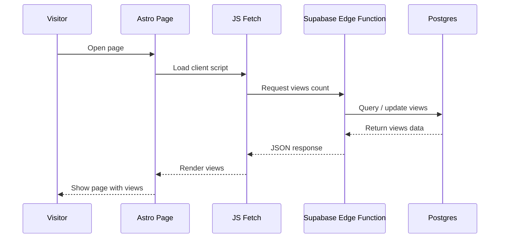

## Table of contents

## Introduction

After setting up **Astro 6**, one question immediately came to mind: How do you **track page views in Astro without Google Analytics** or any third-party scripts?

This guide shows how to build a **privacy-friendly analytics solution for Astro**, using Supabase as a backend. You will be able to **track page views**, store them in Postgres, and avoid external analytics platforms completely.

At first, it looked like there should be many ready-made solutions. There were. But after reviewing them, most were either too complex, too dependent on third-party services, or simply not something I would trust long-term.

So I built my own version.

In this article, I’ll show a complete **Astro page view counter** powered by **Supabase**, with real database storage, Edge Functions, and a tiny frontend component.

## What You Will Build

A minimal **Astro analytics system** that:

- tracks page views per page
- works with static Astro sites
- uses Supabase Edge Functions as a serverless backend
- stores data in Postgres
- avoids Google Analytics and third-party scripts

## Existing Astro Views Counter Solutions

Naturally, the first thing I did was search for existing solutions. If someone already solved this cleanly, why reinvent it?

Most existing guides focus on **basic page view counters**, but few explain how to build a **production-ready analytics backend** for Astro.

Here are the most relevant implementations I found — and why none of them fully worked for me.

[https://crockettford.dev/blog/astro-blog-views-counter](https://crockettford.dev/blog/astro-blog-views-counter)

A fairly simple implementation. Good overall, but highly specific. Best suited for people already using **Coolify** and **Docker**.

It also introduces a less native database workflow (**schema**, **connection**, **select**, **increment**), which may be unnecessary complexity for a blog owner.

[https://mvlanga.com/blog/how-to-build-a-page-view-counter-with-astro-db-actions-and-server-side-islands/](https://mvlanga.com/blog/how-to-build-a-page-view-counter-with-astro-db-actions-and-server-side-islands/)

There's a fair amount of unnecessary code here (in my opinion). A display component and two more for of updating views (**Vanilla** vs. **React**). How is one better than the other, and which should I ultimately use?

Also, the author didn't explain the data storage layer. Where does **Astro DB** connect to, and where will the view data be stored?

[https://elazizi.com/posts/add-views-counter-to-your-astro-blog-posts/](https://elazizi.com/posts/add-views-counter-to-your-astro-blog-posts/)

This is the most creative approach of the three and the simplest to set up.

However, it depends on two third-party services ([corsproxy.io](https://corsproxy.io/) and [hits.seeyoufarm.com](http://hits.seeyoufarm.com/)). If one becomes unavailable, the counter stops working. That is a weak point for long-term use.

:::warn
Unfortunately, one of the services is no longer available, so this solution no longer works.
:::

### Search Results Summary

| Solution     | Pros              | Cons                        |
| ------------ | ----------------- | --------------------------- |
| crockettford | simple setup      | stack-specific              |
| mvlanga      | native approach   | requires Astro DB knowledge |
| elazizi      | creative solution | third-party dependency      |

None of these options fully matched what I wanted.

The closest was the implementation from **mvlanga**, but it does not fully cover real database setup and production usage.

So I decided to build my own version: simple, practical, and independent **Astro page views** powered by **Supabase**.

## The Plan

We'll use **Supabase Postgres** for storage, an **Edge Function** as the backend layer, and a tiny **Astro** component on the frontend. The key design decision: all mutation logic stays in the **Edge Function**, not in the browser. This keeps the public surface area minimal — the component only calls one endpoint and renders one number.



This approach effectively creates a **serverless analytics pipeline** for tracking page views in Astro.

## Implementation

If you don't have an account with [Supabase](https://supabase.com/) yet, I'd recommend creating one, confirming your email, and creating your first project. Leave all the settings at default, we don't need that right now. After creating the project, wait a few minutes for initialization.

### Create Database

This part takes only a few minutes and gives you permanent storage for all page views. The schema is optimized for a simple **page view tracking system**, where each page is identified by its slug.

Open `SQL Editor` and paste the next script:

```sql
create table public.views (
  id bigint generated by default as identity not null,
  created_at timestamp with time zone not null default now(),
  slug text not null,
  views bigint not null default '0'::bigint,
  constraint views_pkey primary key (id),
  constraint views_slug_key unique (slug)
) TABLESPACE pg_default;
```

What this table gives you: <u>slug is unique</u> — so each page has exactly one row. `views` starts at `0` and is incremented atomically by the **Edge Function**. No application code manages row creation, the `UPSERT` in the function handles both insert and update.

See the [Supabase Table Editor docs](https://supabase.com/docs/guides/database/tables) if you prefer a visual interface over SQL.

### Configure Access Policy

After creating the table, configure access.

Open: `Authentication → Policies`

For table `views`, create policy:

- Policy Name: `Public Read`
- Policy Command: `SELECT`
- Below in the policy expression editor, immediately after the line `using`, type `true`.

All other settings remain unchanged.

:::warn
Now the table is publicly readable. For a simple page view counter with no personal data, this is usually acceptable.
:::

## Edge Function

Now comes the useful part. Supabase [Edge Functions](https://supabase.com/docs/guides/functions) run on Deno and are deployed globally. We need single public endpoint that:

1. receives a page slug
2. creates the row if missing
3. increments views atomically
4. returns the latest count

Next Edge Function acts as a **page view tracking API**. It replaces traditional analytics collectors like Google Analytics by handling view counting directly in your backend.

Open: `Edge Functions` then find the buttons `Deploy a new function → Via Editor` and paste the next code:

```ts file=views
// Setup type definitions for built-in Supabase Runtime APIs
import 'jsr:@supabase/functions-js/edge-runtime.d.ts';
import { Pool } from 'jsr:@db/postgres';

const pool = new Pool(Deno.env.get('SUPABASE_DB_URL')!, 3, true);

Deno.serve(async (req: Request) => {
  const corsHeaders = {
    'Access-Control-Allow-Origin': '*',
    'Access-Control-Allow-Methods': 'OPTIONS, POST',
    'Access-Control-Allow-Headers': 'x-client-info, apikey, content-type',
    'Content-Type': 'application/json',
  };

  if (req.method === 'OPTIONS') {
    return new Response(null, {
      status: 204,
      headers: corsHeaders,
    });
  }

  if (req.method !== 'POST') {
    return new Response(JSON.stringify({ error: 'Method not allowed' }), {
      status: 405,
      headers: corsHeaders
    });
  }

  try {
    const { slug } = await req.json();

    if (!slug) {
      return new Response(JSON.stringify({ error: 'slug is required' }), {
	      status: 400,
	      headers: corsHeaders
	    });
    }

    const db = await pool.connect();

    try {
      const result = await db.queryObject<{ views: string }>(
        `
	        insert into views (slug, views)
	        values ($1, 1)
	        on conflict (slug)
	        do update
	        set views = views.views + 1
	        returning views::text as views
        `,
        [slug]
      );

      const [row] = result.rows;

      return new Response(JSON.stringify(row.views), {
        status: 200,
        headers: corsHeaders,
      });
    } finally {
      db.release();
    }
  } catch (e) {
	  const error = e instanceof Error ? e.message : 'Something went wrong';

    return new Response(JSON.stringify({ error }), {
      status: 500,
      headers: corsHeaders,
    });
  }
});
```

### Function: What to customize

- restrict `corsHeaders` to your domain

### Function: How it works

- handles `OPTIONS` and `POST`
- validates `slug`
- uses atomic **UPSERT**
- returns updated count immediately

At the very bottom of the page in the **Function name** field, enter the name of your function `views` and click **Deploy Function**. You will then be redirected to the function settings page.

:::info
In the function settings, disable **Verify JWT with legacy secret** and click **Save changes**. This makes the function publicly callable — which is what we want for a view counter. The function is safe to expose publicly because it only accepts a slug string and performs a single `UPSERT`.
:::

### Function: Verification

At the very beginning of the function page you'll notice the address of your function, `https://.../functions/v1/views` follow that link and you should receive the following error:

```json
{ "error": "Method not allowed" }
```

Excellent, exactly what we need!

This indicates that the function is actually working and rejecting incoming **GET** requests, because in the code we explicitly specified only **OPTIONS** and **POST** requests.

This completes the server-side work.

If you'd like, you can play around with this request using tools like [Postman](https://www.postman.com/) or [Apidog](https://apidog.com/).

- Send a **POST** request to the function's address with a request body like `{"slug":"test"}`.
- Go to `Database → Tables` and verify that the new record was successfully created.

## Astro Component

This component is responsible for sending a request from the client and updates the counter without blocking rendering.

Create: `Views.astro`

```jsx file=views.astro
---
import IconEyeIcon from "@/assets/icons/IconEye.svg";

type Props = {
  slug: string;
};

const { slug } = Astro.props;
---

<span class="inline-flex items-center gap-x-2 opacity-80">
  <IconEyeIcon />
  <span class="sr-only">Views</span>
  <span id="views">…</span>
</span>

<script define:vars={{ slug }} is:inline data-astro-rerun>
  (() => {
    if (!slug) return;

    const el = document.getElementById("views");

    if (!(el instanceof HTMLElement)) return;

    const endpoint = "https://hash.supabase.co/functions/v1/views";

    const render = value => {
      el.textContent = new Intl.NumberFormat().format(Number(value));
    };

    const fallback = () => {
      el.textContent = "…";
    };

    const load = async () => {
      try {
        const res = await fetch(endpoint, {
          method: "POST",
          headers: {
            "Content-Type": "application/json",
          },
          body: JSON.stringify({ slug }),
          keepalive: true,
          credentials: "omit",
          cache: "no-store",
        });

        if (!res.ok) {
          fallback();
          return;
        }

        const value = await res.json();

        render(value);
      } catch {
        fallback();
      }
    };

    if ("requestIdleCallback" in window) {
      requestIdleCallback(load, {
        timeout: 1000,
      });
    } else {
      setTimeout(load, 0);
    }
  })();
</script>
```

### Component: What to customize

- replace the icon with your own
- replace the endpoint with your function URL

### Component: How it works

- fires on `requestIdleCallback`, so it does not block initial page render

[requestIdleCallback](https://developer.mozilla.org/en-US/docs/Web/API/Window/requestIdleCallback) schedules work during browser idle time. MDN has a full reference if you need it.

Once you've created the view counter component, you can use it as follows: declare the component's import, add it to your layout, and pass the current page's id to it.

```jsx file=layout.astro
import Views from "@/components/Views.astro";
...
<Views slug={post.id} />
```

## Prevent Fake Views

Right now every refresh counts as a new view. The simplest mitigation to prevent fake views and that requires no extra dependencies: add a `sessionStorage` check in the Astro component so the same browser tab only counts once per session.

Add this at the top of the load function:

```js file=views.astro
if (sessionStorage.getItem(slug)) return;
```

Add this after a successful fetch:

```js file=views.astro
sessionStorage.setItem(slug, "1");
```

This is a basic **anti-spam mechanism** for your tracking system. It won't stop bots or multi-tab visits, but it eliminates accidental self-inflation during development. That may be perfectly fine for a personal blog. But if you want cleaner numbers, add:

- IP cooldown
- Fingerprint deduplication
- Bot exclusion (known bots/crawlers/suspicious traffic)
- Rate limiting

Use the level of accuracy your project actually needs.

## Self-Hosted Page Views vs Analytics Platforms

If you are looking for a **Google Analytics alternative for Astro**, and only need to track page views, tools like [Google Analytics](https://developers.google.com/analytics) or [Plausible](https://plausible.io/)
are simply overkill. They load external scripts, add latency, and hand your
visitor data to a third party.

This approach is a form of **privacy-first analytics**, where no user data is shared with third parties and keeps everything under your control:

- **Full data ownership** — views live in your own Supabase Postgres,
  not someone else's dashboard
- **Minimal frontend overhead** — one small fetch call fired on idle,
  nothing injected at page load
- **Simple architecture** — one table, one Edge Function, one component.
  Easy to debug, easy to replace
- **No external dependency** — if Supabase goes down, your site still loads.
  The counter just shows `…`

## FAQ

<details><summary>Does this work with Astro static output mode?</summary>
<strong>Yes</strong>. The view counter uses a client-side fetch call, so it works with 
fully static Astro output. No server-side rendering required.
</details>

<details><summary>Will this count my own visits during development?</summary>
<strong>Yes</strong>, by default. To exclude yourself, either add an IP-based cooldown 
in the Edge Function or simply ignore the count until you deploy.
</details>

<details><summary>Is this a replacement for analytics platforms?</summary>
<strong>No</strong>. This only tracks raw page views per slug. It has no referrer data, 
session tracking, bounce rates, or geography.
</details>

## Conclusion

You now have a complete **self-hosted analytics system for Astro** — it lives in your **Postgres** table, increments atomically, and costs nothing beyond your **Supabase** plan. No third-party scripts. No data leaving your stack.

For a blog that just wants to know what people are reading, that's the whole game.
