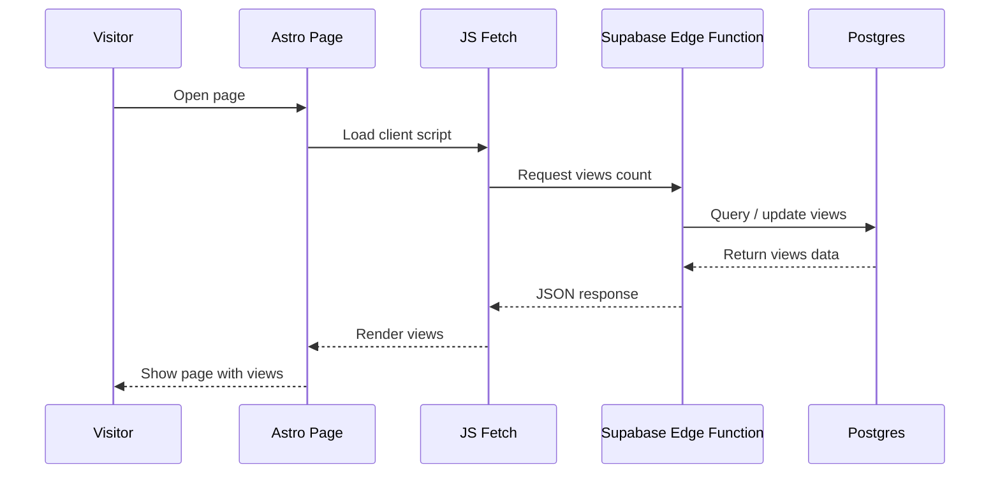

## Table of contents

## Introduction

After setting up **Astro 6**, one question immediately came to mind:

How do you add a proper **page view counter** to an Astro blog without installing a heavy analytics platform?

At first, it looked like there should be many ready-made solutions. There were. But after reviewing them, most were either too complex, too dependent on third-party services, or simply not something I would trust long-term.

So I built my own version.

In this article, I’ll show a complete **Astro page view counter** powered by **Supabase**, with real database storage, Edge Functions, and a tiny frontend component.

## Existing Astro Views Counter Solutions

Naturally, the first thing I did was search for existing solutions. If someone already solved this cleanly, why reinvent it?

Here are the most relevant implementations I found — and why none of them fully worked for me.

> [https://crockettford.dev/blog/astro-blog-views-counter](https://crockettford.dev/blog/astro-blog-views-counter)

A fairly simple implementation. Good overall, but highly specific. Best suited for people already using **Coolify** and **Docker**.

It also introduces a less native database workflow (**schema**, **connection**, **select**, **increment**), which may be unnecessary complexity for a blog owner.

> [https://mvlanga.com/blog/how-to-build-a-page-view-counter-with-astro-db-actions-and-server-side-islands/](https://mvlanga.com/blog/how-to-build-a-page-view-counter-with-astro-db-actions-and-server-side-islands/)

There's a fair amount of unnecessary code here (in my opinion). A display component and two more for of updating views (**Vanilla** vs. **React**). How is one better than the other, and which should I ultimately use?

Also, the author didn't explain the data storage layer. Where does **Astro DB** connect to, and where will the view data be stored?

> [https://elazizi.com/posts/add-views-counter-to-your-astro-blog-posts/](https://elazizi.com/posts/add-views-counter-to-your-astro-blog-posts/)

Probably the most creative approach and much simpler than previous options.

However, it depends on two third-party services ([corsproxy.io](https://corsproxy.io/) and [hits.seeyoufarm.com](http://hits.seeyoufarm.com/)). If one becomes unavailable, the counter stops working. That is a weak point for long-term use.

:::warn
Unfortunately, one of the services is no longer available, so this solution no longer works.
:::

### Search Results Summary

| Solution     | Pros              | Cons                        |
| ------------ | ----------------- | --------------------------- |
| crockettford | simple setup      | stack-specific              |
| mvlanga      | native approach   | requires Astro DB knowledge |
| elazizi      | creative solution | third-party dependency      |

None of these options fully matched what I wanted.

The closest was the implementation from **mvlanga**, but it does not fully cover real database setup and production usage.

So I decided to build my own version: simple, practical, and independent **Astro page views** powered by **Supabase**.

## The Plan

We’ll use:

- **Supabase Postgres** for storing page views
- **Supabase Edge Functions** for secure backend logic
- a lightweight **Astro component** for rendering views on the page

Small stack with clear responsibilities. All logic for updating and returning views will live in the backend.



## Implementation

If you don't have an account with [Supabase](https://supabase.com/) yet, I'd recommend creating one, confirming your email, and creating your first project. Leave all the settings at default, we don't need that right now. After creating the project, wait a few minutes for initialization.

### Create Database

This part takes only a few minutes and gives you permanent storage for all page views.

Open `SQL Editor` and paste the next script:

```sql
create table public.views (
  id bigint generated by default as identity not null,
  created_at timestamp with time zone not null default now(),
  slug text not null,
  views bigint not null default '0'::bigint,
  constraint views_pkey primary key (id),
  constraint views_slug_key unique (slug)
) TABLESPACE pg_default;
```

It will create ready for work table for your analytics views. That’s it — just a table with numbers.

### Configure Access Policy

After creating the table, configure access.

Open: `Authentication → Policies`

For table `views`, create policy:

- Policy Name: `Public Read`
- Policy Command: `SELECT`
- Below in the code editor, immediately after the line `using`, type `true`.

All other settings remain unchanged.

:::warn
Now the table is publicly readable. For a simple page view counter with no personal data, this is usually acceptable.
:::

## Edge Function

Now comes the useful part. We need one public endpoint that:

1. receives a page slug
2. creates the row if missing
3. increments views atomically
4. returns the latest count

Open: `Edge Functions` then find the buttons `Deploy a new function → Via Editor` and paste the next code:

```ts file=views
// Setup type definitions for built-in Supabase Runtime APIs
import 'jsr:@supabase/functions-js/edge-runtime.d.ts';
import { Pool } from 'jsr:@db/postgres';

const pool = new Pool(Deno.env.get('SUPABASE_DB_URL')!, 3, true);

Deno.serve(async (req: Request) => {
  const corsHeaders = {
    'Access-Control-Allow-Origin': '*',
    'Access-Control-Allow-Methods': 'OPTIONS, POST',
    'Access-Control-Allow-Headers': 'x-client-info, apikey, content-type',
    'Content-Type': 'application/json',
  };

  if (req.method === 'OPTIONS') {
    return new Response(null, {
      status: 204,
      headers: corsHeaders,
    });
  }

  if (req.method !== 'POST') {
    return new Response(JSON.stringify({ error: 'Method not allowed' }), {
      status: 405,
      headers: corsHeaders
    });
  }

  try {
    const { slug } = await req.json();

    if (!slug) {
      return new Response(JSON.stringify({ error: 'slug is required' }), {
	      status: 400,
	      headers: corsHeaders
	    });
    }

    const db = await pool.connect();

    try {
      const result = await db.queryObject<{ views: string }>(
        `
	        insert into views (slug, views)
	        values ($1, 1)
	        on conflict (slug)
	        do update
	        set views = views.views + 1
	        returning views::text as views
        `,
        [slug]
      );

      const [row] = result.rows;

      return new Response(JSON.stringify(row.views), {
        status: 200,
        headers: corsHeaders,
      });
    } finally {
      db.release();
    }
  } catch (e) {
	  const error = e instanceof Error ? e.message : 'Something went wrong';

    return new Response(JSON.stringify({ error }), {
      status: 500,
      headers: corsHeaders,
    });
  }
});
```

### Edge Function: Code Review

- restrict `corsHeaders` to your domain
- handles `OPTIONS` and `POST`
- validates `slug`
- uses atomic **UPSERT**
- returns updated count immediately

At the very bottom of the page in the **Function name** field, enter the name of your function `views` and click **Deploy Function**. You will then be redirected to the function settings page.

:::info
In the function settings, find the **Verify JWT with legacy secret** parameter and disable it. Click **Save changes**.

This is necessary for publicly calling the function by all visitors of your site.
:::

At the very beginning of this page, you'll notice the address of your function, `https://.../functions/v1/views` follow that link and you should receive the following error:

```json
{ "error": "Method not allowed" }
```

Excellent, exactly what we need!

This indicates that the function is actually working and rejecting incoming **GET** requests, because in the code we explicitly specified only **OPTIONS** and **POST** requests.

This completes the server-side work.

If you'd like, you can play around with this request using tools like [Postman](https://www.postman.com/) or [Apidog](https://apidog.com/).

- Send a **POST** request to the function's address with a request body like `{"slug":"test"}`.
- Go to `Database → Tables` and verify that the new record was successfully created.

## Astro Component

Now we connect everything to the frontend. This component sends a request after page load and updates the counter without blocking rendering.

Create: `Views.astro`

```jsx file=views.astro
---
import IconEyeIcon from "@/assets/icons/IconEye.svg";

type Props = {
  slug: string;
};

const { slug } = Astro.props;
---

<span class="inline-flex items-center gap-x-2 opacity-80">
  <IconEyeIcon />
  <span class="sr-only">Views</span>
  <span id="views">…</span>
</span>

<script define:vars={{ slug }} is:inline data-astro-rerun>
  (() => {
    if (!slug) return;

    const el = document.getElementById("views");

    if (!(el instanceof HTMLElement)) return;

    const endpoint = "https://hash.supabase.co/functions/v1/views";

    const render = value => {
      el.textContent = new Intl.NumberFormat().format(Number(value));
    };

    const fallback = () => {
      el.textContent = "…";
    };

    const load = async () => {
      try {
        const res = await fetch(endpoint, {
          method: "POST",
          headers: {
            "Content-Type": "application/json",
          },
          body: JSON.stringify({ slug }),
          keepalive: true,
          credentials: "omit",
          cache: "no-store",
        });

        if (!res.ok) {
          fallback();
          return;
        }

        const value = await res.json();

        render(value);
      } catch {
        fallback();
      }
    };

    if ("requestIdleCallback" in window) {
      requestIdleCallback(load, {
        timeout: 1000,
      });
    } else {
      setTimeout(load, 0);
    }
  })();
</script>
```

### Astro Component: Code Review

- replace icon with your own
- replace endpoint with your function URL
- uses `requestIdleCallback`
- does not block initial page render

Once you've created the view counter component, you can use it as follows: declare the component's import, add it to your layout, and pass the current page's id to it.

```jsx file=layout.astro
import Views from "@/components/Views.astro";
...
<Views slug={post.id} />
```

## Prevent Fake Views

Right now every refresh counts as a new view. That may be perfectly fine for a personal blog. But if you want cleaner numbers, add:

- IP cooldown
- Fingerprint deduplication
- Bot exclusion (known bots/crawlers/suspicious traffic)
- Rate limiting

Use the level of accuracy your project actually needs.

## Why This Approach Is Better Than Third-Party Analytics

If you only need page view counts, tools like Google Analytics or Plausible 
are simply overkill. They load external scripts, add latency, and hand your 
visitor data to a third party.

This setup keeps everything under your control:

- **Full data ownership** — views live in your own Supabase Postgres, 
  not someone else's dashboard
- **Minimal frontend overhead** — one small fetch call fired on idle, 
  nothing injected at page load
- **Simple architecture** — one table, one Edge Function, one component. 
  Easy to debug, easy to replace
- **No external dependency** — if Supabase goes down, your site still loads. 
  The counter just shows `…`

## FAQ

<details><summary>Does this work with Astro static output mode?</summary>
Yes. The view counter uses a client-side fetch call, so it works with 
fully static Astro output. No server-side rendering required.
</details>

<details><summary>Will this count my own visits during development?</summary>
Yes, by default. To exclude yourself, either add an IP-based cooldown 
in the Edge Function or simply ignore the count until you deploy.
</details>

<details><summary>Can I use this with a database other than Supabase?</summary>
Yes — any database with an HTTP-accessible endpoint works. You'd replace 
the Edge Function with your own API route and adjust the UPSERT query for 
your SQL dialect.
</details>

<details><summary>Is this a replacement for analytics platforms?</summary>
No. This only tracks raw page views per slug. It has no referrer data, 
session tracking, bounce rates, or geography.
</details>

## Conclusion

In the end, we built a simple and reliable **Astro page view counter with Supabase**.

For most blogs, this is enough to track **Astro blog views** without unnecessary complexity or heavy analytics platforms.
