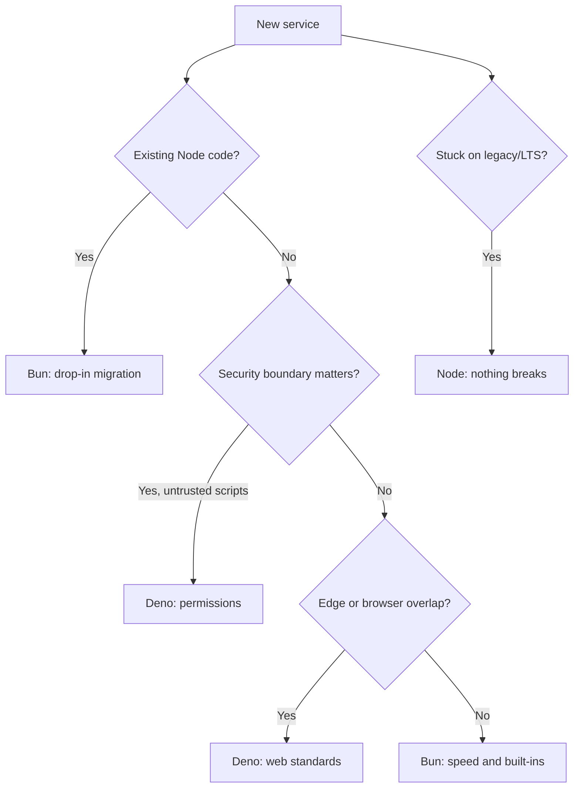

## Table of contents

## Introduction

Deno launched in 2018 with a clear pitch from Ryan Dahl: fix the things he regretted about Node.js. In practice that meant permissions enabled by default, web standards in place of CommonJS, native TypeScript, and no `node_modules` to wrangle. The original talk was titled "10 Things I Regret About Node.js," and Deno turned out to be a serious answer to all ten of them.

Years later Deno is still the cleaner runtime, but Bun is the one that keeps ending up in production.

I noticed this on a side project where I wanted to replace a small Express service and reached for Deno first. An hour in I was rewriting imports, swapping `process.env` for `Deno.env`, and porting a dependency that used a Node-only API. The same migration to Bun took twenty minutes: `bun install`, change the start script, done.

That's most of the story behind how Bun quietly won this runtime race: Deno asked the ecosystem to move, while Bun moved to where the ecosystem already was.

This post covers why that gap matters, where Bun is fast in ways you can measure, a working API you can run locally, how to deploy it, and the cases where Deno is still the right call.

## The numbers

State of JS surveys, npm download counters, and the GitHub stars chart all point in the same direction:

| Metric                          | Node.js     | Bun        | Deno      |
|---------------------------------|-------------|------------|-----------|
| GitHub stars                    | ~110k       | ~80k       | ~98k      |
| npm weekly installs (runtime)   | n/a         | ~2.1M      | ~310k     |
| State of JS usage               | 96%         | 31%        | 12%       |
| State of JS retention           | 88%         | 79%        | 41%       |

Deno passed Bun on stars years ago and never gave the lead back, largely because the early adopters loved the pitch and showed up on launch day. Retention tells a harsher story: four out of every five developers who tried Bun kept using it, while fewer than half of the people who tried Deno stuck around long enough to ship anything serious with it.

Adoption isn't really a vote on which runtime is better designed, it mostly tracks how much existing work you have to throw away to use it.

## Why Bun wins on adoption

### Drop-in Node compatibility

Bun reads your existing `package.json`, runs the same `node_modules` Node would, and implements most of the Node API surface that real services actually depend on, including `fs`, `path`, `http`, `crypto`, `child_process`, and `worker_threads`. Both CommonJS and ESM work side by side, and so do projects that mix the two in the same tree.

For an existing service, the migration usually looks like this:

```bash
# inside your Node project
bun install
bun run dev
```

That's it, most of the time. If something breaks, it's usually a native module without a Bun-compatible binary, and that list shrinks with every release.

Deno took the opposite bet from the start. The original design rejected `node_modules` entirely and asked you to import from URLs and lean on the Deno standard library instead. Compatibility with npm only arrived years later through the `npm:` import specifier, and there are still sharp edges around package resolution, lockfile semantics, and native modules that the average Node project never had to think about. By the time that compatibility layer was good enough to migrate a real service onto Deno, Bun had already taken the migration market.

### Speed you can measure

Bun is built on JavaScriptCore (the engine inside Safari) and written in Zig. Most of the standard library is implemented in native code rather than JavaScript. The difference shows up in places you don't expect:

| Task                          | Node 22  | Deno 2   | Bun 1.2 |
|-------------------------------|----------|----------|---------|
| `bun install` vs `npm install` | ~28s    | ~14s     | ~2s     |
| HTTP server req/sec (hello)   | ~52k    | ~110k    | ~165k   |
| Reading a 1MB file            | 1.0x    | 0.9x     | 3 to 4x  |
| Starting a TypeScript file    | n/a*    | ~180ms   | ~40ms   |
| SQLite query (built-in)       | n/a*    | n/a*     | ~2x faster than better-sqlite3 |

\* Requires `tsx`, `ts-node`, or a build step in Node; SQLite needs a separate package.

The install time is the one most teams notice first. Going from a 30-second `npm install` to a 2-second `bun install` rewires what a developer does between commits. CI minutes drop, Docker cold starts drop, and a fresh checkout stops being a coffee break.

### Built-ins that replace whole tool chains

Bun ships a lot in one binary:

- TypeScript and JSX run natively, without `tsx` or a build step
- `bun test`, a Jest-compatible test runner
- `bun build`, a bundler with tree-shaking
- `bun --hot`, file watcher and hot reload
- `Bun.sqlite`, embedded SQLite faster than `better-sqlite3`
- `Bun.serve`, an HTTP server faster than any Node framework
- `Bun.password`, bcrypt and argon2 without a native dep
- `bun --watch`, a built-in nodemon replacement
- Native `.env` loading, so no `dotenv`

A small service that needed seven dev dependencies on Node needs zero on Bun. That sounds like marketing copy, but it really does change how a project starts.

## Why Deno is still the safer runtime

None of the above means Deno picked wrong on security. It picked the harder problem, which is different.

### Permissions by default

Deno refuses to read your filesystem, hit the network, or read environment variables unless you grant permission explicitly, per run.

```bash
deno run main.ts                          # blocked from doing anything
deno run --allow-net --allow-env main.ts  # allowed to network + read env
deno run --allow-read=./data main.ts      # read only ./data, nothing else
```

This catches a whole category of supply chain attack. A malicious dependency in `node_modules` can scrape your `~/.aws/credentials` the moment you run `npm test`. The same dependency in Deno cannot, because the test command didn't get `--allow-read=~/.aws`.

Bun has no permission model. A Bun program runs with full user privileges, exactly like Node.

### Web standards over Node APIs

Deno's standard library targets the web platform: `fetch`, `Request`, `Response`, `Headers`, `URL`, and `crypto.subtle`. The same code runs in a browser, a service worker, a Cloudflare Worker, and a Deno process.

```ts file=server.ts
Deno.serve({ port: 8000 }, (req: Request) => {
  return new Response("Hello from Deno");
});
```

That's a complete HTTP server with no imports. The signature is the web `Request` and `Response`. Bun has `Bun.serve` with a near-identical API, but the runtime overall is more comfortable mixing Node and web styles.

:::info
If you're building edge functions or planning to run the same code across browser and server, Deno's web-first design pays off. For a backend that talks to a database and serves an API, that elegance is invisible.
:::

### Standard library you can trust

Deno's standard library is reviewed, versioned, and signed. You import `@std/http`, `@std/fs`, or `@std/encoding/hex`, and the Deno team maintains them. There's no supply chain to audit.

Node has nothing equivalent. The "standard" in Node is whatever npm package the community happens to be settled on at the moment. Bun inherited that situation, so a Bun project still pulls dozens of packages for things Deno includes natively.

## A working example: a small JSON API on Bun

We'll build a tiny URL shortener using Bun's built-in HTTP server and Bun's embedded SQLite. No dependencies.

### Project setup

```bash
mkdir shortlink && cd shortlink
bun init -y
```

`bun init` writes a `package.json`, a `tsconfig.json`, and an empty `index.ts`. It doesn't ask about ESM versus CJS or which test framework you want. It's set up.

### The server

```ts file=index.ts
import { Database } from "bun:sqlite";

const db = new Database("shortlink.db");
db.run(`
  CREATE TABLE IF NOT EXISTS links (
    code TEXT PRIMARY KEY,
    url  TEXT NOT NULL,
    created INTEGER DEFAULT (unixepoch())
  )
`);

const insert = db.prepare("INSERT INTO links (code, url) VALUES (?, ?)");
const lookup = db.prepare("SELECT url FROM links WHERE code = ?");

function makeCode() {
  return Math.random().toString(36).slice(2, 8);
}

Bun.serve({
  port: 3000,
  async fetch(req) {
    const url = new URL(req.url);

    if (req.method === "POST" && url.pathname === "/shorten") {
      const { url: target } = await req.json();
      if (!target) return new Response("missing url", { status: 400 });

      const code = makeCode();
      insert.run(code, target);
      return Response.json({ code, short: `http://localhost:3000/${code}` });
    }

    if (req.method === "GET" && url.pathname.length > 1) {
      const code = url.pathname.slice(1);
      const row = lookup.get(code) as { url: string } | null;
      if (!row) return new Response("not found", { status: 404 });
      return Response.redirect(row.url, 302);
    }

    return new Response("shortlink up", { status: 200 });
  },
});

console.log("listening on http://localhost:3000");
```

A few things to notice. `bun:sqlite` is a built-in module, so there's no `npm install` for it. The HTTP handler signature is web standard: `Request` in, `Response` out. `Response.json` and `Response.redirect` are static helpers from the Fetch spec, which is why you don't see an Express-style `res.json()`. TypeScript runs directly, with no `tsc` step and no separate build.

### Run it

```bash
bun run index.ts
```

Or with auto-reload:

```bash
bun --hot index.ts
```

`--hot` runs in-process: the module reloads, the server stays up, and open connections survive. `--watch` is also available and restarts the whole process when you want a clean slate.

Hit it:

```bash
curl -X POST http://localhost:3000/shorten \
  -H "Content-Type: application/json" \
  -d '{"url":"https://example.com/very/long/path"}'

# { "code": "x4f8za", "short": "http://localhost:3000/x4f8za" }

curl -i http://localhost:3000/x4f8za
# HTTP/1.1 302 Found
# location: https://example.com/very/long/path
```

That's a working JSON API and a persistent store in 35 lines, with zero dependencies.

## Deploying it

### The all-in-one binary

`bun build --compile` packages your code, the Bun runtime, and your assets into a single executable:

```bash
bun build --compile --minify --sourcemap \
  --target=bun-linux-x64 \
  index.ts --outfile shortlink
```

The output is a self-contained binary. You don't need to install a runtime on the target host. Copy it to a VM with `scp` and run it.

```bash
./shortlink
# listening on http://localhost:3000
```

Cross-compile targets include `bun-linux-x64`, `bun-linux-arm64`, `bun-darwin-arm64`, and `bun-windows-x64`. Useful when you build on a Mac and deploy to Linux.

### Docker

```dockerfile file=Dockerfile
# Stage 1: install
FROM oven/bun:1.2-alpine AS deps
WORKDIR /app
COPY package.json bun.lock ./
RUN bun install --frozen-lockfile --production

# Stage 2: runtime
FROM oven/bun:1.2-alpine AS runtime
WORKDIR /app
COPY --from=deps /app/node_modules ./node_modules
COPY . .
USER bun
EXPOSE 3000
CMD ["bun", "run", "index.ts"]
```

`oven/bun:1.2-alpine` is around 90 MB. The `distroless`-style equivalent (`oven/bun:1.2-distroless`) drops that to roughly 50 MB and removes the shell, with the same trade-offs covered in [the base image post](/blog/docker-base-image-types).

The `bun` image already ships a non-root `bun` user. Use it.

:::warn
Don't run `bun install` inside the runtime stage. Use a multi-stage build so dev dependencies and the Bun package cache stay out of the final image.
:::

### Serverless and edge

Bun isn't a first-class runtime on every platform yet:

| Platform              | Bun support           |
|-----------------------|-----------------------|
| Vercel (Node functions) | Use Bun as build tool, Node at runtime |
| Cloudflare Workers    | Not supported; use the Workers runtime (V8 isolates) |
| AWS Lambda            | Custom runtime, possible but unusual |
| Fly.io                | Full Bun support via Docker          |
| Railway, Render       | First-class Bun runtime              |
| Deno Deploy           | Deno only, obviously                 |

For long-running services on a container platform, Bun deploys like any other Linux binary. For edge functions, you're either on Deno (Deno Deploy, Cloudflare via the `npm:` shim) or on the platform's own V8 isolate.

## The honest comparison



The full comparison:

| Concern                   | Node.js              | Deno                  | Bun                   |
|---------------------------|----------------------|-----------------------|-----------------------|
| Engine                    | V8                   | V8                    | JavaScriptCore        |
| Written in                | C++                  | Rust                  | Zig                   |
| TypeScript                | Needs build/tsx      | Native                | Native                |
| Node compat               | n/a                  | Partial via `npm:`    | Near-complete         |
| Package manager           | npm/pnpm/yarn        | built-in              | built-in              |
| Test runner               | built-in (basic)     | built-in              | built-in (Jest-compat) |
| Bundler                   | Not included         | Not included          | built-in              |
| Permissions               | None                 | Granular              | None                  |
| Standard library          | None ("npm is std")  | Versioned, signed     | None (uses npm)       |
| Cold start                | Baseline             | Slow                  | Fast                  |
| Install speed             | Baseline             | ~2x faster            | ~10 to 15x faster     |
| HTTP throughput           | Baseline             | ~2x                   | ~3x                   |
| Maturity                  | Highest              | Mid                   | Mid (stable since 1.0) |
| Ecosystem                 | Largest              | Smaller, growing      | Borrows npm's          |

## Where Bun still bites

Bun is past 1.0 and stable for most workloads, but it isn't bug-free and there are still pockets where it bites:

1. **Native modules.** The popular ones work fine, including `sharp`, `prisma`, `bcrypt`, and `node-canvas`, but anything off the beaten path may not have a Bun-compatible binary, so it's worth checking before you commit a service to it.
2. **Edge case Node APIs.** Some corners of `vm`, `cluster`, `dgram`, and `inspector` are partial or missing. Most application code never touches them, but monitoring agents and tracing libraries occasionally do, and those are exactly the kind of integrations that don't fail loudly.
3. **No permission model.** If you run untrusted code or pull from a deep npm tree you don't audit, Deno's sandbox is the safer choice.
4. **Smaller community.** Stack Overflow answers, blog posts, and tutorials skew Node-first. The Bun docs are good, but you'll hit unfamiliar errors with fewer search results.
5. **JavaScriptCore quirks.** A handful of V8-specific optimizations don't carry over. Real-world impact is rare but exists for hot loops.

:::warn
Don't migrate a production service to Bun without running its full test suite under Bun first. The 95% compatibility is great until you land in the 5%.
:::

## FAQ

<details><summary>Does Bun replace Node in production?</summary>
For a new service, yes, and most teams that try it end up keeping it. For an existing service, the safer pattern is to migrate a non-critical one first, run it in production for a few weeks, and then decide. The runtime itself is stable; what's harder to predict is whether a specific dependency, agent, or build tool has a Bun-shaped sharp edge that only shows up under real traffic.
</details>

<details><summary>Is Deno dead?</summary>
Far from it. Deno 2 was a strong release and the Deno Deploy platform brings in real revenue, so the project isn't going anywhere. The runtime now occupies a smaller and more opinionated niche than its founders originally hoped for, mostly edge functions, scripts that need a sandbox, and teams that genuinely want a Node-free stack, and that niche is healthy on its own terms even if it's narrower than the original ambition.
</details>

<details><summary>What about Node's built-in TypeScript support?</summary>
Node 22 added experimental type stripping via <code>--experimental-strip-types</code>, and Node 24 made it stable for a subset of TS syntax. It's progress, but Bun's TypeScript support is faster, handles JSX, and works without flags. The Node story is catching up; it isn't there yet.
</details>

<details><summary>Can I use Bun just for the package manager?</summary>
Yes, and this is how a lot of teams adopt it in the first place. Running <code>bun install</code> against a Node project produces a <code>node_modules</code> tree that Node itself can run without any further changes, so you get the 10x install speed without committing to the Bun runtime. Plenty of CI pipelines do exactly this and never touch the runtime at all.
</details>

<details><summary>What about Deno's npm compatibility: is it good enough now?</summary>
Better than it was. <code>npm:</code> specifiers, <code>node:</code> built-ins, and the Node compatibility layer cover most cases. The friction is usually around package resolution, native modules, and tools that assume a real <code>node_modules</code> on disk. Bun took the easier route by just having one.
</details>

<details><summary>Does Bun work on Windows?</summary>
Yes, since 1.1. Earlier versions were Linux and macOS only. Windows support is real but newer, so unusual workflows occasionally hit issues there first.
</details>

## Conclusion

Deno was the cleaner runtime and Bun was the more pragmatic one, and in a world where teams already had years of Node code, half-finished migrations, and a Jira backlog that had nothing to do with the runtime, the pragmatic option won by default. None of that was a referendum on engineering taste, it was a referendum on how much existing work people were willing to throw away.

The lesson isn't really about Bun or Deno, it's about how new tools spread through a working team. A tool grows fast when it removes work from people's plates, and it stalls when it asks them to redo things they already finished, which is why Bun's "your existing project just runs faster" landed and Deno's "your existing project should be rewritten" never quite did.

Both runtimes are worth knowing. If you're starting something new, install Bun and see how a fresh project feels without seven separate build tools wired together. If you're maintaining an existing Node service, try `bun install` first and judge from there, since that one command is enough to tell you whether the rest of the runtime is worth a deeper look.
