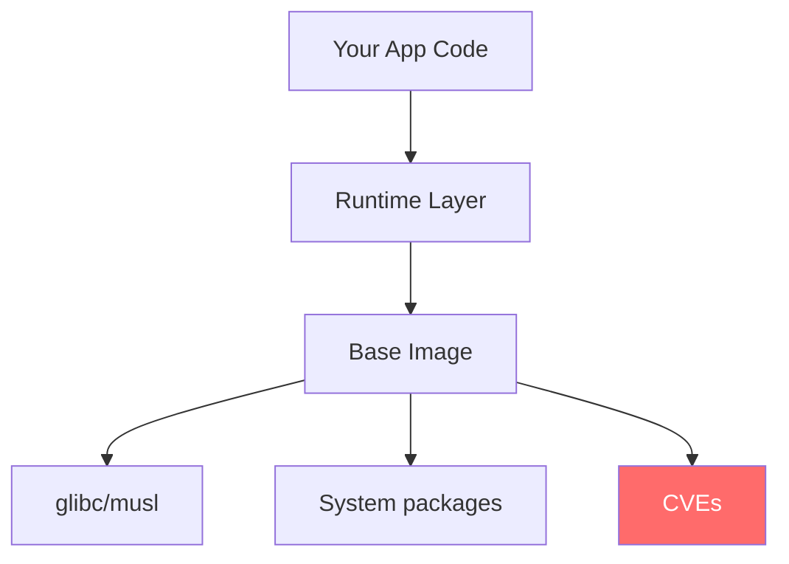
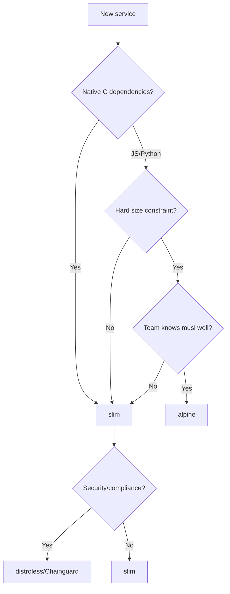

## Table of contents

## Introduction

Choosing a Docker base image — bullseye, bookworm, slim, alpine, distroless, or Chainguard Wolfi — shouldn't be this confusing. You open a blank `Dockerfile`, type `FROM`, and immediately stall — none of these names explain what they actually are, and the Docker Hub tag list doesn't help.

I've picked the wrong one more than once. A native module that refused to compile on Alpine. A CVE (Common Vulnerabilities and Exposures) scan returning 300 findings on an image I assumed was clean. A colleague asking why a 40 MB app was shipping inside a 1.2 GB container. The base image is usually somewhere in that conversation.

This is the guide I kept looking for. It's not a definitive answer (there isn't one), but enough of a picture that you can make a call you can actually explain later.

## Why the Base Image Actually Matters

Everything your container inherits flows from the base: the C library, the package manager, the pre-installed binaries, and every CVE that comes with all of them.


```mermaid caption=Typical image schema
graph TD
    A[Your App Code] --> B[Runtime Layer]
    B --> C[Base Image]
    C --> D[glibc/musl]
    C --> E[System packages]
    C --> F[CVEs]

    style F fill:#ff6b6b,color:#fff
```

A bad pick rarely explodes on day one. It surfaces six months in — a package that won't install after a Debian upgrade, 45 minutes in CI trying to figure out why `node-gyp` builds locally but not in the container. The root cause is almost always the base.

### C libraries

<details><summary>glibc (GNU C Library)</summary>

- The default on most Linux distros (Ubuntu, Debian, Fedora, RHEL, etc)
- Feature-rich, widely compatible, well-tested
- Larger in size
</details>

<details><summary>musl</summary>

- A lightweight alternative, used mainly in Alpine Linux
- Minimal, fast, small footprint
- Designed for containers and embedded systems
- Strictly follows POSIX standards (sometimes too strict, which causes compatibility issues with software built for glibc)
</details>

### The Landscape

| Image              | OS           | C library | Approx. size | Debug tools | CVE surface |
| ------------------ | ------------ | --------- | ------------ | ----------- | ----------- |
| `bookworm` (full)  | Debian 12    | glibc     | ~120 MB      | Full        | Medium–High |
| `bookworm-slim`    | Debian 12    | glibc     | ~75 MB       | Minimal     | Lower       |
| `bullseye-slim`    | Debian 11    | glibc     | ~75 MB       | Minimal     | Lower       |
| `alpine`           | Alpine Linux | musl      | ~7 MB        | Minimal     | Medium      |
| `distroless`       | Debian-based | glibc     | ~20–50 MB    | None        | Low         |
| `Chainguard Wolfi` | Wolfi        | glibc     | ~15–40 MB    | Optional    | Very Low    |

:::info
Sizes are rough, they shift with every rebuild and depend on the language runtime on top.
:::

## Debian: bookworm and bullseye

Both are full Debian images. `bookworm` is Debian 12, current stable. `bullseye` is Debian 11, old stable, with [security updates running out in the end on August 31, 2026](https://www.debian.org/releases/bullseye/)

> For anything new, pick `bookworm`. Fresh packages, longer security window, no reason not to.

`bullseye` only makes sense if you have a service locked to specific Debian 11 package versions and migrating it right now creates more risk than leaving it alone. That's a valid call for an existing service. It's not a starting position.

The full images ship with compilers, curl, git, and other things your runtime doesn't use. That's the problem bookworm-slim solves.

:::warn
`bullseye` security updates end in August 31, 2026. Running it in production after that means you're patching manually or not at all.
:::

## slim — The Boring Default That Works

`node:slim` and `python:slim` share the same Debian foundation, most non-essential packages stripped out. Same glibc, apt and smaller attack surface.

> This is my default node Docker image. It handles the vast majority of real dependency trees without drama, and fewer packages means fewer findings when a scanner runs.

### What's missing

Diagnostic tools. There is no `curl`, no `strace` by default. During an incident, if you want to poke inside the container, you'll need to install them on the fly or accept they're not there. For most production workloads, that trade is worth it.

## alpine — Small, With Conditions

Alpine gets picked because the numbers look good. A Node.js Alpine image sits around 40–50 MB. That's the whole pitch.

The actual catch is musl vs glibc. Alpine doesn't ship glibc it uses musl, a different C standard library. For a pure JavaScript service with no native extensions, this usually doesn't surface. Add anything that compiles C during `npm install` ([sharp](https://www.npmjs.com/package/sharp) or [prisma](https://www.npmjs.com/package/prisma) as example), and the trouble starts.

```mermaid caption=Workflow when project needs to compile C
graph TD
    A[npm i (native)] -->|glibc| B[Compiles fine]
    A -->|musl| C[Usually fails]
    C --> D[Debug]
    D --> E[It's musl]
    D --> F[Use slim]
```

Python is where this gets particularly painful. Not all packages publish musl-compatible wheels, so pip falls back to compiling from source. That often fails. The error messages point everywhere except the actual problem.

:::info
Alpine's size is real. The compatibility surface is narrower than most people expect. Don't pick it because the number looks good.
:::

## distroless — No Shell, No Escape Hatch

Google's distroless images strip out everything except the language runtime and its dependencies.

- No shell.
- No package manager.
- No coreutils.

Fewer packages means fewer CVEs. No shell means a compromised container is much harder to use as a foothold — an attacker with code execution inside a distroless container doesn't have a lot of options.

> The cost is operational. You can't `exec` into a running container and look around.

If something behaves strangely in production, your only window is your observability stack — logs, metrics, traces. If those are solid, distroless works well. If they're thin, you'll end up rebuilding the image just to stick a shell in for debugging.

### Dockerfile with distroless runtime

```dockerfile file=Dockerfile
# Stage 1 — Install dependencies & build
FROM node:22-slim AS builder
WORKDIR /app
COPY package.json pnpm-lock.yaml ./
RUN corepack enable && pnpm install --frozen-lockfile
COPY . .
RUN pnpm build

# Stage 2 — Runtime
FROM gcr.io/distroless/nodejs22-debian12
WORKDIR /app
COPY --from=builder /app/dist ./dist
COPY --from=builder /app/node_modules ./node_modules
CMD ["dist/main.js"]
```

One thing that surprises people: distroless still uses glibc. Native module compatibility isn't the issue it is with Alpine.

:::warn
The trade-off is purely about how much you trust your observability when something breaks.
:::

## Chainguard Wolfi — The Security-First Option

Wolfi is a lightweight Linux distribution built specifically for container security, no kernel included (use host kernel). Every image ships with an SBOM (Software Bill of Materials) and Sigstore signature.

The CVE numbers are hard to ignore. Standard Debian-based Docker Hub images average around 280 known CVEs. Chainguard images sit at zero or near-zero. When upstream security fix lands, Wolfi picks it up, new image is out within hours instead of waiting for a Debian release cycle.

:::info
Greenfield project with compliance requirements? Evaluate it properly. Everyone else wait until a scanner report makes the case for you.
:::

You can verify the image yourself without pulling or building locally:

```bash
docker scout cves node:22-slim
docker scout cves cgr.dev/chainguard/node:latest
```

[Docker Scout](https://docs.docker.com/scout/) queries the remote image registry directly and reports known CVEs for the published image layers.

## Multi-Stage Build: What Actually Moves the Needle

Regardless of which image you pick, the build structure matters as much as the base. Multi-stage build keep build-time dependencies out of the runtime layer. Compilers, dev tools, test runners stay in the builder stage and never ship.

```dockerfile file=Dockerfile
# Stage 1 — Install dependencies
FROM node:22-slim AS deps
WORKDIR /app
COPY package.json pnpm-lock.yaml ./
RUN corepack enable && pnpm install --frozen-lockfile

# Stage 2 — Build
FROM node:22-slim AS build
WORKDIR /app
COPY --from=deps /app/node_modules ./node_modules
COPY . .
RUN pnpm build

# Stage 3 — Runtime
FROM node:22-slim AS runtime
WORKDIR /app
ENV NODE_ENV=production
COPY --from=build /app/dist ./dist
COPY --from=deps /app/node_modules ./node_modules
USER node
CMD ["node", "dist/main.js"]
```

No build toolchain in production and no dev dependencies. Doesn't run as root. These three things cut a large category of scanner findings before a line of application code gets involved.

## Mistakes That Show Up Everywhere

:::warn{title="node:latest in production."}
Every CI build silently pulls whatever `:latest` is that day. Pin a version `node:22.11.0-slim`. Rebuilds become reproducible and rollbacks become possible.
:::

:::warn{title="Single-stage builds shipping dev dependencies."}
`npm install` in a single stage pulls everything, including tools you don't need at runtime. Use `npm ci --omit=dev` or better, split into stages.
:::

:::danger{title="Running as root."}
There's no good reason to leave it out. `USER node` is one line. It belongs in every runtime stage.
:::

## Decision Flow


```mermaid
flowchart TD
    A[New service] --> B{Native C dependencies?}
    B -->|Yes| C[slim]
    B -->|JS/Python| D{Hard size constraint?}
    D -->|No| C
    D -->|Yes| E{Team knows musl well?}
    E -->|Yes| F[alpine]
    E -->|No| C
    C --> G{Security/compliance?}
    G -->|Yes| H[distroless/Chainguard]
    G -->|No| I[slim]
```

:::success{title="The Winner"}
Most paths end at `slim` (bookworm-slim). That's not a coincidence — it's just a genuinely good default for most situations.
:::

## FAQ

<details><summary>Is slim safe for production?</summary>
Yes. Debian 12 stable, actively maintained, security patches come through on a regular cadence. It's what most backend services should be running.
</details>

<details><summary>Does Alpine actually make things faster?</summary>
Smaller image, faster pull. The app doesn't run faster. And if any package falls back to compiling from source on musl, the build will be slower than what you had before.
</details>

<details><summary>When should I skip distroless?</summary>
When your logging and tracing aren't solid enough to diagnose production problems without a shell. Distroless removes the escape hatch — that's the point of it, and also the risk.
</details>

<details><summary>Is Chainguard worth it for a small team?</summary>
With a compliance requirement, probably yes — it's easier than building the hardening yourself. Without one, the setup overhead is real and there are usually higher-priority things to fix first.
</details>

<details><summary>Should I stay on bullseye in 2026?</summary>
Only if migration is genuinely blocked. Security updates end on August 31, 2026. After that, you're running unpatched and the window keeps getting worse.
</details>

## Conclusion

Most paths through this decision end at `slim` as Docker base image. Not because it's clever, but because it works: glibc compatibility, active patches, a size you can live with, and a runtime you can actually debug when something breaks.

Multi-stage build, pinned version, non-root user — do all of that regardless of which image you pick. It's table stakes, not optimization.

Everything else is context-specific. Adjust when you have a concrete reason, not before.
