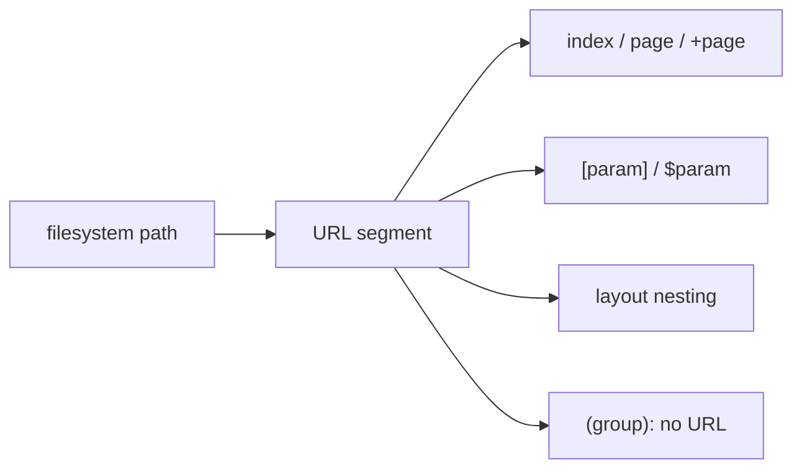

## Table of contents

## Introduction

For years, routing was something you configured. You imported a router, wrote an array of objects, matched paths to components, and hoped the config stayed in sync with the rest of the app.

It never quite did. The routes file grew long and stale. Someone renamed a component and forgot to update the path. A new developer joined, had no idea where to add a route, and picked a pattern that differed from the three already there.

File-based routing removes the config entirely. The file is the route. Put a file at `pages/about.tsx` and `/about` exists. Move the file, the URL moves. Delete the file, the route is gone. You never touch a config.

Every major full-stack framework adopted this as the primary routing mechanism: Next.js, Remix, Nuxt 3, SvelteKit, Analog. This post covers how each one works, what they share, where they differ, and the patterns worth knowing.

## What file-based routing actually is

The idea: the filesystem mirrors the URL structure. A file at a given path corresponds to a route at the same path.

```
pages/
├── index.tsx        → /
├── about.tsx        → /about
├── blog/
│   ├── index.tsx    → /blog
│   └── [slug].tsx   → /blog/:slug
└── settings/
    └── profile.tsx  → /settings/profile
```

The framework scans the directory on build (or startup in dev), discovers the files, and generates routes from the structure. You never write a route config.

Two conventions make this work:

1. **Index files** map to the parent path: `blog/index.tsx` → `/blog`
2. **Bracket syntax** marks dynamic segments: `[slug]` → `:slug`

That's the base model. Every framework builds on these two rules, with their own naming conventions layered on top.

## How each framework does it

### Next.js: App Router

Next.js has two routers. The Pages Router (the original) uses a flat `pages/` directory. The App Router uses a nested `app/` directory where **directories** define route segments, not the files themselves.

```
app/
├── page.tsx             → /
├── about/
│   └── page.tsx         → /about
├── blog/
│   ├── page.tsx         → /blog
│   └── [slug]/
│       └── page.tsx     → /blog/:slug
└── settings/
    ├── layout.tsx        ← shared layout for /settings/*
    └── profile/
        └── page.tsx      → /settings/profile
```

Special files in App Router:

| File            | Purpose                                        |
|-----------------|------------------------------------------------|
| `page.tsx`      | The route UI                                   |
| `layout.tsx`    | Shared wrapper, persists across navigation     |
| `loading.tsx`   | Shown while `page.tsx` is streaming            |
| `error.tsx`     | Error boundary for this segment                |
| `not-found.tsx` | 404 handler for this segment                   |
| `route.ts`      | API endpoint (GET, POST, etc.)                 |

```tsx file=app/blog/[slug]/page.tsx
interface Props {
  params: { slug: string };
}

export default async function BlogPost({ params }: Props) {
  const post = await getPost(params.slug);
  return <article>{post.content}</article>;
}

export async function generateStaticParams() {
  const posts = await getAllPosts();
  return posts.map(post => ({ slug: post.slug }));
}
```

`page.tsx` is an async Server Component by default. Data fetching lives in the component itself, with no separate data layer for route-level loading.

### Remix: flat file routes

Remix uses a flat file convention inside `app/routes/`. Instead of nested directories, dots act as path separators:

```
app/routes/
├── _index.tsx           → /
├── about.tsx            → /about
├── blog._index.tsx      → /blog
├── blog.$slug.tsx       → /blog/:slug
└── settings.profile.tsx → /settings/profile
```

The underscore prefix creates layout routes without adding a URL segment: `blog._index.tsx` is the index for `/blog`, while `blog.tsx` (if it exists) acts as the layout wrapper for all `/blog/*` routes.

Data loading and mutations are exported from the same file as the component:

```tsx file=app/routes/blog.$slug.tsx
import type { LoaderFunctionArgs } from "@remix-run/node";
import { useLoaderData } from "@remix-run/react";

export async function loader({ params }: LoaderFunctionArgs) {
  const post = await getPost(params.slug);
  if (!post) throw new Response("Not Found", { status: 404 });
  return { post };
}

export default function BlogPost() {
  const { post } = useLoaderData<typeof loader>();
  return <article>{post.content}</article>;
}
```

`loader` runs on the server before the component renders. `action` handles form submissions. Both live in the same file as the UI, so you don't need a separate API route for route-level data.

### Nuxt 3: pages directory

Nuxt 3 uses a `pages/` directory. Conventions are close to the original Next.js Pages Router, with Vue file extensions:

```
pages/
├── index.vue            → /
├── about.vue            → /about
├── blog/
│   ├── index.vue        → /blog
│   └── [slug].vue       → /blog/:slug
└── settings/
    └── profile.vue      → /settings/profile
```

`<NuxtPage />` and `<NuxtLayout />` handle composition. Layouts live in a separate `layouts/` directory.

```vue file=pages/blog/[slug].vue
<script setup lang="ts">
const { slug } = useRoute().params;
const { data: post } = await useFetch(`/api/posts/${slug}`);
</script>

<template>
  <article>{{ post.content }}</article>
</template>
```

`useFetch` runs on the server during SSR and on the client for subsequent navigation. Nuxt handles hydration automatically. Server-side logic goes in `server/api/` routes, separate from pages. Remix puts loaders in the same file; Nuxt keeps them apart.

### SvelteKit: plus-prefixed files

SvelteKit uses `src/routes/` with `+` prefixed files to tell route files apart from collocated components:

```
src/routes/
├── +page.svelte         → /
├── about/
│   └── +page.svelte     → /about
├── blog/
│   ├── +page.svelte     → /blog
│   └── [slug]/
│       ├── +page.svelte → /blog/:slug
│       └── +page.ts     ← load function for this route
└── settings/
    ├── +layout.svelte   ← shared layout for /settings/*
    └── profile/
        └── +page.svelte → /settings/profile
```

The `+` prefix solves a real problem: you often want helper components, utilities, or tests next to route files. Without a prefix, the framework can't tell which files are routes. With `+`, only `+page.svelte`, `+layout.svelte`, `+page.ts`, and their variants are treated as routes; everything else is just collocated.

```ts file=src/routes/blog/[slug]/+page.ts
import type { PageLoad } from './$types';

export const load: PageLoad = async ({ params, fetch }) => {
  const post = await fetch(`/api/posts/${params.slug}`).then(r => r.json());
  return { post };
};
```

```svelte file=src/routes/blog/[slug]/+page.svelte
<script lang="ts">
  export let data;
</script>

<article>{data.post.content}</article>
```

The load function and page component are separate files. `+page.ts` is optional; only create it when the route needs data.

### Analog: Angular goes filesystem-first

Analog adds file-based routing on top of Angular, which previously required manual route config in `app.routes.ts`:

```
src/app/pages/
├── index.page.ts         → /
├── about.page.ts         → /about
├── blog/
│   ├── index.page.ts     → /blog
│   └── [slug].page.ts    → /blog/:slug
└── (auth)/
    └── login.page.ts     → /login
```

Analog uses the `.page.ts` extension to identify route components. Route groups with parentheses organize files without affecting the URL.

```ts file=src/app/pages/blog/[slug].page.ts
import { Component } from '@angular/core';
import { AsyncPipe, NgIf } from '@angular/common';
import { injectLoad } from '@analogjs/router';

@Component({
  standalone: true,
  imports: [AsyncPipe, NgIf],
  template: `
    <article *ngIf="data$ | async as data">
      {{ data.post.content }}
    </article>
  `,
})
export default class BlogPostPage {
  data$ = injectLoad<typeof load>();
}

export async function load({ params }: { params: { slug: string } }) {
  const post = await getPost(params.slug);
  return { post };
}
```

Analog brings file-based routing to Angular without abandoning the DI system or standalone component model.

## What they all share

Across all five frameworks, these conventions hold:

| Convention           | How                                              |
|----------------------|--------------------------------------------------|
| Index route          | `index.tsx` / `+page.svelte` / `index.vue`      |
| Dynamic segment      | `[param]` or `$param` (Remix)                   |
| Catch-all route      | `[...slug]` / `[...params]`                     |
| Layout wrapping      | `layout.tsx` / `+layout.svelte` / wrapper file  |
| Route grouping       | `(group)`: organizational, no URL impact         |
| Nested layouts       | Directory nesting = layout nesting               |



## Dynamic routes

All frameworks use bracket syntax for dynamic segments, with small variations:

```
Next.js:    app/blog/[slug]/page.tsx
Remix:      app/routes/blog.$slug.tsx
Nuxt 3:     pages/blog/[slug].vue
SvelteKit:  src/routes/blog/[slug]/+page.svelte
Analog:     src/app/pages/blog/[slug].page.ts
```

Catch-all routes capture multiple path segments:

```
Next.js:    app/docs/[...slug]/page.tsx     → /docs/a/b/c
SvelteKit:  src/routes/docs/[...slug]/      → /docs/a/b/c
Nuxt 3:     pages/docs/[...slug].vue        → /docs/a/b/c
```

Optional catch-all (the segment may or may not be present):

```
Next.js:  app/docs/[[...slug]]/page.tsx    → /docs  AND  /docs/a/b
```

## Layouts and nesting

Nested directories create nested layouts. A layout wraps all routes in its directory and **persists across navigation**: the outer shell doesn't remount when you navigate between sibling routes.

```
app/
├── layout.tsx          ← root layout (html, body, navigation)
├── page.tsx            → /
└── settings/
    ├── layout.tsx      ← settings layout (sidebar)
    ├── profile/
    │   └── page.tsx    → /settings/profile
    └── billing/
        └── page.tsx    → /settings/billing
```

When the user navigates from `/settings/profile` to `/settings/billing`, the settings layout stays mounted. Only the inner `page.tsx` swaps. Previously you'd implement this manually with React context and conditional rendering.

In SvelteKit:

```svelte file=src/routes/settings/+layout.svelte
<nav>
  <a href="/settings/profile">Profile</a>
  <a href="/settings/billing">Billing</a>
</nav>

<slot />
```

`<slot />` is where the child `+page.svelte` renders.

## Route groups

Parentheses create route groups: organizational structure with no URL impact.

```
app/
├── (marketing)/
│   ├── layout.tsx      ← marketing layout
│   ├── page.tsx        → /
│   └── about/
│       └── page.tsx    → /about
└── (protected)/
    ├── layout.tsx      ← auth check runs here
    ├── dashboard/
    │   └── page.tsx    → /dashboard
    └── settings/
        └── page.tsx    → /settings
```

`(marketing)` and `(protected)` don't appear in the URL. The path `/about` works correctly even though the file is at `(marketing)/about/page.tsx`. This is the clean way to apply different layouts to routes at the same URL depth: one layout for public pages, another for authenticated pages.

## Advanced patterns

### Parallel routes (Next.js)

`@folder` naming lets you render multiple independent pages in the same layout simultaneously:

```
app/
├── layout.tsx
├── @team/
│   └── page.tsx
└── @analytics/
    └── page.tsx
```

```tsx file=app/layout.tsx
export default function Layout({
  children,
  team,
  analytics,
}: {
  children: React.ReactNode;
  team: React.ReactNode;
  analytics: React.ReactNode;
}) {
  return (
    <div>
      {children}
      <aside>{team}</aside>
      <aside>{analytics}</aside>
    </div>
  );
}
```

Each slot loads independently and has its own loading and error states. Use this for dashboards where sections can fail without taking down the whole page.

### Intercepting routes (Next.js)

Intercepting routes render a route inside the current layout on client navigation, but show the full page on direct load:

```
app/
├── feed/
│   └── page.tsx                       → /feed
└── photo/
    ├── [id]/
    │   └── page.tsx                   → /photo/123 (full page)
    └── (..)photo/
        └── [id]/
            └── page.tsx               ← intercepts navigation from /feed
```

Click a photo in `/feed`: it opens in a modal over the feed. Copy the URL and open it directly: you get the full-page photo view. Same URL, different presentation based on how you arrived. Instagram-style navigation, no client-side routing hacks.

### Colocation

File-based routing doesn't force you to centralize everything. Components, utilities, and tests can live next to the route they belong to:

```
app/blog/[slug]/
├── page.tsx            ← route
├── BlogHeader.tsx      ← component, only used here
├── formatDate.ts       ← utility, only used here
└── page.test.tsx       ← tests
```

Non-`page.tsx` / non-`layout.tsx` files in `app/` are not treated as routes. SvelteKit's `+` prefix makes this even more explicit: `+page.svelte` is a route, `BlogHeader.svelte` next to it is not. Put files where they're used.

## Best practices

**1. Route groups for layout boundaries, not folder tidiness.**

Use them when routes genuinely need different layouts: public vs. authenticated, marketing vs. app shell. Don't create groups just to organize folders.

```
app/
├── (public)/
│   ├── layout.tsx    ← no auth check
│   └── login/
│       └── page.tsx
└── (protected)/
    ├── layout.tsx    ← verify session here
    └── dashboard/
        └── page.tsx
```

**2. Name dynamic segments clearly.**

Avoid `[id]` everywhere. Use `[userId]`, `[postSlug]`, `[orderId]`. When routes nest, all params are available in child segments: explicit names prevent collisions and make code readable without tracing the URL structure.

**3. Colocate, don't centralize.**

Resist the pull toward a top-level `components/` folder that absorbs everything. If a component is only used in one route, put it next to that route. Extract to a shared location only when it's actually shared between routes.

**4. Keep pages thin.**

Navigation, sidebars, and headers that repeat across a section belong in a layout file. Pages should contain only the content unique to that URL. If a page is getting long, it's probably absorbing layout concerns that belong one level up.

**5. Use catch-all routes for docs and content trees.**

One file handles arbitrarily deep content:

```tsx file=app/docs/[...slug]/page.tsx
export default async function DocsPage({
  params,
}: {
  params: { slug: string[] };
}) {
  const path = params.slug?.join('/') ?? 'index';
  const page = await getDocsPage(path);
  return <MDXContent content={page} />;
}
```

This single file handles `/docs/getting-started`, `/docs/api/reference`, `/docs/api/reference/auth`, and every other path under `/docs`.

**6. Export metadata from route files.**

Next.js, SvelteKit, and Nuxt let you export SEO metadata directly from route files:

```tsx file=app/blog/[slug]/page.tsx
export async function generateMetadata({ params }: Props) {
  const post = await getPost(params.slug);
  return {
    title: post.title,
    description: post.excerpt,
    openGraph: {
      images: [post.coverImage],
    },
  };
}
```

Metadata lives with the route: no separate config file, no extra import. The title is always next to the component it describes.

## FAQ

<details><summary>Do I have to use App Router in Next.js?</summary>
The Pages Router is still supported and won't be removed. But the App Router is the default for new projects and the only place where Server Components, Server Actions, parallel routes, and intercepting routes are available. For new projects, use App Router.
</details>

<details><summary>Can I mix file-based and manual routes in the same app?</summary>
In Remix, yes: you can eject from the file convention and define routes manually in <code>vite.config.ts</code>, or mix both approaches. In Next.js, the Pages Router and App Router can coexist in the same project, serving different paths. In Nuxt and SvelteKit, file-based routing is the only mechanism; you extend it with middleware and hooks rather than replacing it.
</details>

<details><summary>What about React Router v7? Is it file-based?</summary>
React Router v7 introduced file-based routing as an optional "framework mode", powered by the same conventions as Remix after the two projects merged. You opt in via the Vite plugin, which scans your routes directory and generates route config automatically. The manual <code>createBrowserRouter</code> approach still works if you prefer it.
</details>

<details><summary>How does file-based routing affect code splitting?</summary>
Route files are automatic code-split boundaries. Each route gets its own chunk, so the framework only loads code for the route the user is on. With manual routing, you'd add <code>React.lazy()</code> for each route yourself. File-based routing makes this the default.
</details>

<details><summary>Does SvelteKit's + prefix affect imports?</summary>
No. The <code>+</code> prefix is a build-time naming convention. It doesn't affect how TypeScript resolves imports or how bundlers process the files. You can import a <code>+page.svelte</code> like any other file, though in practice you rarely need to import route files directly.
</details>

<details><summary>Why did Angular need a separate framework (Analog) for this?</summary>
Angular's core router is imperative by design: you define routes in TypeScript, which keeps it flexible and explicit. Analog didn't change the Angular router; it added a build-time layer that reads the filesystem and generates the route config for you. The result is the same Angular router underneath, with file-based conventions on top.
</details>

## Conclusion

File-based routing solved a coordination problem. When routes live in a config file separate from the components they reference, the two drift apart. Someone moves a component, the route breaks. Someone adds a route, the component never gets created. The config becomes the file nobody wants to touch.

When the file is the route, the connection is structural. A missing file means a missing route. A deleted component means a deleted route. The filesystem is the source of truth.

Every major framework converged on this independently. Not because it was trendy, but because different teams kept hitting the same problem and landing in the same place.

The differences between frameworks are real but narrow: flat files vs. nested directories, `+` prefix vs. special file names, colocated loaders vs. separate API routes. Once you understand the model, switching frameworks means learning the naming conventions, not rethinking how routing works.
