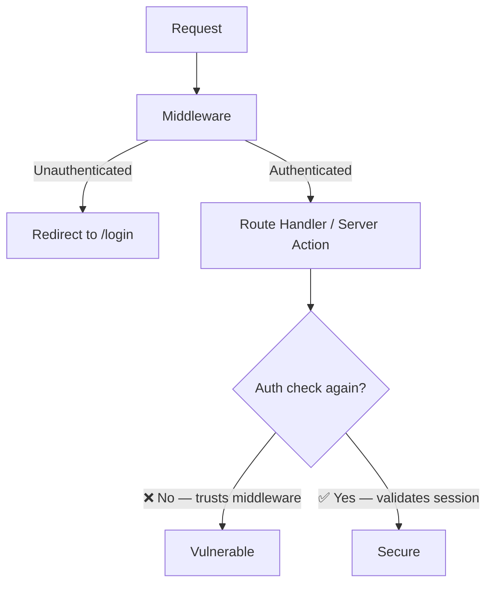

## Table of contents

## Introduction

Most security content is written for backend engineers. It talks about SQL injection, server misconfigurations, and authentication flows. Frontend gets a paragraph at the end about input sanitization, and that's it.

That used to be fine. The frontend was dumb — it rendered HTML, maybe ran some jQuery. The serious logic lived elsewhere.

That's not what frontend means anymore. In 2026, React apps handle authentication, session management, business logic, and direct database access through Server Actions. The attack surface is not smaller than the backend. In some ways it's bigger, because it's public-facing by definition and the security habits built up around it are still catching up.

This guide covers what actually gets frontend apps compromised — the old stuff that still works, and the new class of vulnerabilities that showed up the moment frameworks started owning both the client and the server.

## The Old Stuff That Still Works

Let's not skip the classics. They're classic because they keep working.

### XSS — Cross-Site Scripting

XSS happens when user input gets rendered as code instead of text. The browser can't tell the difference between your script and an attacker's — it just runs whatever shows up.

React's JSX escapes output by default, which catches the most obvious cases. The footgun is `dangerouslySetInnerHTML`:

```tsx file=BadComponent.tsx
// ❌ This will execute whatever userInput contains
function Comment({ content }: { content: string }) {
  return <div dangerouslySetInnerHTML={{ __html: content }} />;
}
```

If `content` comes from user input — even through multiple layers — and you don't sanitize it first, you have XSS. Full stop.

The fix is DOMPurify, which strips dangerous tags before they hit the DOM:

```tsx file=SafeComment.tsx
import DOMPurify from "dompurify";

function Comment({ content }: { content: string }) {
  const clean = DOMPurify.sanitize(content);
  return <div dangerouslySetInnerHTML={{ __html: clean }} />;
}
```

:::warn
`dangerouslySetInnerHTML` without sanitization is the most common XSS vector in React apps. It comes up in markdown renderers, rich text editors, user-generated content, and email templates. If you're using it anywhere, audit it.
:::

Beyond React, XSS can still sneak in through:

- `innerHTML` assignments in vanilla JS helpers
- Template literals building HTML strings
- URL parameters rendered without encoding
- Third-party widgets that inject script tags

### CSRF — Cross-Site Request Forgery

CSRF tricks a logged-in user's browser into making a state-changing request on your behalf. If your cookies are `SameSite=None` or if you're not checking origins, a malicious page can POST to your API as if it were the user.

Next.js Server Actions protect against this automatically — they compare the `Origin` header against the `Host` header and reject mismatches. But if you're still using custom API Routes that modify state, you need to handle this yourself:

```ts file=api/transfer/route.ts
export async function POST(req: Request) {
  const origin = req.headers.get("origin");
  const host = req.headers.get("host");

  // ❌ Skipping this check means CSRF is possible
  if (!origin || !origin.includes(host ?? "")) {
    return Response.json({ error: "Forbidden" }, { status: 403 });
  }

  // proceed with state mutation
}
```

And your session cookies should always have these attributes:

```ts file=setSessionCookie.ts
cookieStore.set("session", token, {
  httpOnly: true,    // not readable by JS
  secure: true,      // HTTPS only
  sameSite: "lax",   // blocks cross-site POST
  path: "/",
  maxAge: 60 * 60 * 24,
});
```

`SameSite=Lax` is the minimum. `Strict` is better for admin tools.

### The `localStorage` Token Problem

A lot of tutorials still tell you to store JWTs in `localStorage`. The reasoning is usually "it's simpler." The problem is that any XSS on your domain — yours, a CDN's, a third-party widget's — can read `localStorage` and steal the token.

`httpOnly` cookies aren't accessible to JavaScript at all. That's the whole point. An attacker with XSS execution can't steal what they can't read.

| Storage | XSS accessible | CSRF risk | Verdict |
|---|---|---|---|
| `localStorage` | Yes | No | Avoid for auth tokens |
| `sessionStorage` | Yes | No | Avoid for auth tokens |
| `httpOnly` cookie | No | Yes (mitigated by SameSite) | Prefer this |

---

## The New Stuff — What Changed When Frameworks Got Server-Side

This is where things get genuinely interesting, and where most teams are flying blind.

### CVE-2025-29927 — The Next.js Middleware Bypass

In March 2025, a CVSS 9.1 vulnerability was disclosed in Next.js. The attack was embarrassingly simple: add one header to any request and every middleware check disappears.

```bash
curl -H "x-middleware-subrequest: middleware:middleware:middleware:middleware:middleware" \
  https://your-app.com/dashboard
```

The dashboard loads. No authentication. No redirect. Nothing.

The root cause: Next.js used an internal header to prevent middleware from calling itself in infinite loops. By including that header in a request, an attacker convinced the framework the middleware had already run. The fix was in versions 12.3.5, 13.5.9, 14.2.25, and 15.2.3.

The deeper lesson is architectural. Middleware is not a security boundary:



If someone bypasses your middleware — by CVE, misconfiguration, or future bug — and every route just trusts that auth has already happened, your entire application is open.

The rule: **authenticate in every Route Handler and Server Action, regardless of what middleware did**:

```ts file=app/api/account/route.ts
import { getSession } from "@/lib/session";

export async function POST(req: Request) {
  // ✅ Always validate here, even though middleware already checked
  const session = await getSession();

  if (!session?.userId) {
    return Response.json({ error: "Unauthorized" }, { status: 401 });
  }

  // proceed
}
```

Think of middleware as the front door of a building — it checks IDs as a first pass, but every room inside still needs its own lock.

### Server Actions — The New Attack Surface

Server Actions are convenient. You call a function from your React component and server-side logic runs. No API route to write. No fetch to configure.

They also bypass the boundary that kept client-side and server-side code separate. A Server Action is just a POST endpoint — any POST endpoint. The input you receive isn't validated by TypeScript. It's whatever the caller sends:

```ts file=actions/updateProfile.ts
"use server";

// ❌ Trusts that formData is what you expect
export async function updateProfile(formData: FormData) {
  const userId = formData.get("userId");
  const role = formData.get("role"); // an attacker can send "admin" here

  await db.users.update({ where: { id: userId }, data: { role } });
}
```

Server Actions need the same validation you'd apply to any API endpoint:

```ts file=actions/updateProfile.ts
"use server";

import { z } from "zod";
import { getSession } from "@/lib/session";

const schema = z.object({
  displayName: z.string().min(1).max(100),
  bio: z.string().max(500).optional(),
});

export async function updateProfile(formData: FormData) {
  const session = await getSession();

  if (!session?.userId) {
    throw new Error("Unauthorized");
  }

  // Validate and type the input
  const parsed = schema.safeParse({
    displayName: formData.get("displayName"),
    bio: formData.get("bio"),
  });

  if (!parsed.success) {
    throw new Error("Invalid input");
  }

  await db.users.update({
    where: { id: session.userId }, // use session, not user-supplied id
    data: parsed.data,
  });
}
```

:::danger
Never use a user-supplied ID to identify who owns a resource. Pull the authenticated user ID from the session. An attacker can send any `userId` value they want in form data.
:::

### React Server Components — Source Code Leakage

When React Server Components serialize data to pass to the client, the serialization includes the function arguments and return values. In late 2025, CVE-2025-55183 demonstrated that malformed requests could cause Server Functions to return their own source code — including any hardcoded secrets, internal URLs, or helper functions inlined by the bundler.

The fix: never put secrets inside Server Actions or components. Secrets belong in environment variables that are never sent to the client:

```ts
// ❌ Hardcoded inside a component or action
const client = new SomeClient({ apiKey: "sk-prod-abc123" });

// ✅ From environment, server-only
const client = new SomeClient({ apiKey: process.env.SOME_SECRET_KEY });
```

In Next.js, prefix variables with `NEXT_PUBLIC_` only if they genuinely need to be on the client. Anything without that prefix stays server-side. Use the `server-only` package to enforce this:

```ts file=lib/db.ts
import "server-only"; // throws at build time if imported on client
```

---

## Content Security Policy — Your Last Line of Defense

CSP is a response header that tells the browser which sources are allowed to load scripts, styles, images, and other resources. If an attacker injects a script tag, CSP can still block it from running.

Most apps don't have one. Here's a working starting point for Next.js:

```ts file=middleware.ts
import { NextResponse } from "next/server";
import type { NextRequest } from "next/server";

export function middleware(request: NextRequest) {
  const response = NextResponse.next();

  response.headers.set(
    "Content-Security-Policy",
    [
      "default-src 'self'",
      "script-src 'self' 'nonce-{nonce}'", // use nonces, not unsafe-inline
      "style-src 'self' 'unsafe-inline'",  // relax for CSS-in-JS if needed
      "img-src 'self' data: https:",
      "connect-src 'self' https://api.yourdomain.com",
      "frame-ancestors 'none'",            // blocks clickjacking
    ].join("; ")
  );

  return response;
}
```

:::info
`frame-ancestors 'none'` replaces the old `X-Frame-Options: DENY` header and blocks your app from being embedded in an iframe — the primary vector for clickjacking attacks.
:::

A strict CSP with nonces is more work to set up than `unsafe-inline` but it actually blocks script injection. `unsafe-inline` defeats the purpose — if you allow all inline scripts, XSS works fine.

---

## Supply Chain Attacks — The Problem You're Probably Not Thinking About

Modern frontend projects pull in hundreds of packages. You don't audit them all. You probably don't audit any of them. That's the attack surface.

The event-stream incident (2018) was the first widely-noticed case where a malicious maintainer shipped backdoored code to millions of projects via a dependency. It wasn't the last. In 2025 and 2026 the pattern keeps repeating, typically through:

- Package maintainer account takeover
- Typosquatting (`react-dom` vs `react-dом` using a Cyrillic `о`)
- Dependency confusion (private packages resolved from public registry)

A few things reduce the risk:

**Lock your lockfile.** `package-lock.json` or `pnpm-lock.yaml` pins exact versions. Don't run `npm install` in CI without `--frozen-lockfile`.

**Enable Subresource Integrity for CDN scripts.** If you're loading anything from a CDN:

```html
<script
  src="https://cdn.example.com/lib.min.js"
  integrity="sha384-abc123..."
  crossorigin="anonymous"
></script>
```

If the CDN serves a modified file, the browser refuses to run it.

**Run `npm audit` in CI.** Not perfect — it misses unknown vulnerabilities — but it catches the known ones:

```yaml file=.github/workflows/security.yml
- name: Audit dependencies
  run: npm audit --audit-level=high
```

**Prefer fewer dependencies.** Every package you don't install is a package that can't be compromised.

---

## Security Headers Checklist

These are the headers worth setting. Most are one-liners:

```ts file=middleware.ts
const securityHeaders = [
  ["X-Content-Type-Options", "nosniff"],       // blocks MIME sniffing
  ["X-Frame-Options", "DENY"],                 // legacy clickjacking protection
  ["Referrer-Policy", "strict-origin-when-cross-origin"],
  ["Permissions-Policy", "camera=(), microphone=(), geolocation=()"],
  ["Strict-Transport-Security", "max-age=63072000; includeSubDomains; preload"],
];
```

HSTS (`Strict-Transport-Security`) tells browsers to only connect over HTTPS, even if the user types `http://`. The `preload` flag gets you into browser preload lists, which hardcodes this for first-time visitors.

---

## Quick-Check: The Questions Worth Asking Your Codebase

Before shipping, run through these. If the answer to any of them is "I'm not sure," that's the one to check first:

1. Is dangerouslySetInnerHTML used anywhere? Is it sanitized with DOMPurify?
1. Are auth tokens in httpOnly cookies, not localStorage?
1. Does every Server Action validate the session independently?
1. Does every Server Action validate and type its inputs with a schema?
1. Is Next.js up to date? (Check: https://github.com/vercel/next.js/releases)
1. Are user-supplied IDs used for resource lookups, or session IDs?
1. Is CSP configured?
1. Is npm audit running in CI?
1. Are there any hardcoded secrets in Server Actions or components?
1. Are cookies set with httpOnly, Secure, and SameSite?

---

## FAQ

<details><summary>Is React safe against XSS by default?</summary>
Mostly yes, for JSX rendered content. React escapes HTML entities automatically. The exceptions are <code>dangerouslySetInnerHTML</code>, direct DOM manipulation via <code>useRef</code>, and libraries that inject raw HTML. Those need explicit sanitization.
</details>

<details><summary>Do Server Actions need CSRF protection?</summary>
Next.js Server Actions check the <code>Origin</code> header automatically. Traditional API Routes don't. If you're mixing both, add origin checks to your Route Handlers for any state-mutating endpoints, and set <code>SameSite=Lax</code> on session cookies.
</details>

<details><summary>Is Vercel hosting safer than self-hosting Next.js?</summary>
For some things, yes. CVE-2025-29927 was patched in Vercel's infrastructure before public disclosure. Self-hosted deployments were exposed until the patch was applied manually. That's a meaningful difference if your team is slow to apply updates.
</details>

<details><summary>What's the fastest way to check if my Next.js is vulnerable?</summary>
Check your version in <code>package.json</code>. If it's below 15.2.3 (15.x branch) or 14.2.25 (14.x branch), update. For CVE-2025-29927 specifically, you can test locally by sending a request with the <code>x-middleware-subrequest</code> header to a protected route and seeing if you get redirected.
</details>

## Conclusion

The model has changed. Frontend is no longer a thin layer on top of an API — it owns session management, data access, and business logic. That means it needs to be secured like a backend.

Most of it isn't complicated. Validate inputs. Authenticate in every handler. Keep dependencies updated. Set the headers. Use `httpOnly` cookies. Don't put secrets in components.

The gap isn't knowledge — it's habit. These checks aren't part of most teams' default workflow, so they get skipped under deadline pressure and stay skipped. Getting CVE-2025-29927 was embarrassing for Next.js. Getting compromised through middleware you forgot to audit is worse.

Start with the checklist above. One item at a time.
