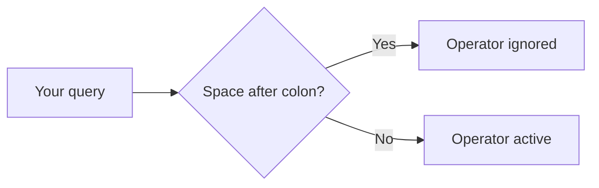
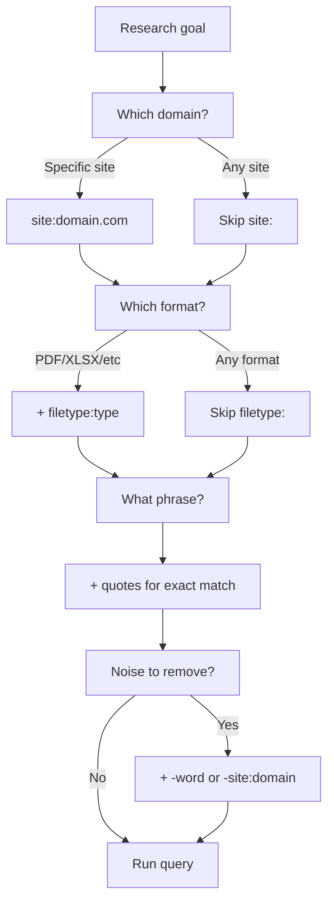

## Table of contents

## Introduction

For a long time I searched Google the same way everyone does: two or three words, scroll through whatever came back, open five tabs, close four of them. Then I added `filetype:pdf` to a query and the PDF spec I'd been hunting through blog summaries appeared in the first result.

> That was embarrassing and useful in equal measure.

This guide covers the operators that work in 2026, with examples you can copy. No deprecated commands that old SEO articles still recommend. Just the queries that actually filter results.

## The One Rule That Breaks Half Your Queries

Before anything else: **no space after the colon**.

:::success{title="Correct"}
site\:example.com
:::

:::danger{title="Wrong — operator is ignored"}
site: example.com
:::

That single space tells Google you're searching for the literal word "site:" as a keyword. The operator doesn't fire. This applies to every operator in this guide `filetype:`, `intitle:`, `inurl:`, all of them.

```mermaid caption=The One Rule That Breaks Half Your Queries
flowchart LR
    A[Your query] --> B{Space after colon?}
    B -- Yes --> C[Operator ignored]
    B -- No --> D[Operator active]
```

## The Core Operators

### `site:` — Search Inside One Domain

Restricts results to a single domain. Useful when the site's own search is weak, missing, or doesn't surface older content.

- [site\:github.com middleware](https://www.google.com/search?q=site:github.com%20middleware)

You can also scope it to a subdomain or a specific path:

- [site\:docs.docker.com authentication](https://www.google.com/search?q=site:github.com%20middleware)
- [site\:rxjs.dev/api observable](https://www.google.com/search?q=site:github.com%20middleware)

:::warn
`site:` returns an estimated count, not an exact one. Google's number is often wrong by a wide margin. Use it as a rough indicator.
:::

---

### `filetype:` and `ext:` — Find Specific File Formats

Forces Google to return only results of a specific document type. Most people skip this one entirely, which is a shame.

- [filetype\:pdf security checklist](https://www.google.com/search?q=filetype:pdf%20security%20checklist)
- [filetype\:xlsx budget template](https://www.google.com/search?q=filetype:xlsx%20budget%20template)

`ext:` works the same way.

Common formats that work reliably: `pdf`, `doc`, `docx`, `xls`, `xlsx`, `ppt`, `pptx`, `txt`, `csv`. Do you need more formats? Check this out [Common media types](https://developer.mozilla.org/en-US/docs/Web/HTTP/Guides/MIME_types/Common_types)

:::info
Combine with `site:` to search documents on a specific domain:

- [site\:nasa.gov filetype\:pdf climate report](https://www.google.com/search?q=site:nasa.gov%20filetype:pdf%20climate%20report)
- [site\:\*.gov filetype\:xlsx unemployment rates](https://www.google.com/search?q=site:*.gov%20filetype:xlsx%20unemployment%20rates)

:::

Government and university websites frequently publish spreadsheets and reports that never appear in normal search results. `site:*.gov filetype:pdf` or `site:*.edu filetype:pdf` is a fast way to find primary sources.

---

### `-` — Exclude Words or Domains

The minus sign removes results that include a specific word. One of the cleanest ways to filter noise.

- [jaguar speed -car](https://www.google.com/search?q=jaguar%20speed%20-car)
- [python tutorial -youtube](https://www.google.com/search?q=python%20tutorial%20-youtube)

You can also exclude entire domains:

- ["kubernetes ingress" -site\:stackoverflow.com -site\:reddit.com](https://www.google.com/search?q=%22kubernetes%20ingress%22%20-site:stackoverflow.com%20-site:reddit.com)

This is especially useful when you want official documentation but searches keep surfacing forum threads and blog summaries instead.

---

### `"quotes"` — Exact Phrase Match

Forces Google to match the phrase exactly, in that word order. No synonyms, no rearranging.

- ["permission denied (publickey)"](https://www.google.com/search?q=%22permission%20denied%20%28publickey%29%22)
- ["docker compose up --build"](https://www.google.com/search?q=%22docker%20compose%20up%20--build%22)

:::info
Where this shines is error messages. Paste the exact error string in quotes and the relevant Stack Overflow thread or GitHub issue comes up immediately.

- [site\:stackoverflow.com "Cannot read properties of undefined"](https://www.google.com/search?q=site:stackoverflow.com%20%22Cannot%20read%20properties%20of%20undefined%22)

:::

---

### `OR` and `|` — Either This or That

Searches for results matching one term or the other. Must be uppercase `OR`.

- [("debian bookworm" OR "debian bullseye") nginx](https://www.google.com/search?q=%28%22debian%20bookworm%22%20OR%20%22debian%20bullseye%22%29%20nginx)
- [site\:\*.com (refund OR return OR cancellation policy)](https://www.google.com/search?q=site:*.com%20%28refund%20OR%20return%20OR%20cancellation%20policy%29)

The pipe `|` does the same thing.

---

### `intitle:` and `allintitle:` — Words in the Page Title

`intitle:` requires the word to appear in the `<title>` tag. `allintitle:` requires all words in the title.

- [intitle\:"getting started" kubernetes](https://www.google.com/search?q=intitle:%22getting%20started%22%20kubernetes)
- [allintitle\:docker security](https://www.google.com/search?q=allintitle:docker%20security)

:::info
Good for finding template-style pages: guest post invitations, resource lists, documentation indexes. If a site structures it's titles consistently, `intitle:` surfaces exactly those pages.
:::

---

### `inurl:` and `allinurl:` — Words in the URL

Searches for terms inside the URL itself, not the page content. Pages are often categorized by their URL structure (`/blog/`, `/docs/`, `/api/`), so this is a fast way to find the right section.

- [site\:\*.com inurl\:blog "performance"](https://www.google.com/search?q=site:*.com%20inurl:blog%20%22performance%22)
- [site\:\*.com inurl\:docs authentication](https://www.google.com/search?q=site:*.com%20inurl:docs%20authentication)

---

### `before:` and `after:` — Filter by Date

Filters results by publication or indexation date.

- [next.js app router after\:2025-06-01](https://www.google.com/search?q=next.js%20app%20router%20after:2025-06-01)
- [docker compose v2 before\:2024-01-01](https://www.google.com/search?q=docker%20compose%20v2%20before:2024-01-01)

:::warn
These filters apply to when Google indexed the page, not necessarily when it was written. A page updated in 2023 might still surface in a `before:2022` query if it was first indexed earlier. Treat dates as a rough filter, not a hard cutoff.
:::

---

### `*` — Wildcard

Substitutes an unknown word in a phrase.

- ["how to \* in astro"](https://www.google.com/search?q=%22how%20to%20*%20in%20astro%22)
- ["\* is not defined"](https://www.google.com/search?q=%22*%20is%20not%20defined%22)

Useful when you remember the structure of a phrase but not the exact wording.

---

### `..` — Number Range

Finds values within a numeric range. Works for prices, years, version numbers.

- [laptop 800..1200 usd](https://www.google.com/search?q=laptop%20800..1200%20usd)
- [iphone 13..15 battery comparison](https://www.google.com/search?q=iphone%2013..15%20battery%20comparison)

---

## How to Build Combined Queries

Single operators are useful. Combinations are where things get precise. Here's how the pieces fit together:

```mermaid caption=How to Build Combined Queries
flowchart TD
    Start[Research goal] --> A[Which domain?]
    A -- Specific site --> B[site:domain.com]
    A -- Any site --> C[Skip site:]
    B --> D[Which format?]
    C --> D
    D -- PDF/XLSX/etc --> E[+ filetype:type]
    D -- Any format --> F[Skip filetype:]
    E --> G[What phrase?]
    F --> G
    G --> H["+ quotes for exact match"]
    H --> I[Noise to remove?]
    I -- Yes --> J["+ -word or -site:domain"]
    I -- No --> K[Run query]
    J --> K
```

## Quick Reference Table

| Goal                 | Operator    | Example                            |
| -------------------- | ----------- | ---------------------------------- |
| Limit to one site    | `site:`     | `site:developer.mozilla.org fetch` |
| Specific file format | `filetype:` | `filetype:pdf security checklist`  |
| Exact phrase         | `"..."`     | `"cannot find module"`             |
| Exclude a word       | `-`         | `react tutorial -hooks`            |
| Either of two terms  | `OR`        | `docker OR podman`                 |
| Word in title        | `intitle:`  | `intitle:"write for us"`           |
| Word in URL          | `inurl:`    | `inurl:blog astro`                 |
| After a date         | `after:`    | `after:2025-01-01`                 |
| Before a date        | `before:`   | `before:2024-06-01`                |
| Wildcard word        | `*`         | `"how to * in react"`              |
| Number range         | `..`        | `laptop 700..1000 usd`             |

## What No Longer Works in 2026

A lot of older articles still list operators that have been quietly removed. Worth knowing so you don't waste time debugging a dead query.

:::warn
The following operators are deprecated or behave unreliably:

- `cache:` — removed in 2024. Use [web.archive.org](https://web.archive.org) instead.
- `related:` — removed in 2023.
- `link:` — removed years ago. Use a dedicated backlink tool.
- `info:` — no longer returns useful output.
- `+` (forced inclusion) — replaced by quotes.
- `~` (synonym search) — gone.

If you see an article recommending any of these, check the publish date.
:::

## Where Operators Are Actually Useful

A few real workflows where search operators save meaningful time:

- **Debugging errors.** Paste the exact error string in quotes. Add the framework name. Add `after:` with a recent date. You stop seeing results about a different version of the same problem from three years ago.
- **Finding primary sources.** `site:*.gov filetype:pdf` or `site:*.edu filetype:pdf` cuts straight to government reports and academic papers rather than articles summarizing them at arm's length.
- **Auditing your own site.** `site:yourdomain.com filetype:pdf` shows what Google has indexed. Sometimes there are PDFs you forgot about, old resources that are technically public, pages you didn't mean to leave indexed.
- **Competitive research.** `site:competitor.com filetype:pdf` occasionally surfaces whitepapers and pricing documents that are technically accessible but not prominently linked. Companies upload things to their servers and forget.
- **Finding actual files.** `intitle:"template" filetype:docx contract remote` skips the listicle articles and finds downloadable files directly.

## A Note on Ethical Use

Search operators work on publicly indexed data. They filter and surface what Google has already crawled and made searchable — they're not a bypass for authentication or access controls.

Use them for research, documentation hunting, content audits, and competitive analysis. Don't use them to probe for exposed credentials or configuration files belonging to others. The OSINT community calls targeted operator queries "dorks," and using them to access data you're not supposed to see is a different conversation entirely.

## FAQ

Can I combine multiple operators in one query?

Yes, and that's where precision comes from. Start with one or two, check results, then add more. Stacking too many at once can return zero results because the criteria conflict.

Is `filetype:` the same as `ext:`?

In practice, yes. Both filter by file extension. `filetype:` is more commonly documented and recommended.

Why does `site:` show a weird number of results?

Google's result count for `site:` queries is an estimate, not an exact count. It's often wrong. Use it to get a rough sense of scale, not a precise figure.

Do operators work in Google Image Search?

Some do. `site:` and `filetype:` work. `intitle:` in Image Search looks for the term in the image filename. Results are less consistent than in web search.

Does Google's AI Overview affect operator results?

AI Overviews appear above results but operator queries still filter the blue-link results below. The filtering behavior hasn't changed — though AI Overviews push those results further down the page.

## Conclusion

Five operators handle most situations: `site:`, `filetype:`, `"quotes"`, `-`, and `OR`. Learn those and searches get a lot quieter. Add `intitle:`, `inurl:`, `before:`, and `after:` when you need another layer.

The gap isn't knowing these exist — it's having them ready when a search is producing garbage. Two or three operators chained together lands you on the right result instead of page three.

Copy two or three templates from the table above, swap in your own topics, and try them today. You'll notice the difference immediately.
