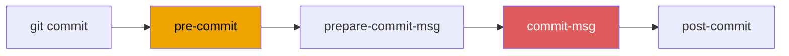
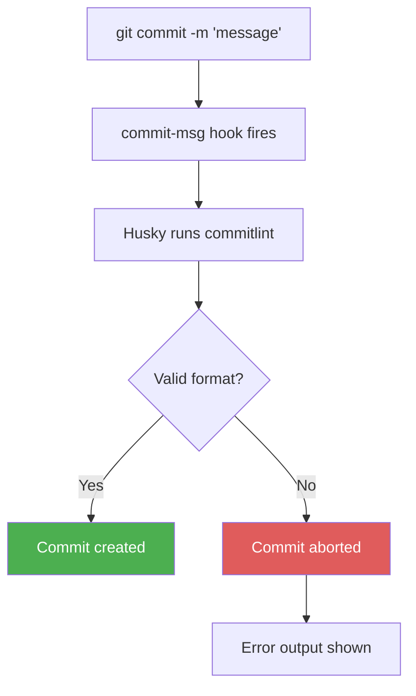

## Table of contents

## Introduction

Have you ever wondered about the meaning of commit messages? Image one day you open someone’s repo when you run `git log --oneline` and you see this:

```bash
a1b2c3d updates
e4f5g6h wip
i7j8k9l more fixes
q4r5s6t FINAL FINAL
```

That history is useless. You can't search it, can't generate a changelog from it, can't tell what broke or when. Six months later, even the person who wrote those commits won't remember what `more fixes` touched. 

This is the reason why you need to use [git commit message convention](https://www.conventionalcommits.org/en/v1.0.0/)

Git hooks exist to prevent exactly this, but knowing how to use them is only half the problem. Write a script, Git runs it before the commit lands and if the message doesn't pass, the commit doesn't happen. 

The real friction is the setup, and that's where most teams quietly give up. Hooks live in `.git/hooks`, which Git doesn't track and every new clone starts from scratch. Even if you document the setup, teammates probably ignore it, and two weeks later you're back to `wip`.

> Few npm packages and one Git hook file, and your team never writes a garbage commit message again.

[Husky](https://www.npmjs.com/package/husky) fixes the plumbing. Hooks become regular files in `.husky/`, committed to the repo, installed automatically on `npm i`. One setup, the whole team gets it.

This guide wires Husky to **Conventional Commits** via [@commitlint/cli](https://www.npmjs.com/package/@commitlint/cli) and [@commitlint/config-conventional](https://www.npmjs.com/package/@commitlint/config-conventional) — so bad messages get blocked at the moment of commit.

## Conventional Commits

The spec is simple, every commit message follows this structure:

```bash
<type>[optional scope]: <description>
```

In practice, once your team has this enforced, every commit in the repo looks like this:

- **feat:** add user registration endpoint
- **feat(auth):** implement refresh token rotation
- **fix:** resolve null pointer in payment handler
- **fix(api):** correct status code on validation failure
- **docs:** update README with environment variables
- **refactor:** extract email validation into helper

The `type` field is what makes the message machine-readable and human-scannable at the same time, below there are the most common values you'll use day to day:

| Type       | When to use                      |
|------------|----------------------------------|
| `feat`     | New feature                      |
| `fix`      | Bug fix                          |
| `refactor` | Code cleanup, no behavior change |
| `docs`     | Documentation only               |
| `chore`    | Build process, dependency bumps  |
| `test`     | Adding or fixing tests           |
| `perf`     | Performance improvement          |
| `ci`       | CI configuration                 |

The optional `scope` narrows context in bigger codebases. `fix` is vague. `fix(auth)` tells you exactly where to look.

Why does any of this matter? Three reasons that show up in daily work:

- **Changelog generation.** Tools like [release-please](https://github.com/googleapis/release-please) read your commit history and build changelogs automatically. No manual release notes.
- **History is searchable.** That works well when the format is consistent.
  - `git log --grep="^feat"` pulls every feature commit. 
  - `git log --grep="^fix(api)"` narrows to API bug fixes.
- **Code review gets faster.** A reviewer scanning 20 commits in a PR immediately knows which ones changed behavior and which were cleanup.

:::warn
None of it works without enforcement, if you left it as voluntary the format lasts about a week.
:::

## How Git Hooks Actually Work

Git has 13 client-side hooks and each named after the operation that triggers it, we care about only two:



`commit-msg` is the one we care about most, it fires after you write your message but before Git saves the commit, so if the hook rejects the format, nothing gets pushed. 

`pre-commit` runs even earlier, before the message editor opens, which makes it the right place for linting and fast tests. 

Both hooks abort the commit on failure; they just guard different things at different moments.

:::info
All Git hooks are documented in the [official Git documentation](https://git-scm.com/docs/githooks)

There are hooks for rebasing, merging, cherry-picking and worth reading once you've got the basics working.
:::

## Setup

Commitlint validates the message and Husky fires it automatically via the commit-msg hook. One config file ties the ruleset together, that's the whole stack.



### Step 1 — Install commitlint

```bash
npm i @commitlint/cli @commitlint/config-conventional --save-dev
```

`@commitlint/cli` validates and `@commitlint/config-conventional` is the ruleset — it implements the full Conventional Commits spec. You don't have to use it, but it's the right default for almost every project.

Create `.commitlintrc` in your project root:

```json file=.commitlintrc
{
  "extends": ["@commitlint/config-conventional"]
}
```

:::info
The full configuration reference is at [commitlint.js.org](https://commitlint.js.org/reference/configuration.html)

You can override individual rules, add custom types, set minimum description lengths ..etc.
:::

Test it now. Pipe a bad string straight into commitlint:

```bash
echo "qwerty" | npx commitlint
```

If everything is wired up correctly, the output should look like this:

```plain
✖   input: qwerty
✖   subject may not be empty [subject-empty]
✖   type may not be empty [type-empty]

✖   found 2 problems, 0 warnings
```

Now try the same thing with a properly formatted message and see what happens:

```bash
echo "feat: add login page" | npx commitlint
```

No output. Exit code 0. It's working.

### Step 2 — Initialize Husky

```bash
npx husky init
```

This creates a `.husky/` directory and adds a `prepare` script to `package.json` that reinstalls hooks on every `npm i`. You'll find a `.husky/pre-commit` file with placeholder content — that's confirmation it worked. Replace it with something harmless for now:

```bash file=.husky/pre-commit
echo "pre-commit hook"
```

We'll come back to `pre-commit` later. The hook we need first is `commit-msg`.

### Step 3 — Create the commit-msg Hook

Create `.husky/commit-msg`:

```bash file=.husky/commit-msg
npx --no -- commitlint --edit $1
```

That's the whole file with one command, two arguments worth understanding:

- `npx --no` — runs the local package, no fallback install if missing
- `commitlint --edit $1` — reads the commit message from the temp file Git passes as the first argument

:::warn
No `.sh` extension. Git identifies hooks by name only. `.husky/commit-msg` fires. `.husky/commit-msg.sh` does nothing.
:::

On macOS or Linux, make it executable:

```bash
chmod +x .husky/commit-msg
```

Husky usually handles this automatically. If the hook isn't firing, check this first.

## Testing the Full Flow

Start by committing something that deliberately breaks the format, typeless message that should never make it through:

```bash
git add .
git commit -m "stuff"
```

Commitlint won't be subtle about it and you'll see something like this:

```
✖   input: stuff
✖   subject may not be empty [subject-empty]
✖   type may not be empty [type-empty]

✖   found 2 problems, 0 warnings
husky - commit-msg script failed (code 1)
```

Husky intercepts it before Git records anything and commit never happened. Now try the same thing with a message that actually follows the convention:

```bash
git commit -m "feat: add husky configuration"
```

That one goes through cleanly the full flow is working end to end.

## Customizing commitlint Rules

The default `@commitlint/config-conventional` ruleset covers most projects out of the box, but you can loosen restrictions or add custom types by extending the config:

```json file=.commitlintrc
{
  "extends": ["@commitlint/config-conventional"],
  "rules": {
    "subject-case": [0],
    "body-max-line-length": [1, "always", 100],
    "type-enum": [
      2,
      "always",
      [
        "feat", 
        "fix", 
        "docs", 
        "refactor", 
        "test", 
        "chore", 
        "perf", 
        "ci", 
        "revert", 
        "wip"
      ]
    ]
  }
}
```

The numbers next to each rule aren't arbitrary, commitlint uses a three-level severity system that controls whether a rule blocks the commit or just warns:

| Level | Meaning                       |
|-------|-------------------------------|
| `0`   | Disabled                      |
| `1`   | Warning (commit goes through) |
| `2`   | Error (commit blocked)        |

A few rules are worth adjusting before you share this with the team:

- **`subject-case`** — default enforces `lower-case` descriptions. Set to `[0]` if your team writes sentence case.
- **`type-enum`** — add `wip` to allow work-in-progress commits locally without the hook blocking you.
- **`scope-enum`** — if your project has defined scopes (`auth`, `api`, `ui`), enforce them here so typos don't slip through.

:::info
Full rule reference: [commitlint.js.org/reference/rules](https://commitlint.js.org/reference/rules)

Every rule documents it's valid values and default behavior.
:::

## Adding More Hooks

`commit-msg` validates messages it is a one hook of 13. The pattern for any hook is the same, just create a file in `.husky/` named after it.

**Lint before every commit:**

```bash file=.husky/pre-commit
npx eslint . --ext .js,.ts
```

**Run tests before push:**

```bash file=.husky/pre-push
npm test
```

**Block direct pushes to main:**

```bash file=.husky/pre-push
branch=$(git rev-parse --abbrev-ref HEAD)
if [[ "$branch" == "main" ]]; then
  echo "Direct push to main is not allowed"
  exit 1
fi
```

:::warn
Keep hooks fast. A `pre-commit` that takes 30 seconds will get disabled or bypassed within a week. Run only what's essential locally and push everything heavy to CI.
:::

## Sharing Hooks With the Team

This is the actual reason Husky exists — not just to make hooks easier, but to make them sharable.

Raw `.git/hooks` files aren't tracked by Git. They exist on your machine and nowhere else, which means every new clone starts with no hooks at all. You document the setup, teammates ignore it, and the hooks quietly die.

Husky moves hooks into `.husky/`, a normal directory that gets committed. When someone clones the repo and runs `npm i`, the `prepare` script fires:

```json file=package.json
{
  "scripts": {
    "prepare": "husky"
  }
}
```

Husky reads `.husky/` and installs everything into `.git/hooks` automatically. No documentation to read, no script to remember. Clone the repo, run `npm i`, and the hooks are already in place.

:::info
The `prepare` lifecycle script runs on every `npm i`, including fresh clones. New team members get the hooks without pain and doing anything extra.
:::

## Bypassing Hooks When You Need To

Sometimes you need to skip them — emergency hotfixes, fixup commits before an interactive rebase, committing generated files.

```bash
git commit --no-verify -m "chore: generated file update"
```

`--no-verify` skips both `pre-commit` and `commit-msg`. Use it deliberately, not as a reflex.

:::warn
If `--no-verify` shows up regularly in your team's workflow, the hooks are too strict or too slow. Fix the hooks — don't normalize bypassing them.
:::

## Project Structure After Setup

```
your-project/
├── .husky/
│   ├── commit-msg       ← runs commitlint
│   └── pre-commit       ← optional: linting, etc.
├── .commitlintrc        ← commitlint config
├── package.json         ← prepare script lives here
└── ...
```

`.husky/` and `.commitlintrc` belong in version control — that's the whole point. Commit both. That's what makes this work for everyone, not just you.

## What You Actually Get

A month of enforced Conventional Commits looks like this:

```bash
git log --oneline

a1b2c3d feat(auth): add OAuth2 integration
e4f5g6h fix(api): handle empty response body
i7j8k9l refactor: extract validation helpers
m1n2o3p docs: update setup instructions
q4r5s6t feat: add dark mode toggle
```

Every line is readable and searchable it tells you exactly what changed and where to look. Compare that to `updates`, `wip`, `FINAL FINAL` history at the top of this post.

## FAQ

<details><summary>Does this work with non-npm projects?</summary>
Husky needs Node.js for installation, but the hooks themselves are plain shell scripts. If your project uses another language, you can install Husky as a dev dependency just for tooling. Alternatively, <a href="https://pre-commit.com">pre-commit</a> (Python ecosystem) or <a href="https://github.com/evilmartians/lefthook">Lefthook</a> (language-agnostic) cover the same ground.
</details>

<details><summary>What if someone doesn't have Node installed?</summary>
The <code>prepare</code> script fails silently — nothing breaks. Non-Node contributors just won't have the hooks locally. CI is your safety net for that case.
</details>

<details><summary>Does this work with pnpm or yarn?</summary>
Yes. The setup is identical. Replace <code>npm install</code> with your package manager. The <code>prepare</code> lifecycle script works the same way across npm, pnpm, and yarn.
</details>

<details><summary>How do merge commits get handled?</summary>
Merge commits generated by Git — like <code>Merge branch 'feature' into 'main'</code> — don't match the Conventional Commits format. commitlint detects they're machine-generated and skips validation automatically.
</details>

<details><summary>Should I enforce this in CI too?</summary>
Yes. <code>--no-verify</code> exists, so local hooks aren't airtight. Add a CI step that runs commitlint against the PR's commits. Local hooks give fast feedback. CI gives actual enforcement.
</details>

## Conclusion

Git hooks have been there the whole time. The friction was never the feature — it was the setup. Files that don't get committed, scripts copied manually, teammates who never ran the setup because it wasn't `npm i`.

Husky removes all of that. Two packages, one config file, one hook. Commit the `.husky/` folder, and the whole team has the same rules from day one.

Set it up once. Stop thinking about it. Start reading your `git log` without closing the terminal in frustration.