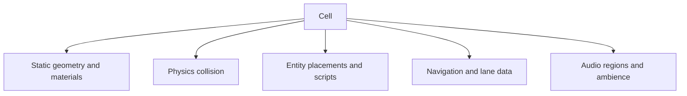
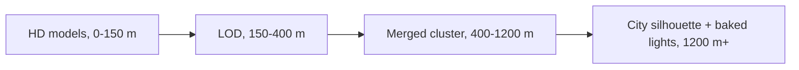
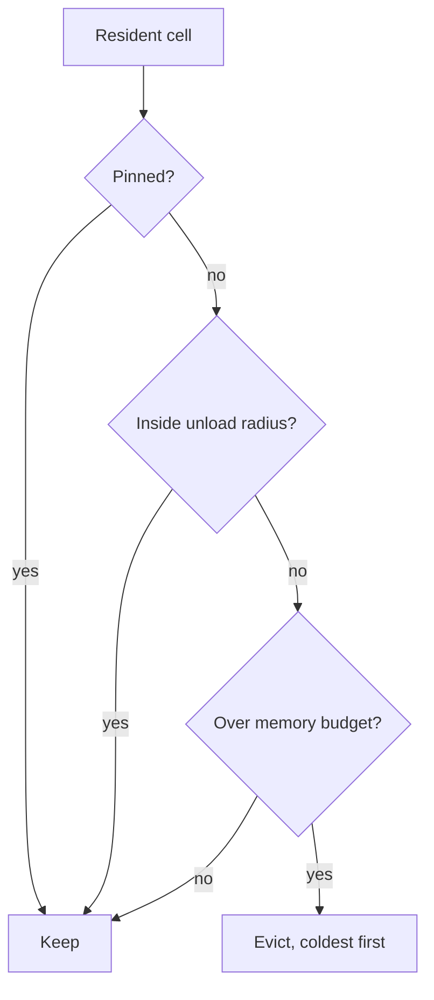
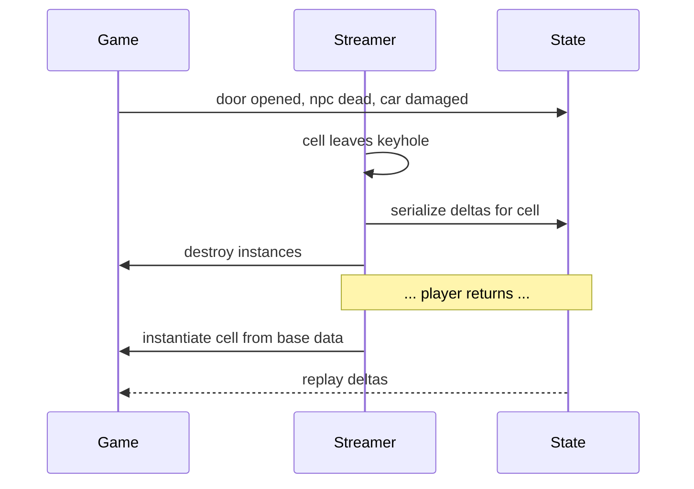

## Table of contents

## Introduction

Drive across the city at 40 km/h and everything is perfect. Steal a jet, climb to 500 meters, point the nose at the far side of the map, and the world starts eating itself: buildings arrive as grey blocks, a bridge appears after you flew through where it should have been, the frame time spikes every time a new chunk lands. Nothing crashed. The streaming system is doing what it was told, and what it was told was wrong.

Level streaming looks like an I/O problem and behaves like a scheduling problem. You have a fixed memory budget, a fixed disk bandwidth, a fixed frame budget, and a player who moves faster than any of them refill. The job is deciding what to spend those budgets on in the next 200 milliseconds.

The shape most open worlds converge on is a **keyhole**: a small sphere around the player plus a long narrow wedge in the direction of travel. Below is how you get there, what has to sit on top of it, and where streaming quietly breaks.

## The three budgets

Every streaming decision trades against one of three limits, and they fail differently.

| Budget | Typical figure | What running out looks like |
| ------ | -------------- | --------------------------- |
| Memory | 3-5 GB for world data on console | Hard crash, or eviction thrash |
| Disk bandwidth | 50 MB/s HDD, 2-9 GB/s NVMe | Pop-in, holes in the world |
| Frame time | 1-2 ms per frame for streaming work | Hitches on chunk arrival |

:::info
These are independent. An NVMe drive fixes the second one and does nothing for the other two. Fast SSDs did not delete streaming systems, they moved the bottleneck from "can I read the bytes in time" to "can I decompress, instantiate and register them without blowing the frame".
:::

The unit everything is measured in is a **cell**: a fixed region of the world, usually a grid square of 64-256 m, holding its static geometry, collision, entity placements, navigation data, and audio regions. Cells are the granularity of loading, eviction, and every decision below.

## Why the sphere fails

The obvious system is a radius. Load every cell whose center is within `R` of the player, unload the rest. It works, and it stops working for two reasons at once.

**Cost grows quadratically.** Cells inside a disc of radius `R` scale with `R²`. Doubling how far you see costs four times the memory, and if you stream vertically for aircraft, it's `R³`.

```text
cells ≈ π * R² / cell_size²

R = 400 m, cell = 128 m  ->  ~31 cells
R = 800 m, cell = 128 m  ->  ~123 cells
```

**Speed sets a floor on `R`.** The radius has to be large enough that a cell finishes loading before the player reaches it. That's a deadline:

```text
R_min = v * t_load + cell_size

v         player speed, m/s
t_load    request to fully registered, seconds
```

A car at 40 m/s with a 1.5 s pipeline needs about 190 m of lead. A jet at 120 m/s needs 610 m. Feed that back into the quadratic and the jet asks for roughly ten times the memory of the car, to look at the same city.

What makes this solvable is that the player can't see behind their own head, and can't reach sideways at 120 m/s either. A full disc buys you a world that's symmetric around a camera that isn't.

## The keyhole

Split the volume in two. A **near sphere** covers everything you could turn around and look at, or crash into, within a moment. A **far sector** covers the direction you're actually going.

```text
                    far sector
              (r = 800 m, θ = 60°)
                  \           /
                   \         /
                    \       /
                     \     /
                   ___\___/___
                  /     ^     \
                 |   player    |   near sphere
                  \___________/     (r = 150 m)
```

The union is cheap compared to what it replaces:

```text
A_keyhole = π * r_near² + (θ / 2) * (r_far² - r_near²)

r_near = 150 m, r_far = 800 m, θ = 60° = 1.047 rad

  near disc   = π * 150²                  =  70 686 m²
  far wedge   = 0.5236 * (800² - 150²)    = 323 318 m²
  keyhole     =                              394 004 m²
  full disc   = π * 800²                  = 2 010 619 m²
```

Under a fifth of the memory, with the same view distance down the road. That ratio is the whole argument: five times the budget spent on the direction the player is looking, instead of on the alley behind them.

Unreal Engine 5 exposes this directly. World Partition streaming sources take a **shape**, sphere or sector with an angle and a radius, and a source can carry several, so the keyhole is a configuration rather than custom code. Rockstar's RAGE has run the same idea across the GTA series for far longer, under map data split into cells with separate high-detail and low-detail hierarchies.

:::warn
`θ` is not the camera FOV. It has to cover FOV plus the angle the player can rotate through during `t_load`, or every fast turn streams into an empty wedge. A 70° camera on a vehicle that yaws 90°/s with a 1.5 s pipeline wants something closer to 180°, and the near sphere is what makes that survivable.
:::

## Predicting, not reacting

Centering the keyhole on the player's current position means you're always `v * t_load` meters late. Center it on where they'll be:

```text
focus = position + velocity * t_lead
```

With `t_lead` roughly equal to `t_load`, plus a margin. Two details decide whether this helps or hurts.

**Use velocity, not camera forward.** In a car you look where you drive, so the two agree. On foot with a free camera, in a drift, in reverse, or with a passenger looking out the side window, they diverge hard. Orient the far wedge along velocity, widen it toward the camera, and let the near sphere cover the rest.

**Smooth it, and clamp it.** Raw velocity from a physics body is noisy, and a wedge that snaps around per frame requests and cancels cells for a living. Low-pass the direction, and cap `t_lead` so a car briefly hitting 200 km/h doesn't fling the focus point across the map and evict everything the player is standing in.

```csharp file=StreamingFocus.cs
using UnityEngine;

public sealed class StreamingFocus : MonoBehaviour
{
    const float TLead = 1.5f;      // seconds, match the load pipeline
    const float MaxLead = 400f;    // meters, clamp for teleports and stunts
    const float Smoothing = 0.1f;  // per-second retention of the old direction

    Vector3 _dir = Vector3.forward;

    public Vector3 Focus { get; private set; }

    public void Tick(Vector3 position, Vector3 velocity, Vector3 cameraForward, float dt)
    {
        float speed = velocity.magnitude;

        // Below walking speed the velocity direction is meaningless, fall back to camera.
        Vector3 raw = speed > 1f ? velocity / speed : cameraForward;

        _dir = Vector3.Slerp(_dir, raw, 1f - Mathf.Pow(Smoothing, dt)).normalized;

        float lead = Mathf.Min(speed * TLead, MaxLead);
        Focus = position + _dir * lead;
    }
}
```

## What actually lives in a cell

"Load the cell" hides five different loads with five different costs, and they don't become visible at the same time.



Collision matters far earlier than materials, because falling through a road the player can already see is worse than a road with the wrong texture. Navigation data matters before entities, since an NPC that spawns without a navmesh under it stands still or slides. So cells aren't atomic: split each payload into its own request with its own priority, and let geometry arrive last. This is also why the nav and traffic layers get their own radii, usually much shorter than the visual one. An NPC 700 m away doesn't need simulating, only [the traffic system's cheaper meso layer does](/blog/ai-traffic-simulation-idm-mobil), and [the NavMesh has to exist before agents on it will move](/blog/unity-navmesh-ai-navigation).

## Priority is a scheduling problem

Once several hundred payloads are in flight, the keyhole has told you *what* is eligible. Something still has to decide the order, and distance alone is a bad answer: a small collision payload 300 m ahead beats a 40 MB texture set 60 m behind.

Score every request and keep the queue sorted:

```csharp file=CellPriority.cs
using UnityEngine;

public enum PayloadKind { Collision, Nav, Entities, Geometry, Audio }

public struct CellRequest
{
    public float Distance;   // meters from the focus point
    public float Angle;      // radians off the travel direction
    public long Bytes;       // read + decompress cost
    public PayloadKind Kind;
}

public static class CellPriority
{
    static float Weight(PayloadKind kind) => kind switch
    {
        PayloadKind.Collision => 4.0f,
        PayloadKind.Nav => 2.5f,
        PayloadKind.Entities => 2.0f,
        PayloadKind.Geometry => 1.0f,
        _ => 0.8f,
    };

    public static float Score(in CellRequest r, float speed)
    {
        // Time until the player can reach the cell, floored so nearby cells stay hot.
        float eta = Mathf.Max(r.Distance / Mathf.Max(speed, 5f), 0.25f);

        // Cells straight ahead beat cells at the wedge edge.
        float facing = Mathf.Max(Mathf.Cos(r.Angle), 0.1f);

        // Cheap payloads first when scores tie: they clear the queue faster.
        float cost = Mathf.Max(r.Bytes / (1024f * 1024f), 0.25f);

        return Weight(r.Kind) * facing / (eta * Mathf.Sqrt(cost));
    }
}
```

Requests stay **cancellable** until the read starts, because a player who turns around invalidates half the queue and paying for it anyway starves the cells they're now driving into. After the read starts, let it finish, or you burn bandwidth on partial reads forever.

:::danger{title="Never block the frame on a load"}
The synchronous load is right there in the API and it will be the worst hitch in your build. When gameplay genuinely can't continue without a cell, like a fast travel arrival, the answer is a fade or a corridor that buys time, not a blocking read on the game thread.
:::

## The LOD ladder

The keyhole controls what exists. LOD controls what it costs, and the two have to be designed together, because "far away" is exactly the case where full-detail assets are both invisible and unaffordable.

GTA's hierarchy is the clearest illustration: high-detail models near the camera, then a coarser LOD layer, then several levels of stitched, merged **SLOD** clusters, and finally a distant silhouette layer with baked lights standing in for a whole neighborhood. Unreal names the same idea HLOD, with clusters built offline per grid level.



What makes this work is that **each rung is a separate, much smaller payload**. The silhouette layer for the entire map can be a few dozen megabytes and simply stay resident, which is why the skyline never pops even when the buildings under it aren't loaded. Pop-in usually isn't a late asset. It's a missing rung, with nothing to show while the real one is still in flight.

:::success
The cheapest fix for visible pop is usually one more LOD rung, not a bigger streaming radius. A rung costs a fraction of the memory of extending `r_far`, and it removes the failure instead of moving it further away.
:::

Hide the swap with dithered cross-fades over a few frames, and put hysteresis on the LOD distances too: switch up at 400 m and back down at 440 m, so a player pacing the boundary doesn't flip detail levels twice a second.

## Eviction, and the thrash you will ship

Loading is the half everyone writes first. Unloading is the half that produces the bug report saying "the game stutters when I stand still". A cell right at the boundary alternates in and out as the player breathes, and each cycle is a full read, decompress, instantiate, register, destroy. Two rules stop it. **Hysteresis:** load at `R`, unload at `R * 1.2`, and keep anything in the band between them. **Cooldown:** a cell that just unloaded can't come back for a second or two, so a jittering source can't drive the pipeline.

Then the policy question. Pure LRU keeps the wrong things, since the alley you walked down once beats the highway you're about to re-enter. Pure distance evicts what you'll need again in three seconds. What survives contact with players is distance-first with pins:



**Pins** are the escape hatch: the mission's target building, the vehicle the player owns, anything a script holds a reference into. Without an explicit pin, gameplay code invents one, usually a hard reference that quietly makes a cell immortal and leaks the world.

## Streaming and game state are different systems

The trap that costs the most to fix late: letting an entity's existence depend on whether its cell is loaded.

Streaming decides what's *instantiated*. Game state decides what's *true*. If the corpse you left in an alley disappears because you walked 300 m away, that's gameplay having no state layer of its own.



Store **deltas against the authored cell**, not full snapshots: an opened door and a dead NPC id are bytes, a serialized neighborhood is megabytes. Deltas need a lifetime policy too, since something has to decide that a wrecked car from two hours ago can be forgotten while a mission-critical unlocked gate can't.

## Where the keyhole breaks

The shape is an optimization built on assumptions about how players move. Each assumption has a case that violates it.

- **The 180° turn.** A car reverses direction on a highway and the wedge sweeps behind. The near sphere has to cover a full turn's worth of travel, or handbrake turns pop. Widening `θ` at high speed is cheaper than growing `r_near`.
- **The scope.** A sniper scope narrows FOV to 10° and pushes view distance to two kilometers. This is the ideal keyhole case, since a very narrow, very long wedge is nearly free, but only if the wedge follows the camera rather than velocity while aiming.
- **Altitude.** A helicopter at 400 m sees the whole grid at a shallow angle. The answer isn't a bigger radius, it's the LOD ladder doing its job, with the far rungs resident and the wedge feeding detail along the flight path.
- **Teleports.** Fast travel, respawn, and cutscene cuts invalidate everything at once. These get an explicit prefetch call: tell the streamer the destination *before* the fade starts, and hold the fade until the near sphere is resident.
- **Extra sources.** Split screen, spectators, co-op players and a cutscene camera on a crane are all streaming sources, and you load the union of their keyholes. The memory budget doesn't double when the sources do, so per-source radii shrink as they're added.

:::warn
Interiors don't belong in the keyhole at all. A building's inside is a separate cell that no outside radius should pull in, gated by the door instead: prefetch within a few meters of the entrance, commit on the transition, unload the exterior detail behind them. Treating interiors as ordinary world cells is how a downtown block loads forty apartments nobody can see.
:::

## Keeping the frame flat

Even with perfect scheduling, the moment a cell lands is the moment you lose the frame. The work after the read is what hitches.

- **Time-slice instantiation.** Budget the registration step, 1-2 ms per frame, and spread a large cell over several frames. A cell that takes 30 ms to instantiate doesn't get to do it at once, however urgently it's needed.
- **Decompress off the game thread.** Reads, decompression, and mesh building belong on workers, with only the final registration on the main thread, since that's where the world data structures live.
- **Budget GPU uploads separately.** Texture and buffer uploads contend with rendering, not with the CPU. A few MB per frame is a typical ceiling, and blowing through it produces a hitch that a CPU profiler won't explain.

## Where the engines land

| Engine | Unit | Detail hierarchy | Notes |
| ------ | ---- | ---------------- | ----- |
| [Unreal Engine 5](https://dev.epicgames.com/documentation/en-us/unreal-engine/world-partition-in-unreal-engine) | World Partition grid cell | HLOD layers per grid level | Streaming sources with sphere or sector shapes, data layers for gameplay-driven sets |
| [Unity](https://docs.unity3d.com/Packages/com.unity.addressables@latest) | Addressable group, additive scene | LOD Group, manual imposters | Addressables handles loading, the streaming policy is yours to write |
| RAGE (GTA) | Map data cell, IPL | LOD, SLOD1-3, distant lights | The reference implementation for city-scale keyhole streaming |

The engine decides how much of the pipeline you write, not what the pipeline is. Even in Unreal, where cells, HLOD and streaming sources are built in, the tuning stays yours: radii, angles, lead time, hysteresis, budgets, pins.

## Why this is hard

Every piece is straightforward on its own. A grid, a distance check, an async read, an LRU. It gets hard where they meet.

- **Prediction and scheduling fight.** The keyhole assumes the player keeps going the way they're going. Priority scoring assumes the queue drains fast enough to matter. A player weaving through traffic violates both, and the result is a cell that was requested, deprioritized, cancelled, and requested again while the road it holds was needed the whole time.
- **The failure is delayed and elsewhere.** A hitch on a bridge comes from an eviction made twenty seconds earlier, in a different part of the map, by a source the player wasn't controlling. There's no stack trace, only a memory graph.
- **Correct behavior looks like a bug.** A distant building that's a merged silhouette is the system working, and so is an NPC that doesn't exist because their cell sits outside the simulation radius. Telling those apart from real holes needs instrumentation: log every request with its score, its deadline, and whether it made it.

## FAQ

<details><summary>What exactly is keyhole streaming?</summary>
A streaming volume built from two shapes: a small sphere centered on the player, plus a long narrow sector pointing along their direction of travel. Together they look like a keyhole. It gives you long view distance where the player is going at roughly a fifth of the memory a full circle of the same radius would cost, because it stops paying for the world behind and beside them.
</details>

<details><summary>Do fast SSDs make streaming systems unnecessary?</summary>
No. They removed the disk bandwidth limit, which was the loudest of the three budgets, and left the other two untouched. Memory still caps how much world can be resident, and instantiation, decompression, and GPU upload still have to fit inside a frame. Faster storage shortens the pipeline, which lets you shrink the radii.
</details>

<details><summary>How big should a cell be?</summary>
Large enough that per-cell overhead stays small next to the payload, and small enough that one cell fits inside a frame's instantiation budget. In practice 64-256 m for a dense city. Too small and the queue is thousands of entries deep, too large and every arrival is a hitch.
</details>

<details><summary>Why does my world flicker in and out when the player stands still?</summary>
Eviction thrash at the boundary. The cell qualifies, loads, drifts a meter out, unloads, qualifies again. Add hysteresis, unloading at a larger radius than you load at, plus a cooldown before a just-unloaded cell can return. It's the most common streaming bug and it's two numbers to fix.
</details>

<details><summary>How do I keep an NPC dead after their cell unloads?</summary>
Keep game state in a layer streaming can't touch. When a cell unloads, serialize the deltas against the authored data (this door open, this NPC id dead) and replay them when it comes back. Entities are instances of state, never the storage for it.
</details>

## Conclusion

Level streaming is a negotiation between three budgets and a player who outruns all of them. The keyhole wins that negotiation by spending memory on the direction the player is going and refusing to spend it anywhere else, at about a fifth of the cost of the naive circle for the same view down the road.

Everything else hangs off it. Prediction decides where to center it, priority scoring decides what to fill it with first, the LOD ladder decides what to show while cells are in flight, hysteresis decides when to let go, and a separate state layer makes sure letting go isn't a save-game bug.

Build it in that order, log every request with its deadline, and measure `t_load` on the slowest hardware you ship on. Then accept that the grey block on the horizon isn't always a failure. Most of the time it's the cheapest rung of the ladder doing its job.
