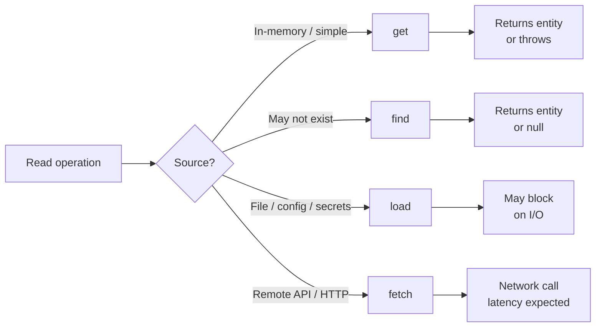
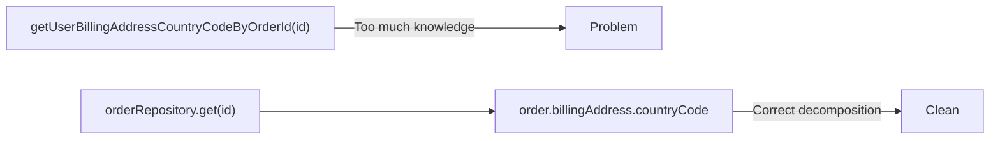

## Table of contents

## Introduction

There's a quote usually attributed to Phil Karlton:

> There are only two hard things in Computer Science: cache invalidation and naming things.

The longer I write production code, the more I think the naming half gets dismissed. Not because it's hard — it isn't. But because bad names accumulate quietly. `data`, `manager`, `helper`, `tmp`, `doStuff` — they all work today. Six months from now, nobody can tell what the system does or why.

This post covers the naming decisions I actually make in code: which verbs to pick, when prefixes pay off, how deep you can nest before names start lying to you, and what to do with a codebase full of `getX()/setX()` pairs that carry zero information.

## Why Naming Is Not Cosmetic

Martin Fowler lists bad names as a code smell. Robert C. Martin makes a simpler point in _Clean Code_: a good name saves more time than it takes to come up with one.

That plays out in concrete ways. Good names reduce comments — the name explains the intent, so there's nothing left to annotate. They reduce errors during changes: when the name is honest, you immediately see when new behavior no longer fits it. They speed up review, because a reviewer who understands the name doesn't have to trace execution to verify what something does.

And they help with decomposition. If you genuinely cannot name something, it usually does too much.

If a name doesn't explain intent, you're spending your team's time on decoding.

## The Only Question That Matters Before Naming

Before naming anything, I ask myself three things:

1. What is this?
2. Why does it exist?
3. In what context will it be used?

If the answer doesn't fit in a name, one of two things is wrong: the name is weak, or the entity does too much. Both are fixable — but you have to notice the problem first.

## `medium`, `middle`, or `mediocre`?

A simple example that shows how much word choice matters.

These three words look related but mean entirely different things:

- `middle` — a position in order or structure (center, halfway)
- `medium` — a size, level, or intensity (average, moderate)
- `mediocre` — a quality assessment (below average, not good enough)

They are not interchangeable.

```ts
// Correct — position in array
const middleIndex = Math.floor(items.length / 2);

// Correct — priority level
const mediumPriority = Priority.MEDIUM;

// Correct — business classification
const isMediocreResult = score < ACCEPTABLE_THRESHOLD;

// Wrong — "medium" doesn't mean center position
const mediumIndex = Math.floor(items.length / 2); // ❌
```

Good naming starts from domain meaning, not from "similar-sounding words." If the word doesn't match the concept, the code tells a small lie every time someone reads it.

## `add` vs `create`

This is one of the most common debates in code review. The distinction is clean once you see it:

- `create` — produces a new entity with its own identity and lifecycle
- `add` — puts an existing entity into a collection, context, or relationship

```ts
// create: new entity comes into existence
async function createUser(data: UserInput): Promise<User> { ... }
async function createOrder(cart: Cart): Promise<Order> { ... }

// add: existing entity joins a structure
async function addUserToTeam(userId: string, teamId: string): Promise<void> { ... }
async function addOrderItem(orderId: string, item: OrderItem): Promise<void> { ... }
```

The practical rule: if the method writes a new row to storage and gives it a new ID, it's probably `create`. If it changes the composition of something that already exists, it's `add`.

Where teams go wrong is using `add` for everything — `addUser`, `addProduct`, `addRecord` — until the word loses all meaning. It becomes the new `do`.

## `delete` vs `remove`

Same pattern, different axis. Here the distinction is about how final the operation is:

- `delete` — physical destruction of an entity (or an explicit soft-delete as a business action)
- `remove` — detaches a relationship or element from the current context, leaving the entity intact

```ts
// delete: the thing is gone
async function deleteUserAccount(userId: string): Promise<void> { ... }
async function deleteFilePermanently(path: string): Promise<void> { ... }

// remove: the relationship is gone, not the entity
async function removeUserFromProject(userId: string, projectId: string): Promise<void> { ... }
async function removeItemFromCart(cartId: string, itemId: string): Promise<void> { ... }
```

:::warn
The important part is consistency. A team that uses `delete` and `remove` randomly — or interchangeably — is building a codebase where you can't trust names at all. Agree on the distinction once, document it in your style guide, and enforce it in review.
:::

## `get`, `find`, `load`, `fetch`

These four look nearly synonymous. They shouldn't be.



Here's the semantic map I use on projects:

| Prefix  | Expectation                           | Missing entity       |
| ------- | ------------------------------------- | -------------------- |
| `get`   | entity is there                       | error / exception    |
| `find`  | entity may or may not be there        | `null` / `undefined` |
| `load`  | reading from file, config, or secrets | depends              |
| `fetch` | explicit remote call (HTTP / API)     | network error        |

```ts
// get: we expect this to exist; absence is an error
async function getUserById(id: string): Promise<User> { ... }

// find: absence is a normal outcome
async function findUserByEmail(email: string): Promise<User | null> { ... }

// load: reading from an external non-network source
async function loadConfiguration(): Promise<Config> { ... }

// fetch: explicit network call
async function fetchExchangeRates(): Promise<Rates> { ... }
```

When a team agrees on this map, reading code becomes much faster. You see `find` and immediately know to handle the null case. You see `fetch` and know there's latency involved.

## `get/set` Pairs — When They're Fine, When They're Not

`get/set` aren't inherently bad. But they have a habit of hiding design problems.

**When `get` is fine:**

- Simple, side-effect-free read on an infrastructure layer (repository, cache adapter)
- Language convention requires it (Java beans, certain ORMs)

**When to drop `get`:**

- The property can be named directly: `price()`, `status()`, `email()` are all cleaner than `getPrice()`, `getStatus()`, `getEmail()`
- The project style prefers noun-like accessors

**When `set` is fine:**

- Explicit mutation with a clear contract, on a simple value object

**When to avoid `set`:**

- The object should be immutable
- The state change has business meaning — use a domain verb instead

```ts
// Bad: "setter soup" that hides domain logic
order.setStatus("approved");
order.setApprovedAt(new Date());
order.setApprovedBy(userId);

// Good: domain action that owns the logic
order.approve(userId); // internally handles status, timestamp, validation
```

:::info
A practical test: if you have dozens of `getX()/setX()` pairs, you probably don't have an object model. You have a data bag with procedural logic wrapped around it. The names are the symptom.
:::

## Prefixes Reference

A short reference for prefixes that consistently produce clear semantics:

| Prefix                      | Use for                                 | Examples                                             |
| --------------------------- | --------------------------------------- | ---------------------------------------------------- |
| `is / has / can / should`   | boolean checks                          | `isActive`, `hasAccess`, `canRetry`, `shouldRefresh` |
| `find / get / load / fetch` | read operations                         | see table above                                      |
| `create / add`              | new entity vs adding to structure       | `createUser`, `addUserToTeam`                        |
| `update / patch`            | full vs partial update                  | `updateProfile`, `patchAddress`                      |
| `remove / delete`           | detach vs destroy                       | `removeFromCart`, `deleteAccount`                    |
| `build / compose`           | assemble an object with no side effects | `buildQuery`, `composeHeaders`                       |
| `validate / check`          | full validation vs quick check          | `validateEmail`, `checkPermission`                   |

The table is a starting point, not a contract. What matters is that your team agrees on a consistent meaning and sticks to it across the project.

## Nesting and Context Boundaries

Long names are usually a symptom, not a solution.

```ts
// This is not a "descriptive name" — it's a distress signal
getUserBillingAddressCountryCodeByOrderId(orderId: string)
```

That name tells you the context is bleeding. The function knows too much. It has crossed multiple ownership boundaries to get to a property that another object should own.



The fix is usually decomposition:

```ts
// Before
const countryCode = getUserBillingAddressCountryCodeByOrderId(orderId);

// After
const order = await orderRepository.get(orderId);
const countryCode = order.billingAddress.countryCode;
```

The name should be exactly as long as it needs to be for unambiguous identification within its scope. If the class is already named `OrderRepository`, the method doesn't need `Order` in it. If the namespace is `billing`, `AddressService` is enough.

## Naming Anti-patterns

The things worth removing in the first review pass.

**Unnecessary abbreviations.** `usr`, `cfg`, `svc`, `mgr` — they save maybe two seconds of typing and cost two seconds of decoding on every read. Over a codebase's lifetime, that's a bad trade.

**Generic filler words.** `data`, `info`, `manager`, `helper`, `util`, `handler` — these carry no information. What kind of data? Managing what? Handling which events?

```ts
// Bad
class UserManager { ... }
function processData(data: any) { ... }

// Better
class UserRegistrationService { ... }
function normalizePhoneNumber(raw: string): string { ... }
```

**Numeric suffixes.** `handler2`, `value3`, `component_new` — proof that two things need different names but nobody picked one yet.

**Mixed terminology for one concept.** Using `client`, `customer`, and `buyer` in the same codebase for the same entity creates a permanent translation layer in every reader's head. Pick one word, use it everywhere.

**Names that lie.** `getActiveUsers()` that returns all users. `isValid()` that throws instead of returning false. This is the worst category — the code says one thing, does another. Every reader has to verify the claim manually.

## A Practical Team Checklist

Most naming debates in code review are avoidable. If the team agrees on conventions before writing the code, review becomes a check, not a negotiation.

A short style guide beats a long argument:

```
1. One term per domain concept. Pick it, document it, use it everywhere.
2. create/add and delete/remove mean different things. Always.
3. find returns optional/null. get returns entity or throws.
4. Boolean fields start with is/has/can/should.
5. No generic filler names without domain meaning.
6. Before merge: does the name explain intent without a comment?
```

That last check catches the most issues. If you're writing a comment to explain what a name means, the name already failed.

## FAQ

<details><summary>Should I always avoid get/set?</summary>
No. In DTOs, infrastructure layers, and simple adapters, `get/set` is often the right call. In domain models, prefer domain action verbs — `approve()`, `cancel()`, `publish()` — over `setStatus()`.
</details>

<details><summary>What if the name gets very long?</summary>
Check your responsibility boundaries first. Long names usually mean one function knows too much. Break the chain, distribute the knowledge, and the name will shorten on its own.
</details>

<details><summary>Are abbreviations ever okay?</summary>
Yes — when they're universally recognized in the domain: `URL`, `ID`, `HTTP`, `SQL`. Avoid local or project-specific abbreviations that readers have to memorize.
</details>

<details><summary>How do I pick between similar English words?</summary>
Start from domain meaning. What does this concept actually represent? Pick the word that fits the concept. Don't pick the word that sounds vaguely right and then construct the concept around it.
</details>

## Conclusion

A name is a small architectural decision that the whole team reads every day.

When names reflect intent — not just implementation detail — the code is easier to reason about, easier to change, easier to review. Not perfect. Just honest.

Honest code is half the quality. The other half is tests. But that's another post.
