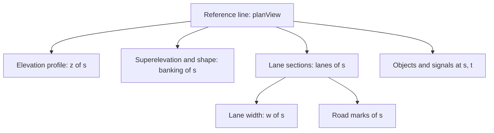
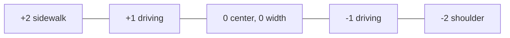
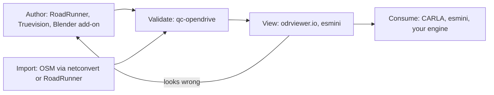

## Table of contents

## Introduction

Export a road network from your favorite editor, load it into CARLA, and the car drives into a wall that isn't there. Load the same file into esmini and the road renders fine. Open the XML and both tools are right: the geometry is continuous to within a millimeter, and the lane the car needed stops existing halfway through a lane section. Neither tool reported an error, because the file is valid. It just describes a road you didn't mean to build.

That's OpenDRIVE in one scene. It is the closest thing autonomous driving and traffic simulation have to a standard map format, every serious tool imports or exports it, and it is precise enough that a small authoring mistake becomes a physically impossible road instead of a warning. I ran into it from the [AI traffic system](/blog/ai-traffic-simulation-idm-mobil) side, where it's the industry answer to "what does a lane level map contain", and the format turned out to be worth a post of its own.

Below is how the ASAM OpenDRIVE format models a road network, the math that makes it compact and occasionally maddening, and the editors, viewers, and converters you can build `.xodr` maps with today.

> The spec is free: [ASAM OpenDRIVE](https://www.asam.net/standards/detail/opendrive/) (current 1.8.x). OpenDRIVE describes the static road network; its siblings [OpenSCENARIO](https://www.asam.net/standards/detail/openscenario-xml/) describes the moving traffic on top and [OpenCRG](https://www.asam.net/standards/detail/opencrg/) the road surface down to the millimeter.

## One idea: the reference line

Everything in OpenDRIVE hangs off a single decision. A road is not a mesh or a list of GPS points. It is a **reference line**, a mathematically exact 2D curve, and every other property (elevation, lanes, road marks, signals, guard rails) is a function of the distance `s` along that line.



Positions on the road use **s-t coordinates**: `s` is how far along the reference line you are, `t` is the signed lateral offset from it, positive to the left. If you've built traffic simulation, this is the Frenet frame again: "who is ahead of me" is a comparison of two `s` values, and the world position only gets computed when something needs to be drawn.

The reference line itself is a chain of geometry primitives, each starting exactly where the previous one ends:

| Primitive | What it is | Why it exists |
| --------- | ---------- | ------------- |
| `line` | Straight segment | Straight roads |
| `arc` | Constant curvature | Constant-radius curves |
| `spiral` | Clothoid, curvature changes linearly with `s` | The transition real roads use |
| `poly3` | Cubic polynomial | Legacy, mostly superseded |
| `paramPoly3` | Parametric cubic | Free-form geometry, editor exports |

The spiral is the one that makes OpenDRIVE feel like a civil engineering document rather than a game format. Real roads never jump from straight into a circular arc, because that would mean turning the steering wheel instantaneously. They insert a **clothoid**, a curve whose curvature grows linearly, so the wheel turns at a constant rate. OpenDRIVE inherited this directly from road construction practice. The format started at VIRES in 2005 for driving simulators, where the maps came from real road surveys, and any tool that consumes `.xodr` has to evaluate clothoids, which involve Fresnel integrals with no closed form.

```ts file=referenceLine.ts
// Evaluate a clothoid segment at arc length s from its start.
// Curvature grows linearly: k(s) = k0 + cDot * s.
// The integral has no closed form, so integrate the heading numerically.
type Spiral = {
  x0: number;
  y0: number;
  hdg0: number; // start heading, radians
  k0: number; // start curvature, 1/m
  cDot: number; // curvature rate, 1/m^2
};

export function evalSpiral(g: Spiral, s: number, steps = 64) {
  let x = g.x0;
  let y = g.y0;
  let hdg = g.hdg0;
  const ds = s / steps;

  for (let i = 0; i < steps; i++) {
    const sMid = (i + 0.5) * ds;
    const hMid = g.hdg0 + g.k0 * sMid + (g.cDot * sMid * sMid) / 2;
    x += ds * Math.cos(hMid);
    y += ds * Math.sin(hMid);
  }

  hdg = g.hdg0 + g.k0 * s + (g.cDot * s * s) / 2;
  return { x, y, hdg };
}
```

:::warn
Consecutive primitives must meet with matching position *and* heading. The spec allows tiny numeric gaps, and every consumer picks its own tolerance. A file that loads cleanly in one simulator and shows hairline cracks between road segments in another almost always has endpoints that agree to 1e-3 but not to 1e-6. Editors that solve geometry properly (fitting arcs and spirals to your control points) prevent this; hand-written XML invites it.
:::

Height is a separate, independent channel: an **elevation profile** of cubic polynomials in `s`, plus **superelevation** for banking the whole cross-section through curves. The 2D plan view and the vertical profile never contaminate each other, which is exactly how road designers have drawn roads on paper for a century: a plan sheet and a profile sheet.

## Lane sections: the part that does the work

The reference line is scaffolding. The content is the `<lanes>` element, and its model is strict: the road is divided lengthwise into **lane sections**, and within each section every lane is numbered from a virtual **center lane 0** that sits on the reference line (shifted by an optional `laneOffset`). Positive ids go left, negative ids go right, and the numbering may not skip values.



Lane 0 has zero width and exists only as the counting origin. Every real lane carries:

- a **type**: `driving`, `sidewalk`, `shoulder`, `biking`, `parking`, `border`, and a dozen more,
- a **width** as one or more cubic polynomials in the distance from the section start, so lanes can taper open and closed smoothly,
- **road marks** on its outer border: solid, broken, double, with color and width,
- **links** to its predecessor and successor lanes, by id.

Width-as-polynomial is the elegant part. A turn lane appearing before a junction is one lane whose width polynomial rises from 0 to 3.5 over eighty meters, and the whole edit is four coefficients rather than new geometry.

It's also the part that bites. A new lane section starts whenever the *set* of lanes changes, lanes are renumbered from scratch in each section, and continuity across the border exists only where a `<link>` says so. The bug from the introduction lives here: a lane whose width hits zero mid-section, or a section border where lane `-2` silently became lane `-3` and the link still points at the old id. The file is still schema-valid; the road no longer makes sense.

Here is a complete, loadable road: straight, 100 meters, one driving lane each way with a sidewalk.

```xml file=simple.xodr
<?xml version="1.0" encoding="UTF-8"?>
<OpenDRIVE>
  <header revMajor="1" revMinor="8" name="minimal" north="0" south="0" east="0" west="0"/>
  <road id="1" length="100.0" junction="-1">
    <planView>
      <geometry s="0.0" x="0.0" y="0.0" hdg="0.0" length="100.0">
        <line/>
      </geometry>
    </planView>
    <elevationProfile>
      <elevation s="0.0" a="0.0" b="0.0" c="0.0" d="0.0"/>
    </elevationProfile>
    <lanes>
      <laneSection s="0.0">
        <left>
          <lane id="2" type="sidewalk" level="false">
            <width sOffset="0.0" a="2.0" b="0.0" c="0.0" d="0.0"/>
          </lane>
          <lane id="1" type="driving" level="false">
            <width sOffset="0.0" a="3.5" b="0.0" c="0.0" d="0.0"/>
            <roadMark sOffset="0.0" type="solid" color="white" width="0.12"/>
          </lane>
        </left>
        <center>
          <lane id="0" type="none" level="false">
            <roadMark sOffset="0.0" type="broken" color="white" width="0.12"/>
          </lane>
        </center>
        <right>
          <lane id="-1" type="driving" level="false">
            <width sOffset="0.0" a="3.5" b="0.0" c="0.0" d="0.0"/>
            <roadMark sOffset="0.0" type="solid" color="white" width="0.12"/>
          </lane>
        </right>
      </laneSection>
    </lanes>
  </road>
</OpenDRIVE>
```

Drop that into a viewer and it renders. Every real map is this, scaled up: more geometry primitives, more lane sections, and the two elements the example dodges, links and junctions.

## Junctions: where authoring gets hard

Roads chain together through `predecessor` and `successor` links, and a plain end-to-end connection is trivial. The moment more than two roads meet, OpenDRIVE requires a **junction**, and the junction model is the same one that makes [traffic simulation](/blog/ai-traffic-simulation-idm-mobil) hard: every legal path through the intersection is its own **connecting road**, a full road with its own reference line and lanes, flagged with the junction's id.

```mermaid caption=A T-junction is three incoming roads plus a connecting road per legal turn
graph LR
    W[Road West] --> C1[Connecting: W to N left turn]
    W --> C2[Connecting: W to E straight]
    E[Road East] --> C3[Connecting: E to W straight]
    E --> C4[Connecting: E to N right turn]
    N[Road North] --> C5[Connecting: N to W right turn]
    N --> C6[Connecting: N to E left turn]
    C1 --> N
    C2 --> E
```

A four-way junction with two lanes per approach easily carries a dozen connecting roads, each needing geometry that meets its incoming and outgoing road with matching position, heading, *and* lane borders. The `<junction>` element then lists which incoming lane maps to which connecting lane. This is the single strongest argument against writing OpenDRIVE by hand: authoring one junction manually means solving a dozen small curve-fitting problems whose inputs change every time you nudge an approach road.

:::danger{title="Junctions are where imports die"}
When a map converted from OpenStreetMap or exported from an editor fails in a simulator, look at the junctions first. Typical failures: connecting roads whose lane links point at lanes that don't exist on the incoming road, right turns modeled with no connecting road at all so routing can't use them, and overlapping connecting roads with no priority defined. The open-source [ASAM Quality Checker for OpenDRIVE](https://github.com/asam-ev/qc-opendrive) catches a good share of these; run it before blaming the simulator.
:::

On top of the network sit **objects** (guard rails, poles, buildings, crosswalks as rectangles on the road) and **signals** (traffic lights and signs, with country-specific type codes, linked to the lanes they control and grouped into controllers so one junction's lights switch as a unit). Signals are the least portable corner of the format: the codes reference national catalogs, and two simulators rarely interpret the same catalog the same way.

## The toolchain: OpenDRIVE editors, viewers, and converters

There is no single blessed editor. What exists is a handful of tools with different price tags and different ideas of who you are.

| Tool | Cost | What it's actually for |
| ---- | ---- | ---------------------- |
| [MathWorks RoadRunner](https://www.mathworks.com/products/roadrunner.html) | Commercial | The industry default editor: interactive junction solving, OSM and GIS import, exports to CARLA, Unreal, Unity |
| [Truevision Designer](https://github.com/truevisionai/designer) | Free / open source | Web-based visual editor, the usual "just let me draw roads" starting point |
| [ODDLOT](https://www.hlrs.de/solutions/types-of-computing/visualization/oddlot) | Free / open source | Academic editor from HLRS Stuttgart, older UI, solid format coverage |
| [Blender Driving Scenario Creator](https://github.com/johschmitz/blender-driving-scenario-creator) | Free add-on | Author roads and junctions in Blender, export `.xodr` plus meshes |
| [esmini](https://github.com/esmini/esmini) | Free / open source | Reference-grade player: `odrviewer` renders any `.xodr`, `odrplot` charts it, great for validation |
| [odrviewer.io](https://odrviewer.io/) | Free, in-browser | Drag a `.xodr` onto a browser tab and inspect it, zero install |
| [CARLA](https://carla.org/) | Free / open source | The consumer: loads OpenDRIVE directly and can generate a drivable world from the bare `.xodr` |
| [SUMO netconvert](https://sumo.dlr.de/docs/netconvert.html) | Free / open source | Converter: OSM to OpenDRIVE and back, the standard "I need a real city" pipeline |

The map creation workflow these settle into:



Two practical notes on it. First, the fastest possible start is no editor at all: `esmini` ships example `.xodr` files, and twenty minutes of editing one by hand while watching it in `odrviewer` teaches the format better than the spec does. That holds up until the first junction, where you switch to an editor and don't look back. Second, the OSM route is seductive and rough: OpenStreetMap has no lane-level geometry, so `netconvert` *infers* lanes and junction shapes from tags, and the result needs manual cleanup roughly proportional to how much you care about the junctions.

:::info
If your target is a game engine rather than a simulator: RoadRunner exports directly to Unreal and Unity scenes, CARLA is an Unreal project that builds a world from OpenDRIVE at load time, and for do-it-yourself pipelines a `.xodr` parser plus the sampling code above gives you lane centerlines to drive [IDM traffic](/blog/ai-traffic-simulation-idm-mobil) on, sidewalk lanes to spawn [NavMesh pedestrians](/blog/unity-navmesh-ai-navigation) on, while the mesh stays whatever your artists made. The format describes the road's *logic*; it never claims to be your render geometry.
:::

## Reading a .xodr file without crying

`.xodr` is XML and opens in any editor, and there is a reliable path through a file you didn't write:

1. **Header first.** `revMinor` tells you the spec version; 1.4/1.5 files (pre-ASAM) and 1.6+ files differ in real ways, and `geoReference` holds the projection string if the map is georeferenced.
2. **Count the roads.** Roads with `junction="-1"` are actual roads; the rest are connecting roads inside junctions. A city import where half the roads are connectors is normal.
3. **Walk one road.** Its `planView` primitives should sum to the road's `length` attribute. Its lane sections partition `[0, length]`.
4. **Then the junctions.** For each `<connection>`, check the incoming road, the connecting road, and the `<laneLink>` pairs. This is where the file's quality shows.

The corresponding sanity checks are exactly what `qc-opendrive` automates: geometry endpoint gaps, lane link consistency, junction connectivity, lengths that don't add up. Wire it into CI if maps are a deliverable; a map format with polynomial lane widths is not something to review by eye in a pull request.

## Boundaries: what OpenDRIVE is not

The format's precision is also its scope limit, and knowing the edges saves weeks.

- **It is not a routing map.** There's no notion of addresses, turn restrictions beyond geometry, or road names you can navigate by. Lanenet-level routing you build yourself on top of the links, or you let SUMO or CARLA's API do it.
- **It is not render geometry.** No textures, no materials beyond road mark colors, no buildings except as abstract outline objects. Every consumer generates or pairs its own meshes.
- **It does not scale to a continent.** One XML file, fully parsed, with global `s` precision. City-sized maps are fine; country-sized maps are not what it's for, and nobody streams `.xodr` in cells the way an open world [streams its geometry](/blog/level-streaming-keyhole-open-world).
- **It is stricter than reality.** Real degraded roads, unmarked rural junctions, and parking lots fit the model awkwardly. The format grew up on well-built German roads and it shows.

The pending change worth knowing about: ASAM is folding OpenDRIVE, OpenSCENARIO and the rest into a harmonized generation with a common foundation, so expect the 1.8 line to be the stable target for a while and check the [ASAM roadmap](https://www.asam.net/standards/detail/opendrive/) before betting a toolchain on a newer major version.

## FAQ

<details><summary>Where do I start if I just want to see a map today?</summary>
Open <a href="https://odrviewer.io/">odrviewer.io</a> in a browser and drag in one of the example files from the esmini repository. No install, instant 3D view of the road network. When you want to poke at values, edit the XML side by side and re-drop the file.
</details>

<details><summary>What's the best free editor?</summary>
Truevision Designer for drawing roads visually with the least friction, the Blender Driving Scenario Creator add-on if you already live in Blender and want meshes exported alongside the <code>.xodr</code>. Both handle junctions for you, which is the feature that matters. RoadRunner is better than either and priced accordingly.
</details>

<details><summary>Can I write OpenDRIVE by hand?</summary>
A straight test road, yes, and it's a great way to learn the format. Anything with a junction, no: each legal turn is a connecting road whose geometry and lane links you'd be solving by hand, and every edit to an approach road invalidates all of them. Hand-edit files; hand-author only trivial ones.
</details>

<details><summary>How do I get a real city as OpenDRIVE?</summary>
OpenStreetMap through SUMO's <code>netconvert</code> (<code>--osm-files in.osm --opendrive-output out.xodr</code>), or through RoadRunner's OSM import if you have a license. Either way OSM lacks lane-level data, so lanes and junctions are inferred and need cleanup. For survey-grade real maps, commercial HD map vendors sell OpenDRIVE directly.
</details>

<details><summary>OpenDRIVE or Lanelet2 or Apollo HD maps?</summary>
OpenDRIVE for simulation toolchains: CARLA, esmini, VTD, and most commercial simulators speak it natively. Lanelet2 when you're on ROS and want a lightweight, library-first map with routing built in. Apollo's format if you're inside Apollo. For a game or research traffic system, OpenDRIVE has the best tool and converter ecosystem of the three.
</details>

<details><summary>Why clothoids instead of just splines?</summary>
Because the format models roads the way they're built: curvature that changes linearly with distance is what a driver turning the wheel at constant speed produces, and it's what real road surveys contain. Splines can approximate a clothoid but carry no such guarantee, which matters when a simulated vehicle's steering and comfort models react to curvature directly.
</details>

## Conclusion

OpenDRIVE is one idea executed thoroughly: a road is an exact curve, and everything else is a function of distance along it. That buys a compact, survey-grade description (a tapering lane is four polynomial coefficients), and it charges for the compactness at authoring time, because junctions become curve-fitting problems and validity stops being the same thing as correctness.

The practical path for OpenDRIVE map creation: learn the format by hand-editing a flat test road in a live viewer, switch to a real editor the moment junctions appear, validate with `qc-opendrive` before trusting any simulator's rendering, and treat OSM imports as a draft rather than a deliverable. Get that pipeline in place and the map layer under your simulation becomes the boring part, which, for a map format, is the highest compliment available.
