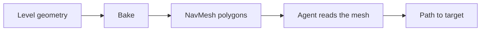
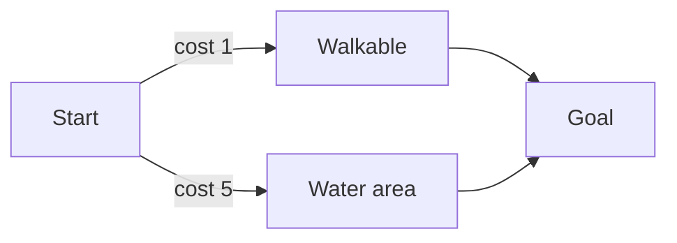
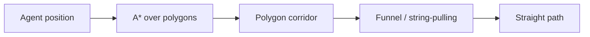

## Table of contents

## Introduction

An enemy that walks into a wall breaks the game faster than any missing texture. The player forgives rough models and placeholder sounds. They don't forgive a guard who marches straight into a crate and keeps pushing.

The hard part was never "move toward the player." That's one line. The hard part is everything between the enemy and the player: the crates, the stairs, the gap in the floor, the four other enemies trying to reach the same spot. The AI has to understand the space before it can move through it.

Unity's NavMesh solves this. It turns your level geometry into a simplified map of where an agent can stand and walk, then answers one question fast: given where I am and where I want to be, what's the path? This post covers how you build that map, how you tune the agents that read it, and how the pathfinding actually reasons about space underneath.

> The component-based workflow (`NavMeshSurface`, `NavMeshModifier`, `NavMeshLink`) lives in the **AI Navigation** package (`com.unity.ai.navigation`). Install it from the Package Manager first — the old built-in Navigation window is being retired.

A good starting point in video form: [AI Tutorial Series in Unity — NavMeshes, NavMeshAgents, and Configuring Enemies](https://youtube.com/playlist?list=PLllNmP7eq6TSkwDN8OO0E8S6CWybSE_xC&si=Ak44J7r4-EmSQPML).

## What a NavMesh actually is

A NavMesh is a set of flat polygons laid over your walkable geometry. Not the floor mesh you rendered — a coarser version, shrunk inward from every wall and ledge by the agent's radius so the agent never clips a corner.

The polygons form a graph. Each polygon knows its neighbors. Finding a path means walking that graph from the start polygon to the goal polygon, which is a much smaller problem than reasoning about raw triangles or a voxel grid.



Everything below is either building that mesh, reading it, or changing it while the game runs.

## Baking the surface

`NavMeshSurface` is the component that scans your geometry and bakes the mesh. Add it to a GameObject, press **Bake**, and Unity generates the polygons.

Put the component on the parent of your level geometry, not on a floating empty. With the surface sitting above everything, you can set **Collect Objects → Current Object Hierarchy** and it grabs only the children of that parent. Cleaner than scanning the whole scene, and it keeps the bake scoped to the level it belongs to.

**Use Geometry** decides what the bake reads:

- **Render Meshes** — the visible triangles. Accurate, but heavier, and it picks up decorative detail the agent doesn't care about.
- **Physics Colliders** — the collision shapes. Usually what you want. It matches where the player actually collides, and simple colliders bake faster than dense render meshes.

### Agent types

The mesh isn't universal — it's baked for one agent size. A NavMesh carved for a small drone won't fit a tall ogre, because the walkable area shrinks by the agent's radius and cuts off at slopes it can't climb.

**Agent Types** is where you define those sizes: **Radius** and **Height** set the footprint, **Max Slope** sets the steepest incline the agent will walk up, and **Step Height** sets how tall a ledge it can step over without a ramp. Change any of these and the walkable area changes with it — a bigger radius means the mesh pulls further from walls, a lower max slope drops steep ramps from the map.

If you have enemies of very different sizes, bake a separate surface per agent type. Each one gets its own mesh.

## The agent

`NavMeshAgent` is the other half. The surface is the map; the agent is the thing that reads it and decides where to step next. Add the component to anything that needs to move — and it's easy to forget, so if an enemy stands still, check the component is there first.

```csharp file=EnemyController.cs
using UnityEngine;
using UnityEngine.AI;

[RequireComponent(typeof(NavMeshAgent))]
public class EnemyController : MonoBehaviour
{
    [SerializeField] private Transform target;
    private NavMeshAgent agent;

    private void Awake()
    {
        agent = GetComponent<NavMeshAgent>();
    }

    private void Update()
    {
        agent.SetDestination(target.position);
    }
}
```

`SetDestination` is the whole API most of the time. You hand it a world position; it finds the path and steers along it. A few settings change how the agent behaves on the way:

- **Angular Speed** — bump it to `720`. The default turn rate is sluggish, and slow turns make an enemy overshoot corners and swing wide. A faster turn keeps the agent glued to the path.
- **Stopping Distance** — raise it a little. When several agents chase the same target, they all aim for one exact point and start shoving each other to own it. Give them a stopping radius and they settle around the target instead of fighting over a single coordinate.
- **Obstacle Avoidance Quality** — set it to **Low**. The higher tiers barely change how agents dodge each other but cost more every frame. Low is the sweet spot: cheap, and good enough.
- **Priority** — decides who yields. A lower number wins. High-priority agents push through; low-priority ones step aside. Give a boss high priority and the mob parts around it instead of jamming the doorway.

## Shaping the mesh

Sometimes the baked mesh is wrong on purpose. A patch of floor is technically walkable but you want it off-limits, or a shallow pool should cost more to cross so agents route around it.

`NavMeshModifierVolume` handles that. Create an empty GameObject, add the component, and it defines a box that overrides the mesh inside it. Set its **Area Type** — mark the volume as non-walkable to punch a hole in the mesh, or tag it as a custom area like *water* with its own traversal cost.



The agent still *can* cross a costed area; it just weighs the price and prefers the cheaper route. One thing to remember: a modifier volume changes the source data, so you have to re-bake the surface for the change to take effect.

## Dynamic obstacles

Baking is a build-time step. But a crate the player shoves across the room, or a door that swings shut, moves after the bake — the mesh doesn't know about it. That's `NavMeshObstacle`.

An obstacle tells agents "don't route through here" without re-baking anything. Two modes:

- **Avoidance only** — agents treat it as a soft blocker and steer around it, but the underlying mesh stays open.
- **Carve** — the obstacle cuts a real hole in the mesh at its position. Agents replan around it as if the mesh itself changed. This is what you want for anything that fully blocks a path.

Carving every frame for a moving object is expensive, so two settings act like a **debounce**: **Time To Stationary** waits until the object has held still for that long before carving, and **Carve Only Stationary** skips carving entirely while the object is in motion. A crate mid-slide stays a soft blocker; once it settles, it carves.

You can flip carving from a script when the object comes to rest:

```csharp file=PushableCrate.cs
using UnityEngine;
using UnityEngine.AI;

[RequireComponent(typeof(NavMeshObstacle))]
public class PushableCrate : MonoBehaviour
{
    private NavMeshObstacle obstacle;

    private void Awake()
    {
        obstacle = GetComponent<NavMeshObstacle>();
    }

    public void OnSettled()
    {
        obstacle.carving = true;
    }
}
```

One limit worth knowing: obstacles are global. You can't tell an obstacle to block goblins but let ghosts pass — it applies to every agent at once. Per-agent rules need area types and cost, not obstacles.

## Connecting separate meshes

Bakes don't always join up. A gap in the floor, a jump between rooftops, a ledge you drop off — Unity bakes two separate mesh islands with no path between them, because nothing walkable bridges the gap.

`NavMeshLink` bridges it. Drop the component between two points and it stitches the islands into one graph, so pathfinding can route across the gap it couldn't cross before. Set **Width** to `1` while you place it — a wider link is easier to see and line up in the editor.

Links carry a cost too, so you can make agents treat a jump as expensive and prefer the stairs when both exist.

## Per-agent routing on one mesh

Obstacles are global, but areas aren't. This is how you get different creatures to route differently across the *same* baked mesh — no second surface, no duplicate geometry.

Two knobs on the agent do it. **Area Mask** decides which areas an agent may enter at all; **Area Cost** decides how much each area costs it. A fox refuses water, a fish only swims — same polygons, opposite rules.

```csharp file=Amphibian.cs
// Land animal: water exists on the mesh, but this agent won't touch it.
int water = 1 << NavMesh.GetAreaFromName("Water");
agent.areaMask = NavMesh.AllAreas & ~water;

// Cautious animal: water is allowed, but five times pricier than ground,
// so it only wades when there's no dry way around.
agent.SetAreaCost(NavMesh.GetAreaFromName("Water"), 5f);
```

`areaMask` is a hard filter — masked-out areas are invisible to that agent's pathfinder, and a target sitting only in water becomes unreachable for it. `SetAreaCost` is soft — the area stays open, it just weighs more, so the agent takes it only when the alternative costs more still.

Area cost set on the agent is per-instance; it overrides the mesh-wide default from the bake. So the same *Water* area can be cheap for the fish and punishing for the wolf at the same time, from the same mesh.

## Repathing without wrecking the frame

`agent.SetDestination(target.position)` in `Update` is the first thing everyone writes, and it's fine for one enemy. Multiply it by a crowd and you're kicking off a fresh path search every frame for every agent, most of them recomputing a route that barely changed.

Throttle it. Repath on a fixed cadence, and only when the goal has actually moved:

```csharp file=Repather.cs
[SerializeField] private float repathInterval = 0.25f;
[SerializeField] private float moveThreshold = 1f;

private float nextRepath;
private Vector3 lastGoal;

private void Update()
{
    if (Time.time < nextRepath) return;
    if ((target.position - lastGoal).sqrMagnitude < moveThreshold * moveThreshold) return;

    nextRepath = Time.time + repathInterval;
    lastGoal = target.position;
    agent.SetDestination(target.position);
}
```

Four times a second is plenty for a chasing enemy; the agent keeps steering along its current path in between. `sqrMagnitude` skips the square root — cheap, and you never need the real distance for a threshold test.

A few more agent members that keep things smooth:

- **`pathPending`** — the path is computed on a worker thread and lands a frame or two later. Check this before you trust `remainingDistance`, or you'll read stale data the frame you set a new destination.
- **`remainingDistance`** — distance left along the path. Compare it to `stoppingDistance` to know when the agent has truly arrived, instead of guessing from world positions.
- **`Warp(position)`** — teleport an agent onto the mesh. After a respawn or a cutscene, setting `transform.position` alone can leave the agent desynced from its internal position; `Warp` snaps both.
- **`isStopped`** — pause steering without losing the path. Cheaper and cleaner than zeroing speed and restoring it later.

```csharp file=Arrival.cs
if (!agent.pathPending && agent.remainingDistance <= agent.stoppingDistance)
{
    // Arrived — attack, idle, or pick the next waypoint.
}
```

## How the AI reasons about space

Under `SetDestination` there are two steps, and knowing them explains a lot of agent behavior.

First, **A\*** searches the polygon graph. Start at the agent's polygon, expand toward the goal, and it returns a *corridor* — the chain of connected polygons that leads to the target. A\* is fast here precisely because the mesh is coarse: a room might be two polygons, not two thousand triangles.

Second, the corridor gets straightened. A polygon corridor is a wide ribbon, not a line — walking its centers would zig-zag drunkenly. The **funnel algorithm** (string-pulling) pulls a taut path through the corridor, hugging the inside of each corner. That's why a well-tuned agent cuts corners cleanly instead of drifting to the middle of every hallway.



You can pull the raw path out and inspect it — useful for drawing debug lines or deciding whether a target is even reachable before committing to it:

```csharp file=PathCheck.cs
NavMeshPath path = new NavMeshPath();

if (agent.CalculatePath(target.position, path) &&
    path.status == NavMeshPathStatus.PathComplete)
{
    agent.SetPath(path);
}
else
{
    // No complete path — pick another target or idle.
}
```

And when the target isn't guaranteed to sit on the mesh — say you clicked a point in open air or on a costed area — snap it to the nearest valid spot first:

```csharp file=Snap.cs
if (NavMesh.SamplePosition(point, out NavMeshHit hit, 2f, NavMesh.AllAreas))
{
    agent.SetDestination(hit.position);
}
```

`SamplePosition` searches within a radius for the closest point on the mesh. Feed the agent a point that isn't walkable and the path silently fails; snap it first and the agent always gets a target it can reach.

## FAQ

<details><summary>Do I need the AI Navigation package, or the built-in Navigation window?</summary>
Use the package. The component workflow (<code>NavMeshSurface</code>, <code>NavMeshModifier</code>, <code>NavMeshLink</code>) lives in <code>com.unity.ai.navigation</code> and supports multiple surfaces, runtime baking, and per-object control. The old built-in Navigation window bakes a single scene-wide mesh and is on its way out.
</details>

<details><summary>My agent won't move. What's the first thing to check?</summary>
Three things, in order: the object has a <code>NavMeshAgent</code> component; the surface is baked and the agent is standing on it; and the destination you passed sits on the mesh. Turn on NavMesh visualization in the Navigation overlay and confirm the blue mesh is actually under your agent's feet.
</details>

<details><summary>NavMeshObstacle or NavMeshModifierVolume — which do I use?</summary>
Modifier volume for permanent, baked changes: walls, no-go zones, costed areas. It needs a re-bake. Obstacle for things that move at runtime: crates, doors, destructible cover. No re-bake, but it only avoids or carves — it can't create custom area types.
</details>

<details><summary>Why do my agents pile up and jitter around the target?</summary>
They're all steering for the exact same point. Raise <code>Stopping Distance</code> so they settle in a ring around the target, set <code>Priority</code> so they yield in a predictable order, and keep <code>Obstacle Avoidance Quality</code> at Low so the avoidance stays stable instead of over-correcting.
</details>

<details><summary>Can one mesh serve creatures that move differently?</summary>
Yes — that's what areas are for. Set <code>agent.areaMask</code> to block an area outright (land animals ignore water), or <code>agent.SetAreaCost()</code> to make an area pricier for one agent than another. Both are per-instance, so the same baked mesh routes a fox and a fish in opposite ways.
</details>

<details><summary>Is calling SetDestination every frame a problem?</summary>
For one agent, no. For a crowd, yes — each call starts a fresh path search. Throttle it to a few times a second and skip the call when the goal hasn't moved (compare with <code>sqrMagnitude</code>). The agent keeps following its current path in between, so movement stays smooth.
</details>

<details><summary>Can I bake the NavMesh at runtime?</summary>
Yes. Call <code>Bake()</code> on a <code>NavMeshSurface</code> at runtime, which is how procedural and destructible levels stay navigable. It's not free — bake asynchronously or in chunks for large levels rather than blocking a frame on a full rebake.
</details>

## Conclusion

NavMesh splits one hard problem into a few small ones. `NavMeshSurface` turns geometry into a walkable map. `NavMeshAgent` reads that map and steers. `NavMeshModifierVolume` and `NavMeshObstacle` change the map — one at bake time, one while the game runs. `NavMeshLink` joins the pieces the bake left apart.

Underneath, the AI reasons about space the same way every time: A\* finds a corridor of polygons, the funnel algorithm pulls a straight line through it. Once you can see those two steps, agent behavior stops being mysterious — a guard that swings wide has a slow turn rate, a mob that jams a doorway has no priority set, a path that silently fails had a target sitting off the mesh.

You don't need to write pathfinding. You need to build the map well, tune the agents that read it, and keep them from repathing the whole crowd every frame. Get that right and the enemy stops walking into walls — which is the whole point.
