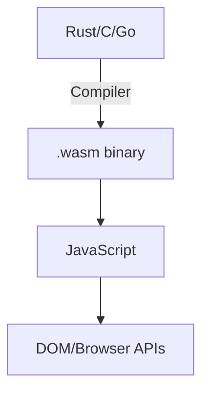
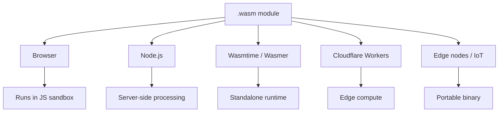

## Table of contents

## Introduction

I skipped WebAssembly for years. Every article led with the hype — "near-native performance" — and ended with a Rust setup guide. No answer to the only question that actually matters: when does this help?

What changed: reading about how Figma built their browser editor. The vector renderer, the layout engine, the constraint solver — all C++ compiled to Wasm. Not as a trick. Because JavaScript can't run that kind of math fast enough for a real-time design tool. That's a real problem with a clear solution, and Wasm is that solution.

That's the gap. Not universal, not a JavaScript replacement — but for CPU-heavy computation in the browser, it's a different class of tool.

This guide covers what Wasm actually is, how it fits alongside JavaScript, where it runs today, and a working Rust example you can build locally.

## What WebAssembly Actually Is

WebAssembly is a binary instruction format — a compiled target, not a language you write directly. You write code in Rust, C, C++, or Go, compile it to a `.wasm` file, and the browser runs that file at speeds close to native machine code.

The browser already knows how to run it. All major browsers have had Wasm support since 2017. No plugins, no flags, nothing to install on the user's end.



JavaScript still owns the DOM. Wasm can't touch it directly. The pattern is always the same: JavaScript loads the Wasm module, calls functions in it, gets results back, does something with those results. They work together — Wasm doesn't replace the JS layer, it handles the computation that JS handles poorly.

### Why JavaScript Struggles With Heavy Computation

JavaScript is dynamically typed and runs through a JIT compiler that makes smart guesses about your code. For typical application code — fetching data, updating state, handling events — those guesses are good enough and performance is fine.

For tight computational loops — image processing, cryptography, compression, physics simulations — the JIT's assumptions break down, it deoptimizes, and performance falls off a cliff.

Wasm bypasses this entirely. The binary is already compiled to a format close to machine code. No JIT warmup, no type inference, no deoptimization. You get consistent, predictable performance.

| Task                   | JavaScript  | WebAssembly           |
|------------------------|-------------|-----------------------|
| DOM manipulation       | Native      | Not possible directly |
| Network requests       | Native      | Needs JS bridge       |
| UI logic / state       | Fine        | Overkill              |
| Image processing       | Slow        | Fast                  |
| Cryptography           | Slow        | Fast                  |
| 3D rendering / physics | Too slow    | Fast                  |
| Video encoding         | Too slow    | Fast                  |

## Real Uses in Production

WebAssembly is not a toy or a benchmark. These are things it's running right now:

- **Figma** — the entire design engine runs in Wasm. The vector rendering, layout engine, and constraint solver are all compiled from C++. Without Wasm, Figma as a browser tool probably doesn't exist.
- **Google Earth** — ported from C++ to the browser via WebAssembly.
- **Adobe** — Photoshop and Lightroom in the browser use Wasm for the actual image processing operations.
- **FFmpeg in the browser** — video transcoding and format conversion without a server. The entire FFmpeg library compiled to Wasm.
- **SQL databases in the browser** — `sql.js` compiles SQLite to Wasm. You get a full relational database that runs locally, no server required. This is how some offline-capable apps persist structured data.

## The Component Model and WASI — Wasm Outside the Browser

When I started looking at Wasm I thought it was browser-only. It's not, and this is where it gets interesting.

**WASI (WebAssembly System Interface)** gives Wasm modules controlled access to the filesystem, network, clocks, and environment variables. With WASI, you can run `.wasm` files anywhere there's a runtime — servers, edge nodes, IoT devices.



**Cloudflare Workers** supports Wasm natively. You can write a Rust function, compile it to Wasm, and deploy it as an edge function that runs globally with sub-millisecond cold starts.

**The Component Model** (stabilized in 2025) is a spec that lets Wasm modules expose typed interfaces and compose with each other — regardless of what language they were written in. A Rust module and a Go module can call each other without going through JavaScript. This is early but it's where server-side Wasm is heading.

## A Working Example: Rust to Wasm

Here's the actual workflow. We'll write a simple string processing function in Rust, compile it to Wasm, and call it from JavaScript.

### How to Start

You need Rust and `wasm-pack`:

```bash
# Install Rust
curl --proto '=https' --tlsv1.2 -sSf https://sh.rustup.rs | sh

# Add the Wasm target
rustup target add wasm32-unknown-unknown

# Install wasm-pack
cargo install wasm-pack
```

### The Rust Code

```bash
wasm-pack new wasm-hello
cd wasm-hello
```

Edit `src/lib.rs`:

```rust file=src/lib.rs
use wasm_bindgen::prelude::*;

#[wasm_bindgen]
pub fn count_words(text: &str) -> u32 {
    text.split_whitespace().count() as u32
}

#[wasm_bindgen]
pub fn reverse_string(s: &str) -> String {
    s.chars().rev().collect()
}

#[wasm_bindgen]
pub fn count_primes(n: u32) -> u32 {
    (2..=n)
        .filter(|&num| {
            let limit = (num as f64).sqrt() as u32;
            (2..=limit).all(|i| num % i != 0)
        })
        .count() as u32
}
```

### Build

```bash
wasm-pack build --target web
```

This generates a `pkg/` folder with the `.wasm` binary, a JavaScript wrapper, and TypeScript types.

### Use From JavaScript

```html file=index.html
<!DOCTYPE html>
<html>
<body>
  <script type="module">
    import init, { count_words, reverse_string, count_primes } from './pkg/wasm_hello.js';

    await init();

    const text = "WebAssembly runs at near-native speed in the browser";
    console.log(count_words(text));       // 9
    console.log(reverse_string("hello")); // "olleh"

    console.time("primes");
    console.log(count_primes(1_000_000)); // 78498
    console.timeEnd("primes");
  </script>
</body>
</html>
```

The key detail: `await init()` loads and compiles the `.wasm` binary asynchronously. After that, the exported functions work exactly like JavaScript functions. The caller doesn't need to know they're running Wasm.

### What `wasm-pack` Generated

```
pkg/
├── wasm_hello.js          ← JS wrapper with init() and exported functions
├── wasm_hello_bg.wasm     ← the actual binary
├── wasm_hello_bg.wasm.d.ts
└── wasm_hello.d.ts        ← TypeScript types for your exports
```

TypeScript types are generated automatically from your Rust signatures. You get type checking on the JavaScript side for free.

## Using Wasm in a Real Project

If you're on Vite, the integration is straightforward:

```bash
npm install vite-plugin-wasm
```

```ts file=vite.config.ts
import { defineConfig } from "vite";
import wasm from "vite-plugin-wasm";

export default defineConfig({
  plugins: [wasm()],
});
```

Then import directly:

```ts file=imageProcessor.ts
import init, { process_pixels } from "./wasm/image_processor.js";

let wasmReady = false;

async function ensureWasm() {
  if (!wasmReady) {
    await init();
    wasmReady = true;
  }
}

export async function applyGrayscale(imageData: ImageData): Promise<ImageData> {
  await ensureWasm();

  const pixels = new Uint8Array(imageData.data.buffer);
  const processed = process_pixels(pixels, imageData.width, imageData.height);

  return new ImageData(
    new Uint8ClampedArray(processed),
    imageData.width,
    imageData.height
  );
}
```

The pattern: initialize once, call as needed. Don't re-initialize on every call — the `.wasm` binary loads once and stays in memory.

## Limitations You Should Know Before Committing

WebAssembly is not a universal upgrade. There are real tradeoffs.

1. **No direct DOM access.** Wasm can't read or write the DOM. Everything goes through JavaScript. If your bottleneck is "too many DOM updates," Wasm won't help. If it's "too much computation between the DOM updates," it will.
2. **Binary size.** A compiled Rust binary can be 1–10MB before compression. Brotli/gzip compress it well, but the first load costs something. For a page that needs 2MB of Wasm, you want to lazy-load it — only initialize the module when the user reaches the feature that needs it.
3. **Garbage collection.** The Wasm GC proposal (part of Wasm 3.0) adds garbage collection for languages like Java and Kotlin, but the Rust/C workflow means managing memory manually or through Rust's ownership system. `wasm-bindgen` handles the JS↔Wasm boundary automatically, but understanding what crosses that boundary still matters.
4. **Debugging is harder.** Chrome DevTools supports Wasm debugging with source maps back to Rust, but it's not as smooth as debugging JavaScript. Errors in Wasm show up as traps, not exceptions. Add instrumentation early.
5. **Thread model.** Wasm threads require `SharedArrayBuffer`, which requires specific COOP/COEP security headers. Not all hosting environments support this without configuration. For parallel computation in Wasm, check whether your host supports the required headers before committing.

:::warn
Don't rewrite working JavaScript to Wasm for the sake of it. Profile first. If JavaScript isn't the bottleneck, Wasm won't move the number that matters.
:::

## When to Actually Use Wasm

This decision comes up more often than people expect once you know it exists. The practical checklist:

- Image or video processing on the client
- Cryptography (hashing, signing, encryption)
- Compression / decompression (gzip, brotli, custom formats)
- Physics or collision detection in games
- Scientific computation, simulations
- Porting an existing C/C++ library to the browser
- Heavy data transformation (parsing large CSV, XML, binary formats)

## FAQ

<details><summary>Do I need to know Rust to use WebAssembly?</summary>
For browser use cases, Rust with <code>wasm-pack</code> is the most practical path — the tooling is mature and the output is clean. You don't need to be a Rust expert; a working understanding of functions, types, and the basic ownership model is enough to write useful Wasm modules. If you're more comfortable with C/C++, Emscripten works well for porting existing libraries. AssemblyScript (TypeScript syntax compiled to Wasm) is the lowest barrier, but it produces less optimized output.
</details>

<details><summary>Can Wasm access the network or filesystem?</summary>
In the browser: no, not directly. All network calls go through JavaScript's fetch. Outside the browser (with WASI), yes — with explicitly granted capabilities. That's actually one of WASI's design goals: a Wasm module only gets the permissions you hand it.
</details>

<details><summary>Is Wasm more secure than JavaScript?</summary>
It runs in the same browser sandbox as JavaScript. It's not more or less secure for the user. From a supply chain perspective, a compiled binary is harder to casually inspect than JavaScript source — which can be a downside. If you're consuming a third-party Wasm binary, you're trusting the compiled output more than you can trust JS.
</details>

<details><summary>Does Wasm work in all browsers?</summary>
Yes. Chrome, Firefox, Safari, and Edge have all supported the MVP spec since 2017. Newer features like threads and SIMD have >95% support in 2026. The Component Model is still landing in runtimes but is production-ready in Wasmtime and Cloudflare Workers.
</details>

<details><summary>What about WebWorkers? Can Wasm run off the main thread?</summary>
Yes, and this is the right pattern for heavy workloads. Run the Wasm module inside a Web Worker so the main thread stays unblocked. The Worker communicates with the main thread via <code>postMessage</code>. It's more setup than running on the main thread but it's how you avoid jank during computation.
</details>

## Conclusion

WebAssembly is one of those technologies that sounds broader than it is. It's not a JavaScript replacement. It's not a backend runtime (though WASI is making it one, slowly). It's a way to run compiled code in the browser at speeds JavaScript can't match — for the specific class of problem where that gap matters.

If your application does any heavy client-side computation, Wasm is worth adding to your toolkit. The `wasm-pack` workflow is genuinely approachable even without deep Rust experience, and the payoff when you hit the right use case is immediate and measurable.

I went from "I'll learn this eventually" to shipping it in production the same week I actually tried it. The delay was the learning curve in my head, not the actual curve.

Start with the prime counter from the example above. Get the toolchain working, understand the build output, call a function from JavaScript. The rest follows naturally from there.
